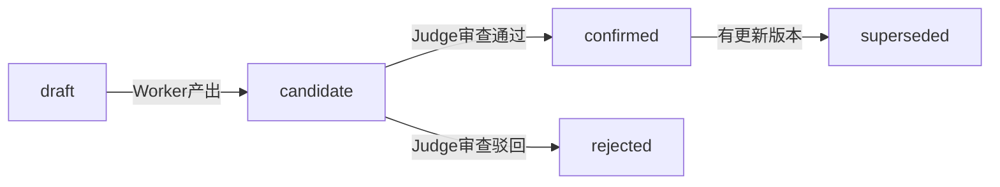

# 如何用多Agent搭建逆向分析框架——从BitWarden的工程实践说起

> 原文作者：BitWarden（看雪论坛ID）
> 原文链接：[打破传统AI逆向的新思路：多Agent、自主管理上下文](https://mp.weixin.qq.com/s/KsQJbU9aG0Br8kn9rFUg0A)
> 本文基于看雪论坛精华文章进行深度扩展，结合2025-2026年最新的MCP协议生态和开源Multi-Agent RE项目补充系统性实践指引

## 一、引言：五个痛点与一个范式突破

如果你用AI辅助逆向过大型商业软件，一定对这些场景不陌生：

| 痛点 | 现象 | 根因 |
|------|------|------|
| **古法主导** | 大部分工作靠人工定位和勘探，AI只是辅助角色 | 缺乏以AI为主的分析范式 |
| **上下文脆弱** | 几十轮对话后信息丢失，重开窗口就从头再来 | 缺乏持久化的上下文管理 |
| **发散不可控** | AI思维链走错分支，打断后分析路径全丢 | 缺乏分支管理和审查机制 |
| **不懂逆向手法** | AI能读懂汇编，但不知道如何还原为C++代码 | 缺乏领域知识（Skills）注入 |
| **上下文爆掉** | 大型函数汇编超过模型注意力窗口 | 单上下文承载能力已达天花板 |

问题是：**为什么传统的"一个窗口、一个对话、一个AI"模式解决不了？**

因为逆向工程的本质是**多路径探索 + 多维度交叉验证**——你需要在多个函数间跳转、同时维持多条分析假设、在不同模块间建立关联。单Agent流式对话天生无法支撑这种工作模式。

解决方案指向一个明确的方向：**多Agent分解 + 结构化上下文 + 置信度状态机**。看雪论坛的 BitWarden 提出了这一套框架的设计思路，而2025-2026年开源的多个项目（ida-procon、RE-AI、GhidraMCP等）已经用实际数据验证了它的可行性。

## 二、核心思路：三个支柱

BitWarden 的设计围绕三个支柱展开，每条都有实际开源项目背书。

### 支柱1：多Agent隔离

```
┌─────────────────────────────────────────┐
│             主Agent（主脑）              │
│  - 用户交互 / 任务拆解 / 指挥调度        │
│  - 参考：ida-procon Coordinator         │
└────────────┬────────────────┬────────────┘
             │                │
     ┌───────┴───────┐ ┌────┴────────┐
     │  Worker Agent │ │  Judge Agent│
     │  (执行分析)    │ │  (审查验证)  │
     └───────────────┘ └─────────────┘
```

**多Agent的好处**：上下文隔离（汇编分析不污染决策上下文）、可同时使用不同模型（主Agent用推理型，Worker用执行型）、可扩展（复杂度增加时增加子Agent即可）。

> **实际验证**：开源项目 **ida-procon**（⭐9） 跑过一个真实基准测试——对一个M68K架构的693个函数的二进制文件，调度 **20个并行Agent**，约80分钟、花费约$15，完成了100%的覆盖率并自主提取了Flag。对比实验显示：**没有procon的同一模型，在693个裸.c文件中grep搜索了17个函数后耗尽上下文，最终失败。** 有procon的Agent通过Contour图直接导航到目标函数，成功完成。这个对比，就是对"多Agent隔离"最有力的实证。

### 支柱2：结构化上下文管理

BitWarden将AI分析的产物分为两个维度：

```
<project>/
├── .artifacts/           ← AI分析的结构化产物
│   ├── index.yaml        ← 主索引（地址→路径）
│   ├── <binary>/         ← 每个目标一个目录
│   │   ├── classes/      ← 类信息
│   │   ├── functions/    ← 未归类函数
│   │   └── cross_refs/   ← 跨文件引用
│
└── .investigations/      ← AI的思考过程
    ├── 000-定位-<binary>/
    └── 001-<任务名>/
```

关键设计原则：
- **树形结构 + 主索引** —— 文件系统即数据库，无需SQLite/RAG等重型方案
- **产物与思考分离** —— `.artifacts/` 存可信结果，`.investigations/` 存分析路径
- **YAML格式** —— 轻量、易读、AI友好，避免工具调用开销

### 支柱3：置信度状态机

> **AI逆向最危险的假设：AI的产出是可信的。**



| 状态 | 含义 | 谁来写入 |
|------|------|---------|
| `draft` | 初始草稿 | Worker |
| `candidate` | 待审查 | Worker |
| `confirmed` | 用户亲手确认 | **只有用户** |
| `rejected` | 被驳回 | 审查Agent提议，主Agent确认 |
| `superseded` | 已被新版本替代 | 系统自动 |

**核心原则**：AI永远写不到 `confirmed`。这是人类决策的保留地。

## 三、框架的完整设计

### 3.1 文件格式体系

BitWarden定义了四类产物文件：

**类文件（class.yaml）**：
```yaml
schema_version: 1
name: Animal
kind: class
methods:
  - name: speak
    address: '0x1400077c0'
    status: confirmed
    last_updated: 2026-04-30
```

**方法文件（method.yaml）**：
```yaml
name: speak
status: confirmed
signature: int __fastcall speak(void* this, int type)
high_level_code: |
  switch (type) {
    case 0: printf("Woof\n"); break;
    case 1: printf("Meow\n"); break;
  }
vtable_index: 2
```

**未归类函数（function.yaml）**：
```yaml
address: '0x140007550'
status: candidate
asm_skeleton: |
  sub     rsp, 28h
  mov     eax, [rcx+8]
  add     eax, [rcx+0Ch]
  add     rsp, 28h
  retn
high_level_code: |
  return this->field_8 + this->field_C;
```

**跨文件引用（cross_refs.yaml）**：
```yaml
编号: xref_001
状态: confirmed
从:
  binary: bar.exe
  地址: '0x140003200'
到:
  binary: foo.dll
  类: Animal
  方法名: speak
关系类型: 调用
证据: 间接调用[rcx+8], rcx在0x14000312A处加载Animal::vftable
```

### 3.2 版本管理

逆向是迭代过程，BitWarden设计了完善的历史版本机制：

```
classes/Animal/methods/
├── speak.yaml          ← 当前活跃版本（v3，confirmed）
├── speak.v1.yaml       ← 第一次分析（rejected，被当作普通函数）
├── speak.v2.yaml       ← 第二次分析（superseded，识别为方法但不准）
├── speak.b1.yaml       ← fan-out 候选1（djb2假设，rejected）
├── speak.b2.yaml       ← fan-out 候选2（CRC32假设，superseded）
└── speak.b3.yaml       ← fan-out 候选3（实际确认的版本）
```

命名规则：`<name>.yaml` 为当前活跃版本，`<name>.vN.yaml` 为时间线历史版本，`<name>.bN.yaml` 为并行分支候选。

### 3.3 文件迁移机制

逆向的典型路径：**从函数到方法，从面向过程到面向对象**。早期定位到的函数随着分析深入会被归类到类下。自动化迁移流程：

1. 在新位置创建文件：`classes/<X>/methods/<name>.yaml`
2. 更新主索引：`path` → 新位置，`kind` → method
3. 更新类清单（`class.yaml`）
4. 删除旧位置函数文件

## 四、Skills与知识体系

### 4.1 Knowledge：蒸馏自己的RE经验

BitWarden提到一个关键点：**AI不懂逆向手法**。虽然能读懂汇编，但不知道如何从汇编骨架还原为高级C++代码。解决方法是**蒸馏自己的RE经验为知识库**：

```
knowledge/
├── INDEX                        ← 全局索引
├── lift-reduction-principles/   ← 高精度还原方法论
├── class-identification/        ← 类识别方法
├── algorithm-patterns/          ← 算法模式库（AES/MD5/CRC/Base64变种）
└── anti-RE-techniques/          ← 反逆向技术应对（花指令/控制流平坦化）
```

### 4.2 Lift Skills：高精度还原五步法

针对精度要求99.9%以上的算法还原，BitWarden设计了结构化流程：

| 步骤 | 名称 | 内容 |
|------|------|------|
| 1 | **骨架还原** | 提取控制流壳（if/while/for/switch），函数体用占位符 |
| 2 | **逐行机械翻译** | asm → C伪代码，变量名保留寄存器名 |
| 3 | **签名草稿** | 从调用方推断调用约定和参数个数 |
| 4 | **优化** | 寄存器识别、中间寄存器折叠、内存操作分类、lea处理 |
| 5 | **语义折叠** | 识别算法模式、赋予有意义变量名、修正签名 |

> **实操提示**：前两步可以交给Worker Agent批量完成（用GLM 5.1等便宜模型），后两步需要主Agent介入推理（用DeepSeek V4/Claude）。这个分工可以大幅降低成本。

### 4.3 Class-Identify Skills

大规模面向对象逆向的系统化流程：

1. **RTTI优先** —— 有RTTI时直接获取继承图、类名、虚函数表
2. **无RTTI时用户给起点** —— 指定某个ctor/thiscall方法地址
3. **vtable列虚方法** —— 通过虚函数表枚举所有虚方法
4. **thiscall偏移聚类** —— 按`[this+N]`偏移聚类识别非虚方法
5. **方法体汇总成员** —— 配合方法体还原，汇总偏移获取成员清单

## 五、2025-2026实操：MCP生态与多Agent工具链

BitWarden的框架是"手动工程化"的典范。而在2025-2026年，**MCP（Model Context Protocol）和一系列开源项目已经将这个范式推向可实操的阶段**。

### 5.1 逆向MCP Server完整对比

目前可用的逆向MCP Server已覆盖从静态分析到动态调试的完整链条：

| 项目 | 平台 | ⭐ | 工具数 | 特点 |
|------|------|---|--------|------|
| **GhidraMCP** | Ghidra | 9.3k | 核心 | 首个LLM自主逆向MCP，支持Claude/Cline |
| **Heretek-RE/RE-AI** | 全平台 | — | **31个MCP** | 最完整的逆向MCP工具链，含技能 |
| **Ghidra Headless MCP** | Ghidra | 93 | 212 | 无头模式+容器化部署 |
| **r0idamcp** | IDA Pro | 81 | 20+ | 中文项目，SSE协议，r0ysue开发 |
| **IX64MCP** | IDA+x64dbg | 6 | 静动联合 | **唯一同时连接IDA和x64dbg** |
| **Binary Ninja MCP** | BN | 214 | 181 | 36个功能组，headless |
| **JS Reverse MCP** | Chrome | 1.9k | 21 | 专为Agent设计的JS逆向 |
| **Reversecore MCP** | 多引擎 | 65 | 综合 | Ghidra+Radare2+YARA |
| **Recaf MCP** | Java | 8 | 核心 | Java字节码逆向 |

### 5.2 重点工具实操

#### GhidraMCP（⭐9.3k）—— AI逆向的"入门级"工具

GhidraMCP是目前最成熟、社区最活跃的逆向MCP方案。安装三步走：

```bash
# 1. Ghidra中安装插件
# File → Install Extensions → 选择GhidraMCP.zip

# 2. 启动MCP桥接服务器
python bridge_mcp_ghidra.py

# 3. Claude Desktop中配置
# 编辑 claude_desktop_config.json
```

Agent获得的能力：反编译二进制、自动重命名方法/数据、列出所有方法/类/导入/导出表、交叉引用分析。

#### r0idamcp（⭐81）—— 中文IDAmcp，开箱即用

由安全圈知名人士 r0ysue 开发，专注IDA Pro的MCP集成：

```json
{
  "mcpServers": {
    "r0idamcp": {
      "url": "http://192.168.1.2:26868/sse",
      "type": "sse"
    }
  }
}
```

核心工具函数（可直接被Agent调用）：
- `get_functions_page(page, page_size)` —— 分页获取所有函数
- `decompile_function(func_addr)` —— 反编译为伪代码
- `disassemble_function(func_addr)` —— 反汇编为机器码
- `rename_function(func_addr, new_name)` —— 重命名函数
- `set_function_prototype(func_addr, prototype)` —— 设置函数原型
- `add_comment(address, comment)` —— 添加注释
- `rename_local_variable(func_addr, old_name, new_name)` —— 局部变量重命名

#### ida-procon（⭐9）—— 超大规模逆向实战验证

这是**唯一一个有多Agent对比实验数据**的项目。架构如下：

```
IDA Pro → ida_dump.py → Coordinator → N × Claude Code Agent
                                     ↓
                              Contour图（函数依赖关系）
```

**真实测试数据**：

| 挑战 | 架构 | 函数数 | Agent数 | 时间 | 成本 | 效果 |
|------|------|--------|---------|------|------|------|
| Flare-On #2 | Go/x86-64 | ~50 | — | 207s | ~$3 | 完整密码学管线重建 |
| Flare-On #10 | M68K | 693 | 20 | ~80min | ~$15 | **100%覆盖率+Flag提取** |
| 工业闭源二进制 | x64 | 11,610 | 6 | 15min | $6 | 948函数文档化 |

关键发现：**无procon的Agent在693个函数中grep搜索17个后耗尽上下文。有procon的直接导航到目标函数。**

#### IX64MCP（⭐6）—— 打通静态与动态的桥梁

唯一同时连接IDA（静态）和x64dbg（动态调试）的MCP方案，正好补上了BitWarden框架缺动态调试的短板。AI Agent可以：
1. 在IDA中定位可疑函数（静态）
2. 在x64dbg中下断点验证（动态）
3. 根据调试结果更新注释和函数签名
4. 生成patch方案

#### Heretek-RE/RE-AI（31个MCP）—— 完整的逆向MCP全家桶

最全面的选项：31个MCP服务器覆盖从反编译到报告生成的完整链条。核心组件：

| 类别 | MCP服务器 | 用途 |
|------|----------|------|
| **静态分析** | re-rizin, re-capa, re-yara, re-kaitai | 二进制特征提取与模式匹配 |
| **反编译** | re-llm-decompile | 基于LLM4Decompile的神经反编译 |
| **动态分析** | re-frida, re-gdb, re-android-dynamic | Frida+GDB+Android动态分析 |
| **网络协议** | re-pcap, re-mitm2swagger, re-fuzz-replay | 流量分析与协议还原 |
| **报告** | re-report-write | AI自动生成逆向报告 |

安装方式：`./install.sh` 克隆全部31个MCP服务器，然后注册到Claude Code的 `.mcp.json` 中即可。

### 5.3 LLM4Decompile：从汇编到C的最后一公里

> 在写博文时，这个项目已经 ⭐6.7k。它解决的是逆向中最硬核的问题：**把汇编翻译成可重编译的C代码**。

**实际性能数据**：

| 模型 | 参数 | 可重执行率 | 说明 |
|------|------|-----------|------|
| V1.5 6.7B | 6.7B | 45.4% | 第一代 |
| **V2 9B** | **9B** | **64.9%** | **基于Yi-Coder-9B，推荐** |
| SK²Decompile | — | 更高 | 两阶段：骨架恢复+标识符命名 |

**实操Demo**（基于Colab，无需GPU）：

```bash
# 本地快速体验
# 1. 用GCC编译C代码
gcc -o out.o test.c -O0 -lm

# 2. 反汇编
objdump -d out.o > out.s

# 3. 提取目标函数的汇编指令
# 4. 送到LLM4Decompile翻译为C代码
```

### 5.4 crackme-agent-bench：测试你的Agent逆向能力

如果你搭建了多Agent框架，怎么验证它是否真正有效？crackme-agent-bench（⭐3）是专门为这个场景设计的基准测试：

- **v1任务**：多阶段crackme，含反调试、链式阶段、纯内存Flag
- **v2任务**：控制流平坦化、加密常量混淆、TLS打包器、散落完整性检查

配套工具 **veh-debugger**——一个VEH（向量异常处理）进程内调试器，封装为MCP工具供Agent调用。

## 六、模型选择与成本策略

### 6.1 BitWarden的配置

- **主Agent** → DeepSeek V4（强推理能力，做决策和拆解任务）
- **Worker Agent** → GLM 5.1（国产模型，性价比高，可内网部署）

### 6.2 ida-procon的成本数据

这个项目提供了真实的成本参考（按Claude Sonnet计价）：

| 任务规模 | 函数数 | Agent数 | 时间 | 成本 |
|---------|--------|---------|------|------|
| 小（一个DLL） | ~50 | 1-2 | ~3min | ~$3 |
| 中（完整二进制） | ~700 | 20 | ~80min | ~$15 |
| **大（工业级）** | **11,610** | **6** | **15min** | **$6** |

### 6.3 模型选择策略的通用原则

| 层级 | 推荐模型 | 理由 |
|------|---------|------|
| 主Agent决策 | DeepSeek V4 / Claude Sonnet | 推理能力强，负责任务拆解和路径判断 |
| Worker分析 | GLM 5.1 / Qwen 3 / Gemini 2.5 | 性价比高，批量分析不心疼token |
| 本地机密分析 | Llama 4 / Qwen 3本地版 | 敏感代码不出内网 |
| 神经反编译 | LLM4Decompile 9B | 专门微调模型，传统通用LLM做不到 |

**实操建议**：用便宜的Worker批量产出candidate级别结果，用推理型主Agent做最终判断。这个组合可以将成本降低50%-70%。

## 七、从零搭建你的多Agent逆向框架：实操路线图

下面是一条经过实战验证的**渐进式搭建路线**，每一步都可以独立使用：

### Level 0：一个人也能用（1天）

目标：建立基本的上下文管理

```bash
# 最简单的目录结构
<project>/
├── .artifacts/           ← 存产物
│   └── index.yaml        ← 手动维护索引
└── .investigations/      ← 存分析记录
```

操作：每次AI分析结果手工保存到对应目录。**这个习惯比你用什么框架都重要。**

### Level 1：引入MCP工具（2天）

目标：让Agent能操作逆向工具

安装GhidraMCP或r0idamcp中的一个，配置到Claude Desktop。验证Agent能否：
- 反编译指定函数 ✅
- 重命名函数 ✅
- 添加注释 ✅
- 搜索交叉引用 ✅

### Level 2：多Agent并行（1周）

目标：用ida-procon或类似方案跑通多Agent

选择工具链入口：
- **有IDA Pro → 用ida-procon**（Coordinator+N个Agent）
- **无IDA Pro → 用Ghidra Headless MCP + RE-AI**
- **需要动态调试 → 配置IX64MCP**

验证基准：用crackme-agent-bench测试你的Agent能否通过v1挑战。

### Level 3：私有知识库注入（持续）

目标：蒸馏自己的逆向经验

1. 整理你的算法模式库（常见的AES/CRC/MD5/Base64变种特征）
2. 整理编译优化模式（不同编译器/优化等级的反编译特征）
3. 整理壳特征库（UPX/VMProtect/自定义壳的入口特征）
4. 将上述内容写作MCP Resource或Prompt Template

验证：让Agent分析一个你以前手动分析过的软件，对比效率提升。

## 八、局限与展望

### 当前局限

| 局限 | 说明 | 解决方向 |
|------|------|---------|
| **动态调试Agent化不成熟** | IX64MCP等方案才起步 | 关注IX64MCP、veh-debugger的后续发展 |
| **Worker准确率依赖基模** | 严重混淆下Worker产出置信度很低 | 用SK²Decompile的两阶段方案提升 |
| **知识库质量决定天花板** | 框架效果取决于你蒸馏了多少经验 | 从小而精的模式库开始，逐步扩充 |
| **生态系统碎片化** | 不同MCP Server间缺乏统一标准 | 关注RE-AI的31合一组装方案 |

### 2025-2026趋势

| 趋势 | 代表项目 | 状态 |
|------|---------|------|
| **端到端神经反编译** | LLM4Decompile V2 9B | ✅ 可用，64.9%可重执行率 |
| **Agent原生逆向工具** | GhidraMCP / r0idamcp | ✅ 生产可用 |
| **超大规模并行** | ida-procon 20 Agents | ✅ 已验证 |
| **MCP全工具链集成** | RE-AI 31件套 | ✅ 可部署 |
| **静动态联合调试** | IX64MCP (IDA+x64dbg) | ⚠️ 早期 |
| **基准测试标准化** | crackme-agent-bench | ⚠️ 起步 |
| **小模型反编译专项化** | LLM4Decompile / VarBERT | ✅ 可用 |

## 写在最后

BitWarden在原文中说了一句话很对：**"不推荐直接使用，可以利用这种设计打造属于自己的'逆向工程sln'"**。

从实际落地的角度看，建议你：

1. **先建立目录结构** —— 从 `.artifacts/` + `.investigations/` 开始，这是最有价值的习惯
2. **再装一个MCP Server** —— GhidraMCP或r0idamcp，体验Agent直接操作逆向工具
3. **加一个置信度状态机** —— 哪怕只有 `candidate → confirmed` 两级
4. **跑一次基准测试** —— 用crackme-agent-bench验证你的框架是否真的有效
5. **最后，写你的第一个Skill** —— 把你最擅长的逆向手法写成可复用的SKILL.md

如果你的分析工作还停留在"打开一个窗口、粘贴代码、等回复、复制结果"，那么这套框架的价值就是：**让逆向从"手艺活"变成"工程活"**——可审计、可回溯、可复用。

---

*参考来源：*

1. [打破传统AI逆向的新思路：多Agent、自主管理上下文](https://mp.weixin.qq.com/s/KsQJbU9aG0Br8kn9rFUg0A) —— BitWarden，看雪论坛精华文章，2026-06-18
2. [GhidraMCP: LLM-powered Ghidra Analysis](https://github.com/LaurieWired/GhidraMCP) — ⭐9.3k
3. [ida-procon: Parallel LLM Agents for Autonomous RE](https://github.com/monksage/ida-procon) — 首个多Agent RE对比实验数据
4. [r0idamcp: IDA Pro MCP Server](https://github.com/r0ysue/r0idamcp) — r0ysue中文项目
5. [Heretek-RE/RE-AI: 31 MCP Servers for RE](https://github.com/Heretek-RE/RE-AI) — 最完整的RE MCP工具链
6. [IX64MCP: IDA + x64dbg联合MCP](https://github.com/lowcort1sol/ida-x64dbg-mcp) — 静动态联合
7. [LLM4Decompile: Neural Decompilation](https://github.com/albertan017/LLM4Decompile) — ⭐6.7k
8. [JS Reverse MCP: Agent-first JS RE](https://github.com/zhizhuodemao/js-reverse-mcp) — ⭐1.9k
9. [crackme-agent-bench: AI Agent RE Benchmark](https://github.com/knewstimek/crackme-agent-bench)
10. 看雪课程《AI辅助逆向分析》，讲师：执着的猫
