---
layout:		post
category:	"program"
title:		"支付宝个人收款解决方案之支付宝签约方案"
tags:		[android,支付宝,支付,收款]
---
- Content
{:toc}
**关键词**：签约支付，签约收款，支付宝收款，个人签约收款


# 背景

​	有做网赚或者在网上售卖个人小产品小服务的，需要进行收款，如果零星个别的收款可能直接走个人转账然后手动发货即可，但是一旦流程标准下来，量走起来之后，付款发货就需要自动化了，以提高人效。例如在网站上挂一个购买链接，用户点击后自动展示收款码，用户扫码付款后网站自动完成发货，是不是感觉很好？或者在APP里提供了付费功能，用户需要购买的时候，能够直接弹出支付宝（或微信）付款，完成付款后自动提供付费功能，是不是感觉很好？

​	本方案场景是针对「个人开发者」或其他「个人商家」的，后面简称**个人收款**方案。对于已经拥有公司的，直接签约支付宝或微信的支付功能即可。

​	个人收款总结下来有两类：**签约**和**免签约**。

- **签约方案**就是直接和支付宝或者微信签约，严格按照支付宝或微信的要求一步步来，完成签约后使用它们的官方接口即可。该方案比较稳定，但是如果售卖的商品属于灰色的话，很容易被「风控」禁用，毕竟使用的是人家的服务，很容易被管控。早期的时候可以直接个人签约，但是后来就不行了，个人必须用营业执照才行。
- **免签约方案**就是避开使用支付宝或微信的签约流程，自己搭建一套支付收款体系，这个在下一篇文章中再做介绍。


​	网上有很多集成了收款方案做的**聚合收款方案**，大家可以了解，但是这些大多是属于不正规的个人或小团队搭建的，因为涉及到资金汇款，这个风险很高，不建议实际使用。截止到目前为止，以前做调研收集到的一些网站已经打不开了，收集了一些权当做了解、借鉴、参考，后面专门整理一篇文章介绍下。


今天主要介绍签约方案，以APP收款为例介绍，即假设你开发了一款需要用户付费的APP，有收款场景。支付方式以支付宝为例介绍，微信方案同理。


# 方案

​	目前个人签约收款，需要营业执照，个人的话可以申请**个体工商户**，自己跑腿办理也可以，或者直接找某宝上找代办也可以。现在个体工商户的注册也需要线下实体门店对应，杭州地区的价格比较高需要3000块，某宝代理办了个外地的，200块就搞定了，流程测完跑通后又花100块让代办注销掉了，怕以后出麻烦。


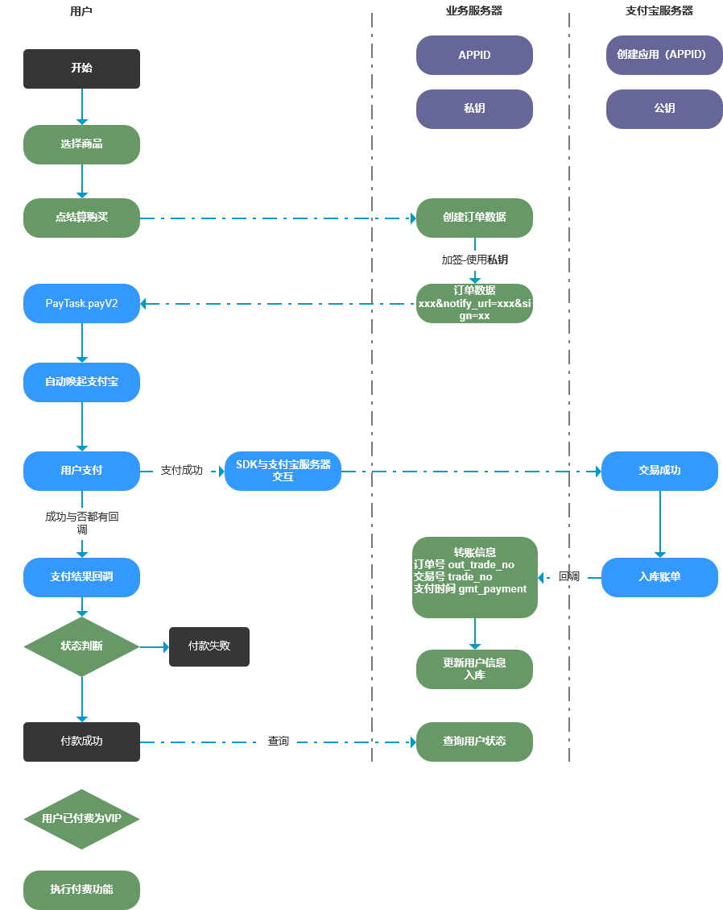


​	如果仅仅是学习研究，可以使用支付宝提供的「沙箱模式」，可以认为是测试环境，跑通流程即可。如果是真实需要支付收款，可以先把营业执照申请起来（需要时间），一边使用沙箱模式开发，它可以让我们不具备这些应用或者说应用审核还没通过的时候先开发调试。


## 沙箱模式

参考：

- 流程：[https://b.alipay.com](https://b.alipay.com/) -> 产品中心 -> [App支付](https://b.alipay.com/signing/productDetailV2.htm?productId=I1011000290000001002)

- [第四百零三节，python网站在线支付，支付宝接口集成与远程调试](https://www.cnblogs.com/adc8868/p/7652314.html)
- [十二、支付宝沙箱环境配置 - 腾讯云](https://cloud.tencent.com/developer/article/1350994)
- [支付宝开放平台-接口调试](https://openhome.alipay.com/platform/demoManage.htm#/alipay.trade.app.pay)
- 参考代码：[App支付客户端DEMO&SDK](https://docs.open.alipay.com/54/104509) 
- 沙箱环境：https://docs.open.alipay.com/200/105311/
- 签名工具：https://docs.open.alipay.com/291/106097
- 参考：[Android沙箱环境测试支付宝官方Demo](https://blog.csdn.net/qq_41258836/article/details/80504588)
- 接入文档参考：https://docs.open.alipay.com/204
- 客户端 Android 集成流程 https://docs.open.alipay.com/204/105296/
- [php 服务端集成支付宝APP支付](https://blog.csdn.net/Just_shunjian/article/details/78630596)
- [如何在Windows上安装PHP7？-php教程-PHP中文网](https://www.php.cn/php-weizijiaocheng-416401.html)（这个是方便在Windows电脑上直接测试的）


登录支付宝网页版，点击“开放平台-开发者中心-[沙箱环境](https://openhome.alipay.com/platform/appDaily.htm)”。下载**沙箱钱包**（也就是测试用的支付宝App）：

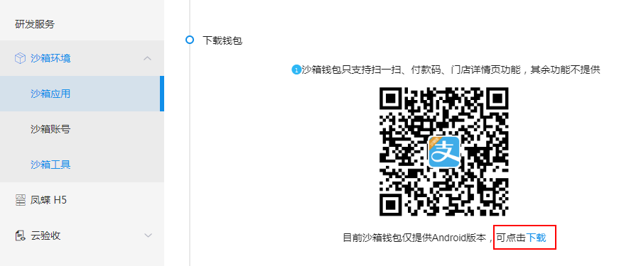


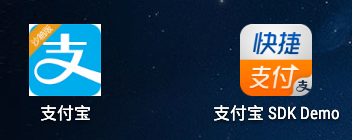


使用签名工具创建密钥：

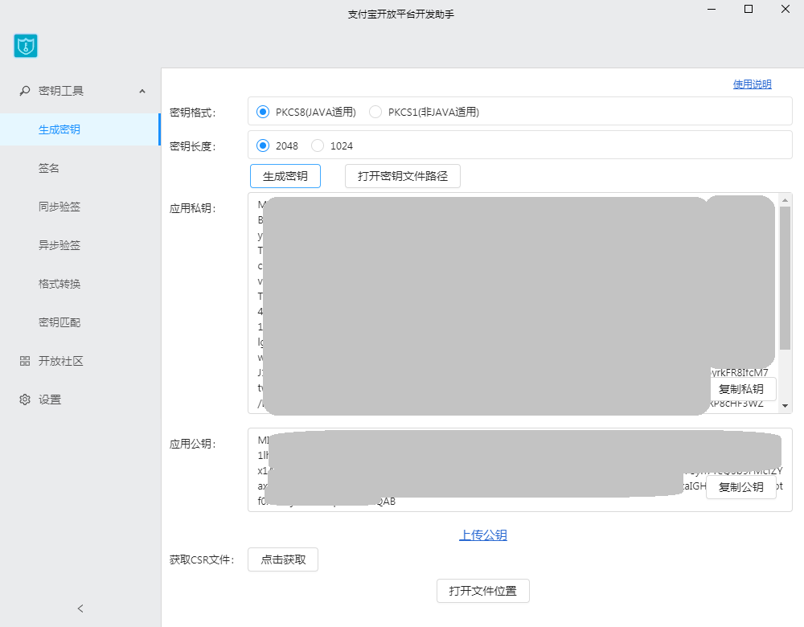


因为是Android应用，选择PKCS8（JAVA适用），点击生成密钥，复制公钥，然后到沙箱应用中，设置一下这个公钥：

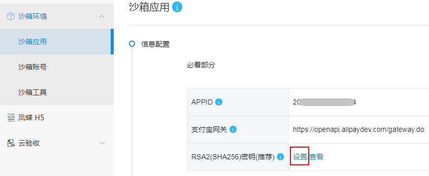


选择公钥，然后把公钥粘贴进来，最后保存设置。

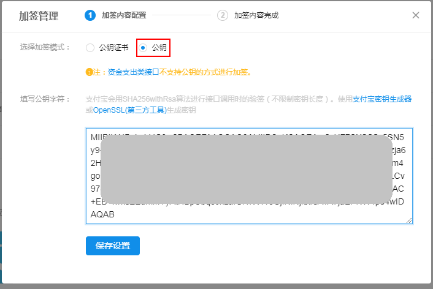


把沙箱应用的**appid**记下来，例如此处是：2021102200872184

在Android的demo里修改代码：

1、设置沙箱模式：

```java
protected void onCreate(Bundle savedInstanceState) {
   EnvUtils.setEnv(EnvUtils.EnvEnum.SANDBOX);
   super.onCreate(savedInstanceState);
   setContentView(R.layout.pay_main);
}
```

2、设置**APPID**，2021102200872184

3、设置私钥，这个demo是直接把私钥写死代码里的，直接把上一步使用签名工具生成的**私钥**复制下来，贴到**RSA2_PRIVATE**里


编译运行demo，点击“支付宝支付demo”：

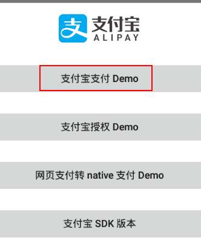


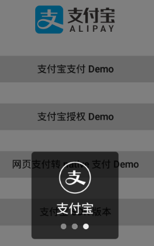


登录使用沙箱账号的买家账号进行支付：

（这一步是为了登录网页版查看测试用的买家账号的）

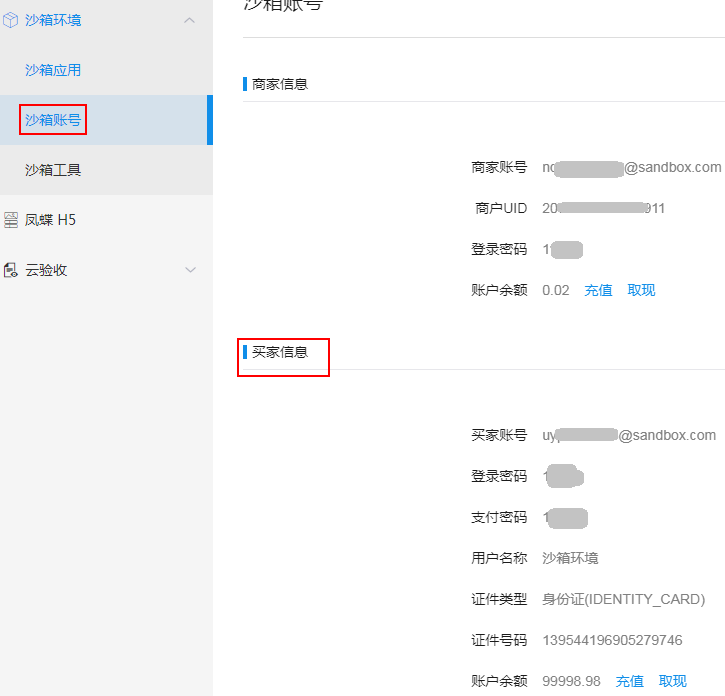


继续支付：

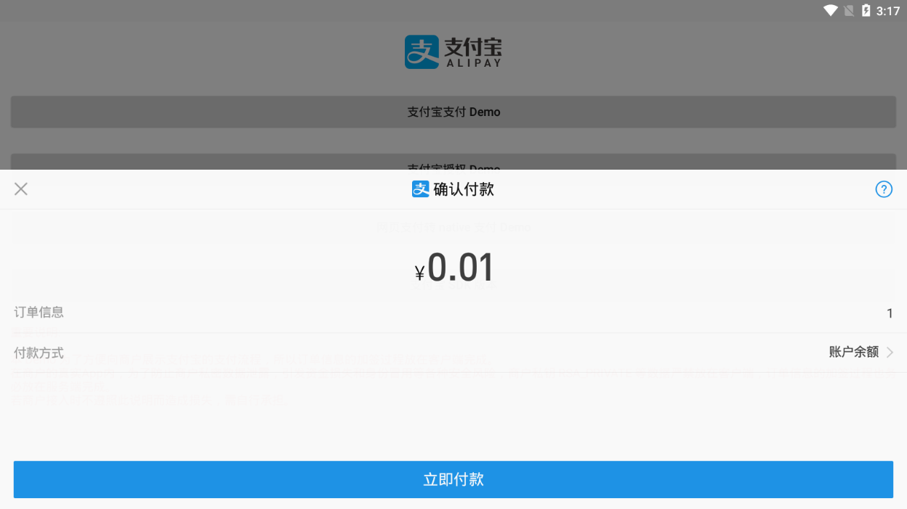

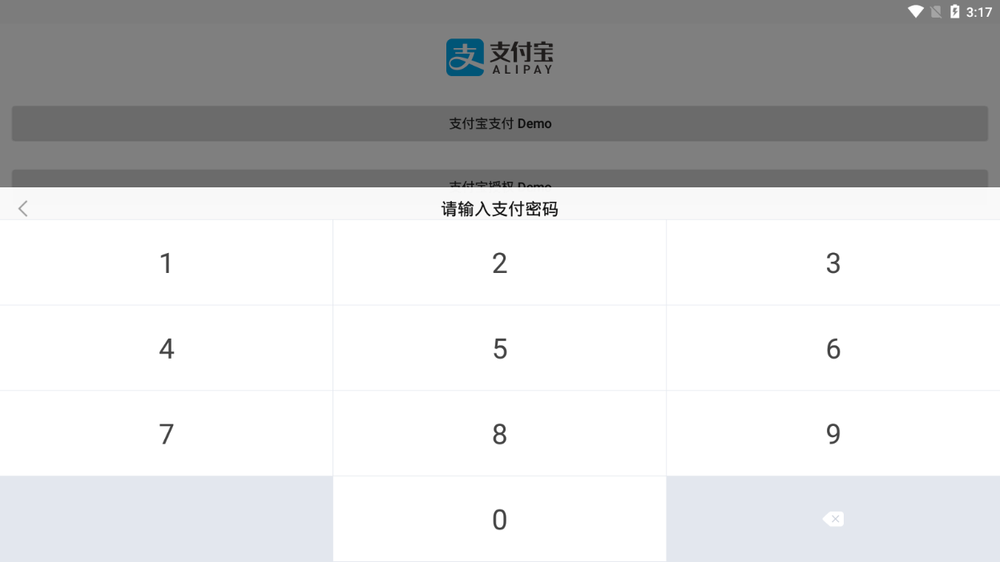

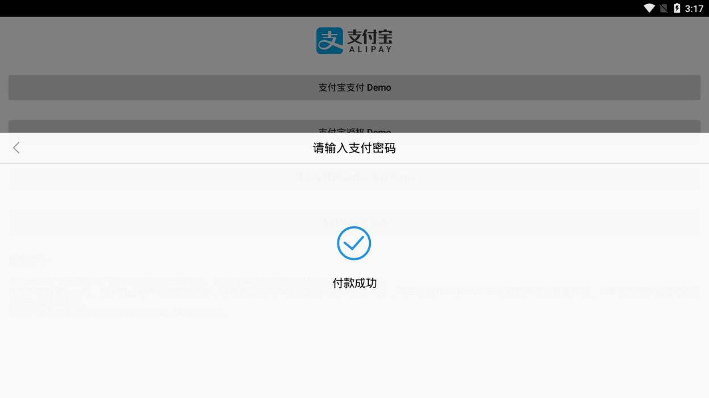

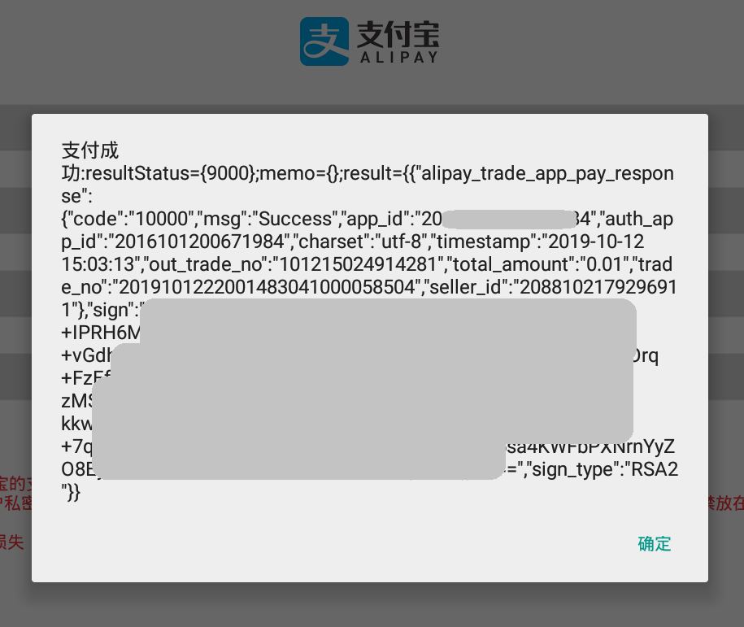


调试跟踪数据：

```json
"app_id" -> "2021102200872184"
"timestamp" -> "2016-07-29 16:55:53"
"biz_content" -> "{"timeout_express":"30m","product_code":"QUICK_MSECURITY_PAY","total_amount":"0.01","subject":"1","body":"我是测试数据","out_trade_no":"1012152245-1761"}"
"method" -> "alipay.trade.app.pay"
"charset" -> "utf-8"
"version" -> "1.0"
"sign_type" -> "RSA2"
```

```json
"app_id" -> "2021102200872184"
"timestamp" -> "2016-07-29 16:55:53"
"biz_content" -> "{"timeout_express":"30m","product_code":"QUICK_MSECURITY_PAY","total_amount":"0.01","subject":"1","body":"我是测试数据","out_trade_no":"101215243516617"}"
"method" -> "alipay.trade.app.pay"
"charset" -> "utf-8"
"version" -> "1.0"
"sign_type" -> "RSA2"
```


```html
app_id=2021102200872184&timestamp=2016-07-29+16%3A55%3A53&biz_content=%7B%22timeout_express%22%3A%2230m%22%2C%22product_code%22%3A%22QUICK_MSECURITY_PAY%22%2C%22total_amount%22%3A%220.01%22%2C%22subject%22%3A%221%22%2C%22body%22%3A%22%E6%88%91%E6%98%AF%E6%B5%8B%E8%AF%95%E6%95%B0%E6%8D%AE%22%2C%22out_trade_no%22%3A%221012152245-1761%22%7D&method=alipay.trade.app.pay&charset=utf-8&version=1.0&sign_type=RSA2&sign=GXgsKV3Hb0SrOHE%2FtempExxFFnomjUJHu1ZQOpd8JSk6NXnVy2I4FKVFPO0h8JNdnruZst2CZXUPnnkgVs5mmXSJA3IZQuQO4M%2FnTvEhNACzyxQkNhqLlAiAePXMt5bHqUlDDciDgQGdzpKfm2iIjNxS76b%2FJIFmkX85PMrcbrUNnhzokjq52Qb9wbLCh5GOxxxxxxxxxxxxxxxxxxxxqdsQmiqbhi0V8pW5lWF3weIF6E0aw%3D%3D
```


```html
app_id=2021102200872184&timestamp=2016-07-29+16%3A55%3A53&biz_content=%7B%22timeout_express%22%3A%2230m%22%2C%22product_code%22%3A%22QUICK_MSECURITY_PAY%22%2C%22total_amount%22%3A%220.01%22%2C%22subject%22%3A%221%22%2C%22body%22%3A%22%E6%88%91%E6%98%AF%E6%B5%8B%E8%AF%95%E6%95%B0%E6%8D%AE%22%2C%22out_trade_no%22%3A%221012152245-1761%22%7D&method=alipay.trade.app.pay&charset=utf-8&version=1.0&sign_type=RSA2&sign=GXgsKV3Hb0SrOHE%2FtempExxFFnomjUJHu1ZQOpd8JSk6NXnVy2I4FKVFPO0h8JNdnruZst2CZXUPnnkgVs5mmXSJA3IZQuQO4M%2FnTvEhNACzyxQkNhqLlAiAePXMt5bHqUlDDciDgQGdzpKfm2iIjNxS76b%2FJIFmkX85PMrcbrUNnhzokjq52Qb9wbLCh5GOxxxxxxxxxxxxxxxxxxxxqdsQmiqbhi0V8pW5lWF3weIF6E0aw%3D%3D
```


# 代码

使用的是支付宝SDK：

```groovy
implementation files('libs/alipaySdk-20180403.jar')
```


支付页面的代码：

```java
public class BuyVipActivity extends BaseActivity {
    private static final int MSG_GET_RECOVERHISTORY_SUCCESS = 555;
    private static final int MSG_GO_PAY_STATE_ACTIVITY = 387;
    private static final int MSG_LOAD_VIP_COMPLETE = 37;
    private static final int MSG_LOCAL_PAY_ERROR = 430;
    private static final int MSG_PAY_FAILED = 710;
    private static final int MSG_PAY_STOP_GET_PAY_INFO = 590;

    // 滚动数据：用户付费记录
    private LooperTextView looperTextView;
    private List<String> looperNotice;

    // VIP类型列表
    private RecyclerView rvVipList;

    // 付费价格
    private TextView tvPrice;

    // 联系手机
    private EditText etContactPhone;

    // 确认支付按钮
    private TextView tvbtnPay;

    private int productTypeNo = ProductTypeEnum.UNKOWN.getTypeno();
    private VipListAdapter vipListAdapter;

    protected int getLayoutId() {
        return R.layout.activity_buy_vip;
    }

    protected void initView() {
        super.initView();
        setToolbarTitle("订单支付").setToolbarLeftIcon(R.drawable.ic_arrow_back_white);
        this.etContactPhone = findViewById(R.id.etContactPhone);
        this.tvbtnPay = findViewById(R.id.tvbtnPay);
        this.tvPrice = findViewById(R.id.tvPrice);
        this.looperTextView = findViewById(R.id.looperTextView);
        this.vipListAdapter = new VipListAdapter();
        this.vipListAdapter.setOnVipSelectChangedListener(new OnVipSelectChangedListener() {
            public void onVipSelectedChanged(ProductData vipItemData) {
                tvPrice.setText("￥" + vipItemData.getCurrentprice());
            }
        });
        this.rvVipList = findViewById(R.id.rvVipList);
        this.rvVipList.setLayoutManager(new LinearLayoutManager(this));
        this.rvVipList.setAdapter(this.vipListAdapter);
        showProgressDialog();
        this.tvbtnPay.setOnClickListener(v -> onPayClick());
        this.productTypeNo = getIntent().getIntExtra("producttypeno", ProductTypeEnum.UNKOWN.getTypeno());
        if (this.productTypeNo == ProductTypeEnum.UNKOWN.getTypeno()) {
            finish();
        }
    }

    protected void onResume() {
        super.onResume();
        loadVipList();
        getRecoverHistory();
    }

    // 从服务端获取VIP类型
    public void loadVipList() {
        ThreadUtil.runOnMulti(() -> postUIMessage(MSG_LOAD_VIP_COMPLETE, 0, 0, HttpManager.getProducts(productTypeNo)));
    }

    public void processUIMessage(Message message) {
        super.processUIMessage(message);
        int msgWhat = message.what;
        if (msgWhat == MSG_LOAD_VIP_COMPLETE) {
            DataResponse<List<ProductData>> vipList = (DataResponse) message.obj;
            if (vipList.isOk()) {
                this.vipListAdapter.setList(vipList.getData());
                if (vipList.getData().size() > 0) {
                    this.vipListAdapter.selectItem(0);
                    this.tvPrice.setText("￥" + vipList.getData().get(0).getCurrentprice());
                }
            } else {
                showToast(vipList.getMessage());
            }
            dismissProgressDialog();
        } else if (msgWhat == MSG_GO_PAY_STATE_ACTIVITY) {
            Bundle data = message.getData();
            NavigateUtil.goOrderStatusActivity(AppApplication.getContext(), data.getString(c.e), data.getFloat("price"), data.getString("payorderno"));
            finish();
        } else if (msgWhat == MSG_LOCAL_PAY_ERROR) {
            String resultMsg = String.valueOf(message.obj);
            dismissProgressDialog();
            showToast(resultMsg);
        } else if (msgWhat == MSG_GET_RECOVERHISTORY_SUCCESS) {
            if (looperNotice == null || looperNotice.isEmpty()) {
                this.looperTextView.setTipList(null);
            } else {
                this.looperTextView.setTipList(looperNotice);
            }
        } else if (msgWhat == MSG_PAY_STOP_GET_PAY_INFO) {
            dismissProgressDialog();
        } else if (msgWhat == MSG_PAY_FAILED) {
            showToast(String.valueOf(message.obj));
        }
    }

    // 正在获取订单信息...
    public void showDlgGetOrderInfo() {
        showProgressDialog("", getResources().getString(R.string.tip_getting_order_info));
    }

    public void stopDlgGetOrderInfo() {
        postUIMessage(MSG_PAY_STOP_GET_PAY_INFO);
    }

    // 确认支付
    public void onPayClick() {
        String phone = this.etContactPhone.getText().toString().trim();
        if (TextUtils.isEmpty(phone)) {
            showToast("请填写联系方式！");
            return;
        }
        if (phone.length() > 14) {
            phone = phone.substring(0, 14);
        }
        ProductData vipType = this.vipListAdapter.getSelectedItem();
        if (vipType == null) {
            showToast("请您选择其中一项进行支付.");
            return;
        }

        // 正在获取订单信息...
        showDlgGetOrderInfo();

        final String contactNumber = phone;
        ThreadUtil.runOnMulti(new Runnable() {
            @Override
            public void run() {
                // 从服务器获取订单信息
                DataResponse<PayData> payData = HttpManager.getPayData(vipType.getProductSku(), contactNumber, PayEnum.ALIPAY, getPayDesc());
                stopDlgGetOrderInfo();
                if (!payData.isOk()) {
                    postUIMessage(MSG_PAY_FAILED, 0, 0, payData.getMessage());
                    return;
                }

                // 调用支付宝SDK支付
                String payOrderNo = payData.getData().getPayorderno();
                PayResult payResult = new PayResult(new PayTask(BuyVipActivity.this).payV2(payData.getData().getPayorder(), true));
                /*payResult的返回内容：
                resultStatus={6001};memo={用户取消};result={}
                 */
                String resultStatus = payResult.getResultStatus();
                if (TextUtils.equals(resultStatus, PayStateEnum.PAY_STATE_USER_CANCEL.getPayStateNo() + "")) {
                    onPayError(PayStateEnum.PAY_STATE_USER_CANCEL.getPayStateDesc());
                } else if (TextUtils.equals(resultStatus, PayStateEnum.PAY_STATE_NET_ERROR.getPayStateNo() + "")) {
                    onPayError(PayStateEnum.PAY_STATE_NET_ERROR.getPayStateDesc());
                } else if (!BuyVipActivity.this.redirecting.getAndSet(true)) {
                    Bundle data = new Bundle();
                    data.putString(c.e, vipType.getName());
                    data.putFloat("price", vipType.getCurrentprice());
                    data.putString("payorderno", payOrderNo);
                    postUIMessage(MSG_GO_PAY_STATE_ACTIVITY, data);
                }
            }
        });
    }

    public void onPayError(String resultMsg) {
        ThreadUtil.runOnMulti(new Runnable() {
            @Override
            public void run() {
                try {
                    Thread.sleep(1000);
                } catch (InterruptedException e) {
                    e.printStackTrace();
                }

                DataResponse<VipInfoData> responseBean = HttpManager.getVipInfo();
                if (responseBean.isOk()) {
                    CacheUtil.setVipInfo(responseBean.getData());
                }
            }
        });

        postUIMessage(MSG_LOCAL_PAY_ERROR, 0, 0, resultMsg);
    }

    private String getPayDesc() {
        StringBuilder buffer = new StringBuilder();
        if (PublicUtil.checkApkExist("com.eg.android.AlipayGphone")) {
            buffer.append("有 支付宝；");
        } else {
            buffer.append("无 支付宝；");
        }
        if (PublicUtil.checkApkExist("com.tencent.mm")) {
            buffer.append("有 微信。");
        } else {
            buffer.append("无 微信。");
        }
        return buffer.toString();
    }
}

```


注意支付的订单数据是通过**HttpManager**的接口 **getPayData** 函数获取，然后调用支付宝SDK的接口**payV2**唤起本地安装的支付宝APP进行支付的，然后根据 **PayResult** 返回状态判断是否支付成功。

```java
// 调用支付宝SDK支付
String payOrderNo = payData.getData().getPayorderno();
PayResult payResult = new PayResult(new PayTask(BuyVipActivity.this).payV2(payData.getData().getPayorder(), true));
```

订单信息也可以在客户端生成（本地调试测试时比较方便），但是通过服务端动态生成，可以提高安全性，保护私钥。


再看下**HttpManager**的代码：

```java
private static final String TAG = HttpManager.class.getSimpleName();
private static final String URL_FEEDBACK = "api/feedback";
private static final String URL_LOGIN = "api/login";
private static final String URL_ORDER_STATUS = "api/orderstate";
private static final String URL_PAY = "api/pay";
private static final String URL_PRODUCT_LIST = "api/productlistv2";
private static final String URL_RECOVERY_HISTORY = "api/recoverhistory";
private static final String URL_REGISTER = "api/register";
private static final String URL_VIP_INFO = "api/vipinfo";
private static final String URL_VIP_LIST = "api/viplist/v2";
private static final String URL_ZIXUN_INFO = "api/zixuninfo";


// 通过服务器动态生成订单信息，客户端也可以生成，主要是为了保护私钥
public static DataResponse<PayData> getPayData(String productSku, String contactPhone, PayEnum payEnum, String payDesc) {
    Map<String, String> param = new HashMap<>();
    param.put("token", CacheUtil.getToken());
    param.put("productsku", productSku);
    param.put("contactphone", contactPhone);
    param.put("payplatformno", payEnum.getPaycode() + "");
    param.put("paydesc", payDesc);
    String url = "http://www.xxxxx.com/recover/api/pay.php";
    DataResponse<PayData> result = new DataResponse<>();
    try {
        String response = HttpManager.post(url, param);
        if (TextUtils.isEmpty(response)) {
            return DataResponse.fail("-1", "请求失败");
        }
        return (DataResponse) GsonUtil.fromJson(response, new TypeToken<DataResponse<PayData>>() {
        }.getType());
    } catch (Exception e) {
        e.printStackTrace();
        return DataResponse.fail("-2", "网络错误");
    }
}

public static DataResponse<OrderStatusData> getOrderStatus(String payorder, PayEnum payEnum) {
    Map<String, String> param = new HashMap<>();
    param.put("token", CacheUtil.getToken());
    param.put("payorderno", payorder);
    String url = "http://www.xxxxx.com/recover/api/orderstate.php";
    DataResponse<OrderStatusData> result = new DataResponse<>();
    try {
        String response = HttpManager.post(url, param);
        if (TextUtils.isEmpty(response)) {
            return DataResponse.fail("-1", "请求失败");
        }
        return (DataResponse) GsonUtil.fromJson(response, new TypeToken<DataResponse<OrderStatusData>>() {
        }.getType());
    } catch (Exception e) {
        e.printStackTrace();
        return DataResponse.fail("-2", "网络错误");
    }
}

public static DataResponse<VipInfoData> getVipInfo() {
    Map<String, String> params = new HashMap<>();
    params.put("token", CacheUtil.getToken());
    String url = "http://www.xxxxx.com/recover/api/vipinfo.php";
    DataResponse<VipInfoData> result = new DataResponse<>();
    try {
        String response = HttpManager.post(url, params);
        if (TextUtils.isEmpty(response)) {
            return DataResponse.fail("-1", "请求失败");
        }
        return (DataResponse) GsonUtil.fromJson(response, new TypeToken<DataResponse<VipInfoData>>() {
        }.getType());
    } catch (Exception e) {
        e.printStackTrace();
        return DataResponse.fail("-2", "网络错误");
    }
}
```


# 总结

​	该方案属于个人签约式的方法，比较正规，但是需要注册营业执照，这块的时间和费用也不少，流水大的话可能会有手续费（支付宝、微信会收取），存在被风控的风险。后面会介绍免签约的方法。
