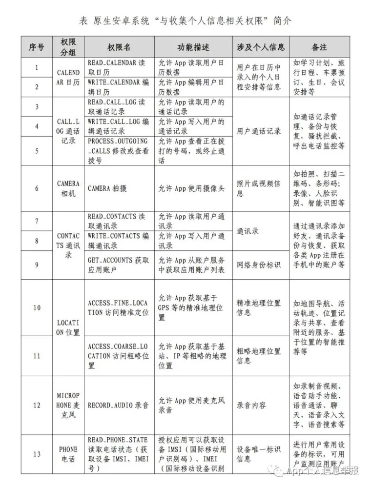
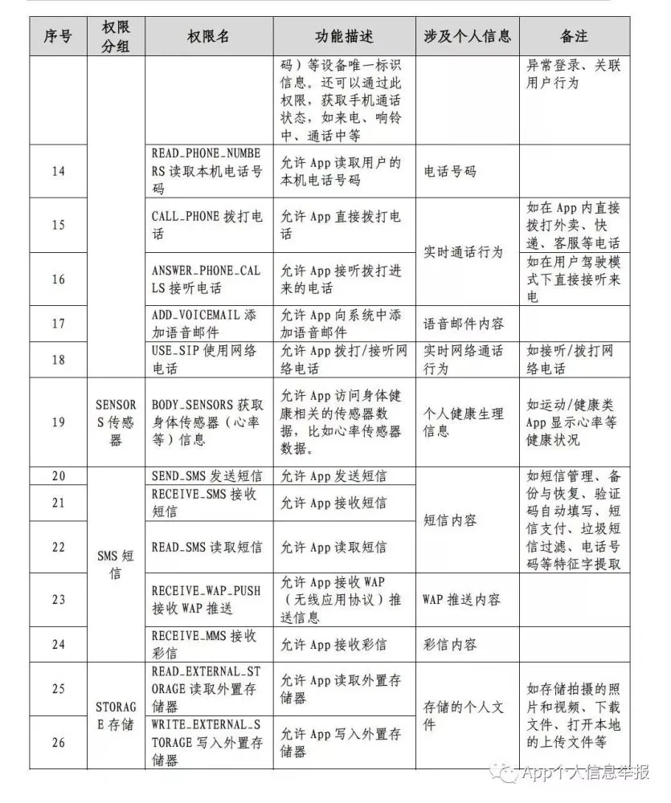
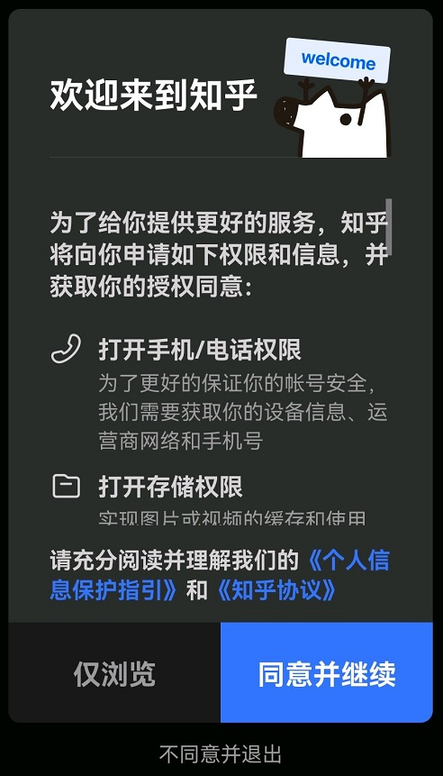
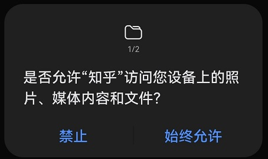

---
layout:		post
category:	"other"
title:		"一文读懂「APP违规违法使用收集个人信息治理工作」隐私合规隐私检测"
tags:		[Android]
---
- Content
{:toc}
**关键词**：APP违规违法收集使用个人信息、隐私合规、隐私检测

# 背景

> 近年来，移动互联网应用程序（App）得到广泛应用，在促进经济社会发展、服务民生等方面发挥了不可替代的作用。同时，App强制授权、过度索权、超范围收集个人信息的现象大量存在，违法违规使用个人信息的问题十分突出，广大网民对此反应强烈。落实《网络安全法》《消费者权益保护法》的要求，为保障个人信息安全，维护广大网民合法权益，中央网信办、工业和信息化部、公安部、市场监管总局决定，自2019年1月至12月，在全国范围组织开展App违法违规收集使用个人信息专项治理。
>
> --摘自[中央网信办、工业和信息化部、公安部、市场监管总局《关于开展App违法违规收集使用个人信息专项治理的公告》](http://www.cac.gov.cn/2019-01/25/c_1124042599.htm)》

其实APP违规违法收集使用个人信息的问题早已被诟病很久了，有部分网民可能已经麻木了，早已习以为常了。然而「存在的就一定合理吗」？还是有广大网民能清醒地认识到这一点，大量的投诉举报，问题日益突出。所以此举措出台，是一件利国利民的好政策，希望各个企业能够拥抱政策，配合落实，还互联网一片清净。

# 政策文件、机构组织

可以参考这个指南：[关于APP违法违规收集使用个人信息专项治理工作这有一份详尽的查询指南!](http://www.cac.gov.cn/2019-11/07/c_1574658334765452.htm)

## 四部联合

四部委指：中央网信办、工信部、公安部、市场监管总局四部门。

- 2019-01-25：[《关于开展App违法违规收集使用个人信息专项治理的公告》](http://www.cac.gov.cn/2019-01/25/c_1124042599.htm)（中央网信办、工信部、公安部、市场监管总局四部门联合发布，以下简称《公告》）
- 
- 2019-12-30：[《App违法违规收集使用个人信息行为认定方法》](http://www.cac.gov.cn/2019-12/27/c_1578986455686625.htm)（四部联合印发，下称《办法》）。

> 《方法》提出，征得用户同意前就开始收集个人信息或打开可收集个人信息的权限、实际收集的个人信息或打开的可收集个人信息权限超出用户授权范围等行为可被认定为“未经用户同意收集使用个人信息”。

## App专项治理工作组

​	为落实《公告》相关部署，受四部门委托，全国信息安全标准化技术委员会、中国消费者协会、中国互联网协会、中国网络空间安全协会成立**App违法违规收集使用个人信息专项治理工作组**（以下简称“**App专项治理工作组**”），具体推动App违法违规收集使用个人信息评估工作。

- 2019-05-06： [《App违法违规收集使用个人信息行为认定方法（征求意见稿）》](http://www.cac.gov.cn/2019-05/06/c_1124455735.htm)（App专项治理工作组），解读参考这个比较直观：[App监管再加码：《App违法违规收集使用个人信息行为认定方法（征求意见稿）》公布-中伦律师事务所](http://www.zhonglun.com/Content/2019/05-14/1204094033.html#)
- 2019年3月：App专项治理工作组发布[《App违法违规收集使用个人信息自评估指南》PDF](http://pip.tc260.org.cn/assets/wz/2019-03-02/f245cdf6-5455-44af-bf7c-aa1f797b4ef7.pdf)（如点击无反应，复制链接再下载）
- 

## 工信部

- 2019-11-06： **337号文**：[工业和信息化部关于开展APP侵害用户权益专项整治工作的通知](https://www.miit.gov.cn/jgsj/xgj/wjfb/art/2020/art_a2fc4363c4344a0e94831fd7bcf318d2.html) （打不开看这个：[工业和信息化部关于开展APP侵害用户权益专项整治工作的通知_百度百科](https://baike.baidu.com/item/工业和信息化部关于开展APP侵害用户权益专项整治工作的通知)）
- 2020-07-28： **164号文**：[工业和信息化部关于开展纵深推进APP侵害用户权益专项整治行动的通知](http://www.cac.gov.cn/2020-07/28/c_1597492913060262.htm)
- 2021-04-26：[公开征求对《移动互联网应用程序个人信息保护管理暂行规定（征求意见稿）》的意见](https://www.miit.gov.cn/jgsj/xgj/gzdt/art/2021/art_68251d4c11784e1bae41048117a8720d.html)

## 网信办

- **2019年11月** ：[关于APP违法违规收集使用个人信息专项治理工作这有一份详尽的查询指南!](http://www.cac.gov.cn/2019-11/07/c_1574658334765452.htm)
- 2021-03-22：[关于印发《常见类型移动互联网应用程序必要个人信息范围规定》的通知](http://www.cac.gov.cn/2021-03/22/c_1617990997054277.htm) [App能提取哪些个人信息？国家明确了!](https://mp.weixin.qq.com/s/nP5HpOSifmPSWBC4D0u7xA)

## 其他

- 

# 历史通报

- 2019-12-20：[关于侵害用户权益行为的APP（第一批）](http://www.gov.cn/xinwen/2019-12/20/content_5462577.htm)
- 2020年05月26日：[APP违法违规收集使用个人信息专项治理报告（2019）](http://www.cac.gov.cn/2020-05/26/c_1592036763304447.htm)
- 2020年07月25日：[2020年App违法违规收集使用个人信息治理工作启动会在京召开](http://www.cac.gov.cn/2020-07/25/c_1597240741055830.htm)
- 2020-05-17：[关于侵害用户权益行为的APP通报（2020年第一批）](http://www.gov.cn/xinwen/2020-05/17/content_5512332.htm)
- 2020-07-05：[关于侵害用户权益行为的APP通报（2020年第二批）](http://www.gov.cn/fuwu/2020-07/05/content_5524298.htm)
- 2020-07-24：[关于侵害用户权益行为的APP通报（2020年第三批）](http://www.gov.cn/xinwen/2020-07/24/content_5529777.htm)
- 2020-09-01：[关于侵害用户权益行为的APP通报（2020年第四批）](http://www.gov.cn/xinwen/2020-09/01/content_5539130.htm)
- 2020-11-10：[工业和信息化部关于下架侵害用户权益APP的通报](http://www.gov.cn/xinwen/2020-11/10/content_5560288.htm)
- 其他通报批次：[关于侵害用户权益行为的APP通报](http://sousuo.gov.cn/s.htm?q=%E5%85%B3%E4%BA%8E%E4%BE%B5%E5%AE%B3%E7%94%A8%E6%88%B7%E6%9D%83%E7%9B%8A%E8%A1%8C%E4%B8%BA%E7%9A%84APP%E9%80%9A%E6%8A%A5)

# 检测项

## 关于权限

​	APP该使用哪些权限，这个在2021-03-22[关于印发《常见类型移动互联网应用程序必要个人信息范围规定》的通知](http://www.cac.gov.cn/2021-03/22/c_1617990997054277.htm) [App能提取哪些个人信息？国家明确了!](https://mp.weixin.qq.com/s/nP5HpOSifmPSWBC4D0u7xA)里有提到，可以借鉴参考。

​	权限的使用，不能太离谱，如果APP不是这个类型但是提供的某个模块有相关功能，需要申请对应地权限，也可以解释得合理。但是不能申请与功能完全不相干的权限，否则就是超范围。

​	另外敏感权限的定义可以参考：[《App申请安卓系统权限机制分析与建议V1.0》](https://kuaibao.qq.com/s/20190528A0E5K500)，内容不再贴了，主要是26个敏感权限需要注意下。

 

# 如何自查自改

企业自查自改的办法可以：

- **参考头部企业的做法**
- **了解并解读政策文件自查自改**
- **借助第三方解决方案**

- [《App违法违规收集使用个人信息自评估指南》PDF](http://pip.tc260.org.cn/assets/wz/2019-03-02/f245cdf6-5455-44af-bf7c-aa1f797b4ef7.pdf)（App专项治理工作组发布，如点击无反应，复制链接再下载）

## 常见不合规参考

### 违规处理个人信息

主要是违规违法收集使用个人信息，主要问题有：

- 隐私政策协议描述不清，或隐私政策协议不容易找到需要超过 3 步才能找到；隐私政策协议可以参考后面的章节。
- 默认勾选同意隐私政策；
- 超范围收集使用个人信息（或申请无关权限）；
- 权限申请在隐私政策协议之前；
- 未经用户同意（提前）申请或者收集个人信息；
- 三方SDK列表未单独明示
- 申请敏感身份信息时未明确告知用户
- 存在个推功能（就是利用个人信息进行大数据分析的用户画像），但隐私政策里未说明存在该功能，且没有关闭该功能的选项（或用户点击关闭后实际并没有关闭，界面欺骗）

这点个人感觉知乎APP做的很巧妙，同时也符合规范。通常情况下，大部分APP的合规做法是，首次运行APP会先弹框隐私协议，并留有一个统一的勾选框，用户勾选同意进入后，会再提示权限申请的弹框，用户同意后再申请安卓的权限（此时有权限申请弹框），综合下来步骤很多。知乎的做法是，把隐私政策弹框去掉，放在权限申请的弹框里（这样用户也可以不用超过3步就能点开查看具体的隐私政策协议），还提供了不同意并退出的选项（这个是可以的），同意继续后，再进入权限申请弹框，这一步骤用户依然是可以拒绝的（用户拒绝不能退出哦，否则就是不合规了）。

也就是整体效果感知上，就两个弹框步骤，规范上也能说得通，大家可以借鉴参考。

### 设置障碍 频繁骚扰用户

主要问题有：

- APP强制、频繁、过度索取权限；
- 不给权限不让用：申请某权限，用户拒绝后，应用退出，或无限弹窗申请，导致应用无法正常使用；
- 个推功能不能关闭或关不掉；
- 账号注销难，不能在App内部注销，需要去官网注销；
- APP自启动或关联启动；

### 欺骗误导用户

主要问题有：

- 欺骗误导掩饰用户提供个人信息及使用目的；
- 欺骗误导用户下载APP；
- 广告关闭选项找不到、关不掉；
- APP中的广告，点击页面任意区域自动下载非用户所自愿下载APP；
- 凡是广告设计不合理容易误导误点，直接打开跳到一切非用户本意的广告或下载其他APP的情况；

### 应用分发责任不到位

这一条款有点连坐，但是政策的设计非常到位，打个比方，一款热门的应用品牌影响力也很高，网民用户都很信赖，但是APP里提供广告或者提供第三方APP的下载，如果这些广告或者第三方APP有问题，很容易让用户受到伤害。所以这块的监管是必须的，也是合理的，主要问题是：

- APP具有分发下载其他应用的功能，但未明示第三方APP的以下信息：APP的开发者信息、版本信息、权限列表及用途、收集使用个人信息的内容、目的、方式和范围等
  

## 隐私政策协议参考

这些是公开的，不是什么机密，可以借鉴参考。

- [隐私政策 - 法律条款——暴雪娱乐](https://cn.blizzard.com/zh-cn/legal/1c6ada91-4be1-4e5d-afb3-c44ace09a8d6/%E9%9A%90%E7%A7%81%E6%94%BF%E7%AD%96)
- 

## 借助第三方解决方案

- [App个人信息保护合规评估工具](https://zcpt.cesidsat.com/cms/index)（这个是由APP专项治理工作组、中国电子技术标准化研究院提供的，本工具仅为企业合规实践提供参考，评估结果不能作为判断是否合规的依据）
- [合规测评_等保测评_三级等保认证_等保过检加固_ 网易易盾](https://dun.163.com/product/compliance-detect)（工具结合人工审核，比较靠谱）
- [史宾格安全及隐私合规平台 - 百度安全](https://anquan.baidu.com/product/appprivacy) 
- [爱加密-安全服务|个人信息保护合规评估](https://www.ijiami.cn/userinfotraining) 
- [产品与服务-隐私信息合规监测 - 加固保](https://jiagu.360.cn/#/global/details/privacy) 
- 通付盾-移动应用安全合规工具箱

# 总结

还有一个参考做法，就是要**以人为本**，以人民为本的思路。这个可能说的有点大了，但是App违规违法收集的这个政策来源就是因为网民苦这些问题久矣，投诉的很多。拿最近在整顿的开屏广告来说，App一打开就是开屏广告，是不是很扰民？很多中老年人根本找不到应用本身的入口，点开就是广告，容易误操作，给他们带来了很多的困扰。那这个就是以人为本，这次整顿很是大快人心。

# 参考

- [App专项治理工作组](https://pip.cybersac.cn/jbxt/privacy/index)
- 公号关注：**APP个人信息保护治理** 中国信息通信研究院 APP个人信息保护治理的工作动态、通知公告等相关信息发布。
- 公号关注：**App个人信息举报**  中国网络空间安全协会 受理对违法违规收集使用个人信息的举报；发布对App隐私政策和个人信息收集情况的评估及处置结果。
- 公号关注：**12315** 国家市场监督管理总局信息中心，可以投诉举报。

## 检测依据和标准

- [《移动互联网应用程序个人信息保护管理暂行规定（征求意见稿）》](https://www.miit.gov.cn/jgsj/xgj/gzdt/art/2021/art_68251d4c11784e1bae41048117a8720d.html)
- 全国信息安全标准化技术委员会《GB/T 35273-2020-信息安全技术 个人信息安全规范》
- 全国信息安全标准化技术委员会《信息安全技术 移动互联网应用程序（App）收集个人信息基本规范(征求意见稿)》
- 全国信息安全标准化技术委员会《移动互联网应用程序（App）收集使用个人信息自评估指南》
- 全国信息安全标准化技术委员会《移动互联网应用程序（APP）系统权限申请使用指引(征求意见稿)》
- App专项治理工作组《App违法违规收集使用个人信息自评估指南》
- APP专项治理工作组《App申请安卓系统权限机制分析与建议》
- 工业和信息化部《关于开展APP侵害用户权益专项整治工作的通知（工信部信管函〔2019〕337号）》
- 工业和信息化部《关于开展纵深推进APP侵害用户权益专项整治行动的通知（工信部信管函〔2020〕164号）》
- 《常见类型移动互联网应用程序必要个人信息范围规定》
- 国家互联网信息办公室《个人信息出境安全评估办法（征求意见稿）》
- 中国信通院《小程序个人信息保护研究报告》
- 《中华人民共和国网络安全法》
- 《个人信息安全规范》 --中国版的GDPR
- 《中华人民共和国网络安全法》
- 《中华人民共和国消费者权益保护法》
- 《App违法违规收集使用个人信息行为认定方法》
- 《信息安全技术 个人信息安全规范》（GB/T 35273-2020）
- 《移动互联网应用程序（App）收集使用个人信息自评估指南》（2020）
- 《工业和信息化部关于开展纵深推进APP侵害用户权益专项整治行动的通知》