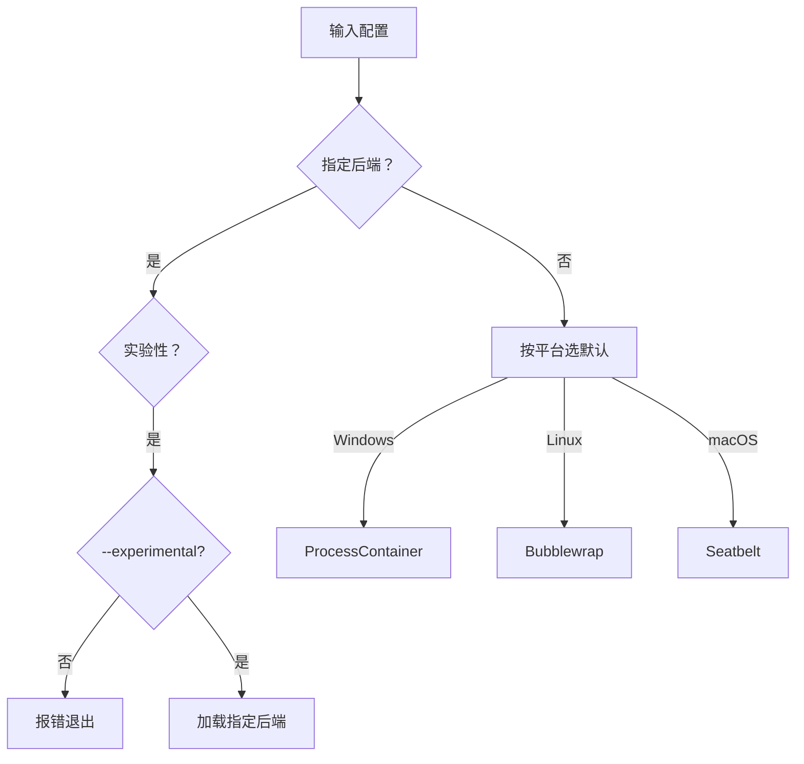

## 背景：AI Agent 越强大，越需要边界

随着 AI Agent 变得越来越自主——自动写代码、访问文件、执行多步骤任务——它们也变得难以预测和控制。一次小小的误用，就可能导致数据泄露或越权操作。这是 AI Agent 在企业落地时面临的核心矛盾：**能力越强，风险越大**。

过去一年，行业内解决 Agent 安全的主流思路是"**沙箱 + 鉴权**"：把 Agent 关在沙箱里运行，然后用 API 级别的权限控制限制其行为。但这种方案的问题是——沙箱是"全有或全无"的，Agent 要么关在笼子里什么都做不了，要么放出来就毫无约束，缺少**细粒度的、可按场景动态调整的权限边界**。

微软在 Build 2026 上发布的 **Microsoft Execution Containers（MXC）**，正是为了解决这个问题。MXC 不仅是一个概念，更是一个**已开源的、跨平台的、生产可用的沙箱引擎**——代码仓库 [github.com/microsoft/mxc](https://github.com/microsoft/mxc) 使用 Rust 构建，提供 TypeScript SDK，截至目前获得 700+ Stars。

> 本文基于 Petri IT 的报道文章 和 **mxc 开源仓库的源代码、文档与架构**，从技术实现层面深入分析 MXC 的设计与能力边界。

---

## 一、MXC 架构总览

### 1.1 整体设计

MXC 采用**分层架构**，核心是一个用 Rust 编写的原生沙箱引擎，上层封装为 TypeScript SDK 以提供开发者友好的 API：

```
┌─────────────────────────────────────────────┐
│              TypeScript SDK                  │
│   @microsoft/mxc-sdk (npm 包)               │
│   spawnSandboxFromConfig / Stateful API     │
├─────────────────────────────────────────────┤
│              JSON 配置 Schema                │
│   0.5.0-alpha / 0.6.0-alpha / 0.7.0-dev     │
├─────────────────────────────────────────────┤
│          Rust 原生沙箱引擎                    │
│   wxc-exec (Windows) / lxc-exec (Linux)     │
│   mxc-exec-mac (macOS)                      │
├─────────────────────────────────────────────┤
│     ┌──────┬──────┬──────┬──────┐           │
│     │Windows│Linux │macOS │ Micro│           │
│     │Native │Bwrap │Seat- │  VM  │           │
│     │Contain│/LXC  │belt  │/Hyper│           │
│     └──────┴──────┴──────┴──────┘           │
└─────────────────────────────────────────────┘
```

| 层级 | 组件 | 说明 |
|------|------|------|
| **SDK** | `@microsoft/mxc-sdk` | TypeScript 包，提供 `spawnSandboxFromConfig` 等高级 API |
| **配置层** | JSON Schema | 版本化管理（v0.5.0 → v0.6.0 → v0.7.0-dev），定义执行参数和安全策略 |
| **原生层** | Rust 二进制 | 各平台独立编译：`wxc-exec.exe`(Windows)、`lxc-exec`(Linux)、`mxc-exec-mac`(macOS) |
| **后端层** | 8 种沙箱引擎 | 按平台选择最合适的隔离技术 |

### 1.2 跨平台支持矩阵

MXC 并非 Windows 独占——它是一套**跨平台抽象层**，在不同操作系统上选择各自平台的原生隔离技术：

| 平台 | 最低版本 | 默认后端 | 备选后端 |
|------|---------|---------|---------|
| **Windows 11 24H2+** | 已验证 25H2 | `processcontainer` | `windows_sandbox`, `wslc`, `microvm`, `hyperlight`, `isolation_session` |
| **Linux x64 / ARM64** | — | `bubblewrap` | `lxc`, `microvm`, `hyperlight` |
| **macOS ARM64 / x64** | Schema 0.6.0-alpha+ | `seatbelt` | — |

> ⚠️ **processcontainer**（Windows 默认后端）需要 Windows Build 26100（24H2）；**isolation_session** 需要 Build 26300.8553（Insider Preview）。

---

## 二、八种隔离后端的深度对比

MXC 集成了 **8 种不同的沙箱后端**，这是它与市面上大多数沙箱方案最显著的差异——不是绑定特定技术，而是在统一的配置接口下抽象出多种实现：

### 2.1 后端一览

| 后端 | 平台 | 状态 | 技术原理 | 隔离粒度 |
|------|------|------|---------|---------|
| **ProcessContainer** | Windows | ✅ 稳定 | Windows AppContainer / BaseContainer，基于内核安全对象 | 进程级 |
| **Bubblewrap** | Linux | ✅ 稳定 | Linux 用户命名空间 + cgroups + seccomp，无 root 依赖 | 进程级 |
| **LXC** | Linux | ✅ 稳定 | Linux Container 标准方案，完整内核命名空间隔离 | 容器级 |
| **Seatbelt** | macOS | 🔬 实验 | macOS Seatbelt 沙箱规则（sandbox_init + sandbox.sb） | 进程级 |
| **Windows Sandbox** | Windows | 🔬 实验 | 轻量 Windows VM，基于容器 + GPU 虚拟化 | 虚拟机级 |
| **WSLC** | Windows | 🔬 实验 | WSL Container，在 WSL 环境中运行 Linux 负载 | 容器级 |
| **MicroVM (NanVix)** | 跨平台 | 🔬 实验 | 极简微虚拟机，使用 KVM/WHyper-V 运行最小内核 | 虚拟机级 |
| **Hyperlight** | 跨平台 | 🔬 实验 | 微软开源的轻量虚拟化引擎（基于 KVM/WHyper-V） | 虚拟机级 |
| **IsolationSession** | Windows | 🔬 实验 | Windows 会话级隔离，独立桌面会话运行 | 会话级 |

> 实验性后端需要通过 `{ experimental: true }` 或 CLI `--experimental` 标志显式启用。

### 2.2 后端选择的决策逻辑



这种"平台默认 + 可选实验后端"的设计，让开发者可以**从简单到复杂渐进式选择隔离强度**：本地调试用 ProcessContainer/Bubblewrap，生产场景可升级到 MicroVM/IsolationSession。

### 2.3 策略模型对比

不同的后端支持的策略粒度不完全相同：

| 策略维度 | ProcessContainer | Bubblewrap | LXC | Seatbelt | MicroVM |
|---------|:---------------:|:----------:|:---:|:--------:|:-------:|
| 文件系统只读路径 | ✅ | ✅ | ✅ | ✅ | ✅ |
| 文件系统读写路径 | ✅ | ✅ | ✅ | ✅ | ✅ |
| 文件系统拒绝路径 | ❌ (未实现) | ✅ | ✅ | ✅ | ✅ |
| 网络出站允许 | ✅ | ✅ | ✅ | ❌ | ✅ |
| 网络出站阻止 | ❌ (未实现) | ✅ | ✅ | ❌ | ✅ |
| 主机过滤 | ❌ (未实现) | ✅ | ✅ | ❌ | ✅ |
| 代理配置 | ✅ | ✅ | ✅ | ❌ | ✅ |
| 剪贴板控制 | ✅ | ✅ | ✅ | ✅ | ✅ |
| 显示访问 | ✅ | ✅ | ✅ | ✅ | ✅ |
| GUI 访问 | ✅ | ✅ | ✅ | ✅ | ✅ |

> 注意到 Windows 的 ProcessContainer 在网络策略方面当前**能力有限**——出站阻止、主机过滤等尚未实现，这与 macOS 的 Seatbelt 在网络策略上同样受限相呼应。微软在 README 中明确表示这些会在后续迭代中解决。

---

## 三、策略模型与 JSON Schema

### 3.1 Schema 版本化设计

MXC 使用**版本化的 JSON Schema** 定义沙箱配置，当前有三个版本：

| Schema 版本 | 状态 | 说明 |
|------------|------|------|
| `0.5.0-alpha` | 稳定 | 初始版本，基础容器和网络策略 |
| `0.6.0-alpha` | **稳定（当前推荐）** | 跨平台支持（macOS）、新策略维度 |
| `0.7.0-dev` | 开发中 | 实验性后端、状态感知生命周期 API |

### 3.2 策略模型详解

一个完整的 MXC 配置包含以下策略域：

```json
{
  "version": "0.6.0-alpha",
  "process": {
    "commandLine": "python -c \"print('hello from sandbox')\"",
    "workingDirectory": "/tmp"
  },
  "filesystem": {
    "readonlyPaths": [
      "/usr/bin",
      "/usr/lib"
    ],
    "readwritePaths": [
      "/tmp/agent-workdir"
    ],
    "deniedPaths": [
      "/etc/passwd",
      "/home/*/.ssh"
    ]
  },
  "network": {
    "allowOutbound": false,
    "allowHost": true,
    "blockOutbound": ["*.malicious.com"],
    "proxy": {
      "server": "http://proxy.company.com:8080",
      "bypass": ["*.local"]
    }
  },
  "ui": {
    "clipboard": "readonly",
    "displayAccess": "denied",
    "guiAccess": "denied"
  },
  "timeoutMs": 30000
}
```

| 策略域 | 策略项 | 说明 |
|--------|--------|------|
| **filesystem** | `readonlyPaths` | Agent 可读的文件路径列表 |
| | `readwritePaths` | Agent 可读写的文件路径列表 |
| | `deniedPaths` | 禁止访问的文件路径（部分后端已实现） |
| **network** | `allowOutbound` | 是否允许出站网络连接 |
| | `blockOutbound` | 阻止访问的域名/IP |
| | `allowHost` | 是否允许访问宿主机网络 |
| | `proxy` | HTTP 代理配置（macOS 不支持） |
| **ui** | `clipboard` | 剪贴板访问控制（`readonly`/`writeonly`/`denied`） |
| | `displayAccess` | 是否允许访问显示输出 |
| | `guiAccess` | 是否允许创建 GUI 窗口 |

### 3.3 策略辅助函数

SDK 内置了几组实用的策略辅助函数：

```typescript
import {
  getAvailableToolsPolicy,
  getTemporaryFilesPolicy,
} from '@microsoft/mxc-sdk';

// 自动检测当前环境的工具链路径
const tools = getAvailableToolsPolicy(process.env);
// → { readonlyPaths: ['/usr/bin', '/usr/local/bin', ...] }

// 安全的临时文件工作目录
const temp = getTemporaryFilesPolicy();
// → { readwritePaths: ['/tmp/mxc-xxxxx'] }
```

这些辅助函数会自动适配当前系统环境（如 Windows、Linux 的不同工具链路径），降低策略编写的工作量。

---

## 四、TypeScript SDK 与集成模式

### 4.1 安装与初始化

```bash
npm install @microsoft/mxc-sdk
```

### 4.2 一次性执行（One-Shot）

适合简单命令、单次代码执行场景：

```typescript
import {
  spawnSandboxFromConfig, createConfigFromPolicy,
  getAvailableToolsPolicy, getTemporaryFilesPolicy,
  getPlatformSupport,
} from '@microsoft/mxc-sdk';

// 检查平台是否支持
if (!getPlatformSupport().isSupported) {
  throw new Error('MXC not available on this host');
}

// 构建策略驱动的容器配置
const tools = getAvailableToolsPolicy(process.env);
const temp  = getTemporaryFilesPolicy();

const config = createConfigFromPolicy({
  version: '0.6.0-alpha',
  filesystem: {
    readonlyPaths:  tools.readonlyPaths,
    readwritePaths: temp.readwritePaths,
  },
  network: { allowOutbound: false },
  timeoutMs: 30_000,
});

config.process!.commandLine = 'python -c "print(\'hello from sandbox\')"';

const child = spawnSandboxFromConfig(config, { usePty: false });
child.stdout!.on('data', (d) => process.stdout.write(d));
child.on('close', (code) => console.log('exit:', code));
```

### 4.3 状态感知沙箱生命周期（Stateful API）

适用长时间运行、多步骤操作的 AI Agent 场景：

```typescript
import {
  provisionSandbox,
  startSandbox,
  execInSandboxAsync,
  stopSandbox,
  deprovisionSandbox,
} from '@microsoft/mxc-sdk';

// 五阶段生命周期
const id = await provisionSandbox(config);  // 1. 预配（分配资源）
await startSandbox(id);                      // 2. 启动（初始化进程）
const result = await execInSandboxAsync(     // 3. 执行（运行命令）
  id,
  'analyze-log --path /tmp/agent-workdir/data.json'
);
await stopSandbox(id);                       // 4. 停止（挂起进程）
await deprovisionSandbox(id);                // 5. 解除预配（释放资源）
```

**设计思考**：stateful API 将沙箱生命周期拆解为 5 个独立阶段，而非简单的"创建 → 执行 → 销毁"。这种设计的优势在于：

- **资源预配与分离**：provision 阶段预先分配容器资源，start 阶段才真正启动进程，中间可做策略注入
- **执行结果的保留**：stop 不会销毁容器，只是挂起进程，exec 可多次调用共享状态
- **中间状态的归零**：deprovision 确保沙箱内容不可恢复，用于敏感数据清理

这对于需要运行多步推理的 AI Agent 来说是核心设计——Agent 可能需要在同一个沙箱内执行代码→读取结果→再执行下一步代码。

### 4.4 CLI 用法

MXC 也提供了原生 CLI 二进制，可用于调试和 CI/CD 场景：

```bash
# Windows
wxc-exec.exe config.json

# 或 base64 编码配置（适合嵌入脚本）
wxc-exec.exe --config-base64 <base64-encoded-json>

# 启用调试输出
wxc-exec.exe --debug config.json

# Linux
./lxc-exec config.json

# macOS（实验性）
./mxc-exec-mac --experimental config.json
```

---

## 五、Windows 的两个隔离级别

回到操作系统层面的隔离模型。MXC 在 Windows 上提供了两端隔离光谱：

### 5.1 进程隔离（Process Isolation）—— ProcessContainer

这是轻量级的隔离模式。Agent 和用户在同一会话中运行，但通过**策略层**限制其行为。底层基于 **Windows AppContainer / BaseContainer** 机制——这是 Windows 内置的进程安全对象模型。

管理员可以配置的策略：

- 指定文件路径为**只读**或**读写**
- 限制对**浏览器**和**屏幕捕获**的访问
- 限制对**位置数据**的访问
- 限制对其他**应用程序**的调用

### 5.2 会话隔离（Session Isolation）—— IsolationSession

这是强隔离模式。Agent 的整个执行上下文与用户桌面**物理分离**——用户看到的桌面是用户的，Agent 运行的"窗口"是 Agent 的，两者之间不共享 UI、剪贴板或输入设备。

防御四类攻击向量：

1. **UI 欺骗（UI Spoofing）**——Agent 无法伪造对话框诱导用户授权
2. **输入注入（Input Injection）**——Agent 无法模拟键盘/鼠标输入执行越权操作
3. **跨会话数据泄漏（Cross-Session Data Leakage）**——Agent 会话数据不会泄漏到用户会话
4. **权限滥用**——Agent 无法访问未授权的系统资源

### 5.3 隔离强度 vs 性能代价

| 隔离级别 | 对应后端 | 隔离强度 | 启动延迟 | 内存开销 | 适用场景 |
|---------|---------|---------|---------|---------|---------|
| 进程级 | ProcessContainer / Bubblewrap | ⭐⭐ | 毫秒级 | ~10MB | 自动化脚本、工具调用 |
| 容器级 | LXC / WSLC | ⭐⭐⭐ | 秒级 | ~100MB | 多步骤 Agent、包安装 |
| 虚拟机级 | MicroVM / Hyperlight / Windows Sandbox | ⭐⭐⭐⭐ | 数秒 | ~500MB+ | 高风险代码、不可信第三方 |
| 会话级 | IsolationSession | ⭐⭐⭐⭐⭐ | 秒级 | 依赖于后端 | 企业级自主 Agent |

---

## 六、Agent 365：企业安全栈的全面集成

MXC 本身只是隔离引擎，真正让它企业级可用的，是 **Agent 365** 这套集成框架。

### 6.1 四层企业安全栈

| 微软产品 | 在 Agent 365 中的角色 |
|---------|---------------------|
| **Microsoft Intune** | 设备级策略下发——集中管控 Agent 的隔离策略和权限 |
| **Microsoft Entra** | 身份和访问管理——Agent 拥有可溯源的云身份 |
| **Microsoft Defender** | 运行时威胁保护——监控 Agent 行为，检测异常 |
| **Microsoft Purview** | 数据治理与合规审计——Agent 活动全程可追溯 |

### 6.2 身份绑定：区分"人"和"Agent"的关键

> "超出隔离本身，每个 Agent 活动都必须可归因、可治理。Windows 为 Agent 分配一个本地 ID 或由 Entra 支持的云预配身份，并将容器内的所有活动归属到该身份，从而清晰区分人类操作和 Agent 操作。"
>
> — **Pavan Davuluri**，微软执行副总裁，Windows + Devices

这段话点出了 MXC 设计的核心理念：**隔离是基础，但问责才是关键**。仅仅把 Agent 关起来是不够的，你还得知道 Agent 做了什么事、用谁的身份做的、在什么上下文中做的。

MXC + Entra 的身份绑定机制在设计上有几个关键点：

- **可归因性**：每个 Agent 操作都绑定到一个可溯源的 Entra 身份或 Windows 本地 ID
- **可区分性**：操作系统能清晰区分"用户正在做"和"Agent 替用户做"的两类操作
- **可审计性**：Purview 记录 Agent 的完整活动日志，支持事后审计和合规审查

### 6.3 运行时安全监控

Defender for Endpoint 扩展了监控范围，将 **MXC 沙箱内的活动**纳入安全检测覆盖：

- 检测 Agent 进程的异常行为模式
- 识别越权尝试（如试图访问 deniedPaths 定义的文件）
- 沙箱逃逸攻击检测
- 异常网络连接告警

---

## 七、OpenClaw：用实践检验边界

MXC 的预映版能够这么快出来，离不开与 **OpenClaw** 的合作。OpenClaw 是一个开源的 AI Agent 框架，它的创始人主动联系微软，双方合作将 MXC 落地为原生 Windows App，在受控边界内实现了高度自主的 Agent 行为。

这个合作项目的意义在于：

1. **验证了 MXC 的可行性和安全性**——一个第三方 Agent 框架在 MXC 内成功运行
2. **展示了新的操作系统设计范式**——操作系统正从"运行程序的平台"转变为"管理智能行为的平台"
3. **提供了参考实现**——其他 Agent 框架开发者可以参考 OpenClaw 与 MXC 的集成方式
4. **暴露了 API 缺口**——早期集成过程中发现的问题驱动了 MXC SDK 的功能完善

---

## 八、当前状态与限制

### 8.1 可用性

| 功能 | 状态 | 可用时间 |
|------|------|---------|
| MXC 沙箱引擎（Rust + SDK） | 开源 | **现在**（github.com/microsoft/mxc） |
| npm 包 `@microsoft/mxc-sdk` | 已发布 | **现在** |
| Agent 365（Entra/Defender/Purview 集成） | 即将推出 | **2026 年 7 月** |

### 8.2 已知限制

微软在 README 中给出了坦诚的预警：

- **早期预览代码**：当前是"早期预览"，底层沙箱仍在持续开发中
- **过于宽松的默认策略**：SDK 生成的某些默认策略过于宽松，正式发布前会收紧
- **不可视为安全边界**：**"No MXC profiles should be treated as security boundaries currently."**——当前版本不应被当作正式的安全边界
- **策略覆盖不完整**：Windows 后端尚未支持 `deniedPaths`、`blockOutbound` 等策略维度
- **macOS 实验性**：macOS Seatbelt 后端只能通过 `--experimental` 启用，网络策略不可用
- **ARM64 支持有限**：Windows ARM64 仅已验证 24H2+ 的特定构建版本

### 8.3 与主流沙箱方案的对比定位

| 方案 | 适用范围 | 隔离粒度 | 策略模型 | 企业集成 | 开源 |
|------|---------|---------|---------|---------|:----:|
| **MXC** | Windows/Linux/macOS | 进程→会话→VM 可调 | JSON Schema + TypeScript SDK | Intune/Entra/Defender/Purview | ✅ MIT |
| **gVisor** | Linux | 应用内核 | 系统调用拦截 | 无内置 | ✅ |
| **Firecracker** | Linux | 微 VM | 完整 VM 隔离 | 无内置 | ✅ |
| **Docker** | Linux/Windows | 容器 | 内核命名空间 | Docker EE | ✅ |
| **NSJail** | Linux | 进程 | cgroups + ns + seccomp | 无内置 | ✅ |

---

## 九、总结与展望

Microsoft Execution Containers 代表了 AI Agent 安全领域的一次**基础设施级创新**。从开源仓库 `microsoft/mxc` 可以看到它的完整技术轮廓：

### 技术层面

- **Rust 原生引擎**：高性能、跨平台，编译为原生二进制，无运行时依赖
- **8 种沙箱后端**：从 AppContainer 到微 VM，覆盖进程→容器→虚拟机→会话的全隔离光谱
- **JSON 策略模型**：版本化管理，文件/网络/UI 策略可逐项配置
- **双 API 模式**：One-Shot 适合代码执行，Stateful 适合长期运行的 Agent

### 生态层面

- **TypeScript SDK**：`@microsoft/mxc-sdk` npm 包，开发者熟悉的编程模型
- **Agent 365 集成**：Intune + Entra + Defender + Purview 形成完整的企业安全闭环
- **OpenClaw 验证**：第三方 Agent 框架成功落地，证明可行性和可集成性

### 核心价值

MXC 解决了三个核心痛点：

1. **细粒度策略**——不是"能/不能"的二元选择，而是可逐项配置的文件、网络、应用访问策略
2. **自适应隔离**——从 Box 内的进程隔离到独立的会话隔离，按风险等级灵活选择
3. **企业级可管理**——通过 Intune、Entra、Defender、Purview 形成完整的策略、身份、安全、合规闭环

对于正在把 AI Agent 引入企业的工作流、开发者和 IT 管理者来说，MXC 提供了一条安全可行的路径：**让 Agent 足够强大，又足够可控**。

---

## 参考资料

- **MXC 开源仓库**（权威参考）：Rust 源码、TypeScript SDK、文档。→ https://github.com/microsoft/mxc
- **原文报道**：How Microsoft Execution Containers Define Boundaries for AI Agents — Petri IT Knowledgebase。→ https://petri.com/microsoft-execution-containers-boundaries-ai-agents/
- **Microsoft Scout**：Autonomous AI Agent with Enterprise Security Controls。→ https://petri.com/microsoft-scout-autonomous-ai-agent-enterprise-security/
- **OpenClaw**：开源 AI Agent 框架。→ https://github.com/openclaw/openclaw
- **npm 包**：`@microsoft/mxc-sdk`。→ https://www.npmjs.com/package/@microsoft/mxc-sdk
