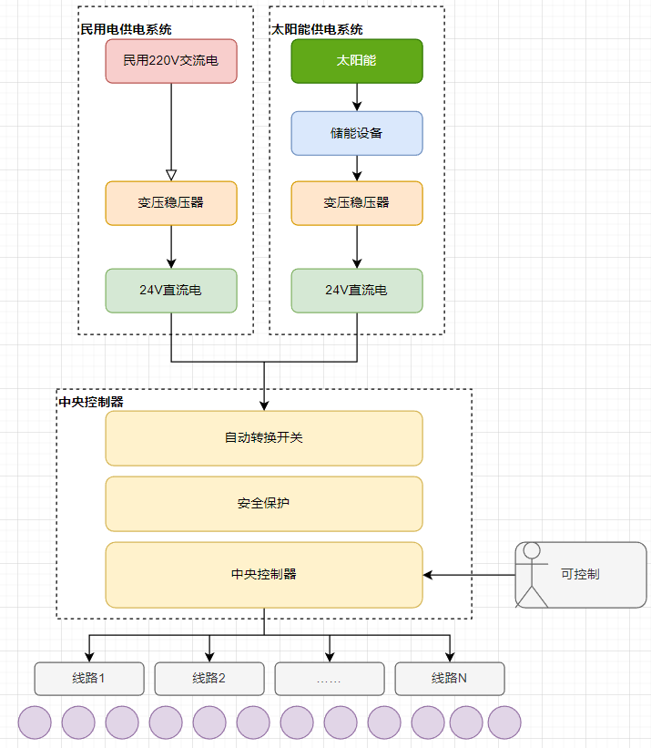

---
layout:		post
category:	"other"
title:		"装修"
tags:		[]
---
- Content
{:toc}

# 双供电系统

需求：家装电路设计，考虑双供电系统，分别是：民用电（220V的交流电），太阳能。

要求： 

1. 该双供电系统需要有一个开关来切换任意一个供电系统，这个开关可以人为切换，也可以根据太阳能储能设备的电量自动切换。 
2. 该双供电系统统一输出24V直流电，两个供电系统都需要配备一个电压转换设备。
3.  太阳能供电系统需要配备一个储能设备，用于储能。
4. 家用所有照明设备统一使用24V直流电，一律使用该双供电系统。
5. 照明设备的总线路开关按照楼层划分，一层楼有一个总控，每个设备有自己的控制开关（物理开关或感应开关或智能控制均可）。

思路：

设备：

| 设备类型                         | 设备推荐                                                     | 功能描述                                                     |
| -------------------------------- | ------------------------------------------------------------ | ------------------------------------------------------------ |
| 太阳能电池板                     | 高效率太阳能电池板（如LG NeON R或Trina Solar）               | 提高太阳能系统的发电效率，确保在有限的空间内最大化能量产出。 |
| 自动转换开关                     | ATS（自动转换开关）或智能电源管理系统                        | 根据太阳能储能设备的电量自动切换供电源，允许用户手动切换。   |
| AC/DC电源适配器                  | Mean Well LRS-350-24                                         | 将220V交流电转换为24V直流电，供照明设备使用。                |
| 太阳能逆变器                     | SMA Sunny Boy 3.0-4000TL                                     | 将太阳能电池板产生的直流电转换为24V直流电。                  |
| 储能电池                         | LG Chem RESU 10H                                             | 储存太阳能电池板产生的多余电能，供夜间或阴天使用。           |
| 24V直流LED照明灯具               | 根据实际需求选择                                             | 直接使用双供电系统提供的24V直流电。                          |
| 智能配电箱/断路器                | 施耐德电气Wiser系列                                          | 实现楼层照明设备的集中控制和远程监控。                       |
| 智能家居中央控制器               | 根据协议选择（KNX、Z-Wave、ZigBee）                          | 集成和管理家庭智能设备，包括照明、电源切换、储能设备等。     |
| 智能电表                         | 根据实际需求选择                                             | 监测和记录家庭的能源消耗。                                   |
| 漏电保护器                       | 根据实际需求选择                                             | 保护电路免受过载和漏电风险。                                 |
| （以下为可选）                   | /                                                            | /                                                            |
| 智能能源管理系统智能能源管理系统 | 智能能源监控器（如Enphase Energy Monitor）智能能源监控器（如Enphase Energy Monitor） | 实时监控太阳能系统的发电效率和家庭能源消耗，提供数据分析和节能建议。实时监控太阳能系统的发电效率和家庭能源消耗，提供数据分析和节能建议。 |
| 充电控制器太阳能电池板           | MPPT太阳能充电控制器（如Victron SmartSolar MPPT）高效率太阳能电池板（如LG NeON R或Trina Solar） | 优化太阳能电池板的充电效率，延长储能电池的使用寿命。提高太阳能系统的发电效率，确保在有限的空间内最大化能量产出。 |
| 智能照明控制充电控制器           | 智能照明系统（如Philips Hue或LIFX）MPPT太阳能充电控制器（如Victron SmartSolar MPPT） | 通过智能手机应用或语音助手控制照明，实现定时开关、亮度调节和场景设置。优化太阳能电池板的充电效率，延长储能电池的使用寿命。 |
| 无线通信模块智能照明控制         | ZigBee或Z-Wave通信模块智能照明系统（如Philips Hue或LIFX）    | 用于智能设备之间的无线通信，实现集中控制和远程监控。通过智能手机应用或语音助手控制照明，实现定时开关、亮度调节和场景设置。 |
| 家庭网络路由器无线通信模块       | 双频Wi-Fi路由器（如Google Nest Wi-Fi或Netgear Nighthawk）ZigBee或Z-Wave通信模块 | 提供稳定的家庭网络连接，支持多个智能设备同时在线。用于智能设备之间的无线通信，实现集中控制和远程监控。 |
| 紧急备用电源家庭网络路由器       | UPS（不间断电源）或便携式发电机双频Wi-Fi路由器（如Google Nest Wi-Fi或Netgear Nighthawk） | 在电力中断时提供临时电源，确保关键设备（如医疗设备）的正常运行。提供稳定的家庭网络连接，支持多个智能设备同时在线。 |
| 漏电保护器紧急备用电源           | 带有漏电保护功能的智能断路器UPS（不间断电源）或便携式发电机  | 在检测到漏电时自动切断电源，提高家庭用电安全。在电力中断时提供临时电源，确保关键设备（如医疗设备）的正常运行。 |

# 铝合金门窗

选择断桥铝门窗时需要注意的几个要点：

| 序号 | 选择要点     | 描述                                                   |
| ---- | ------------ | ------------------------------------------------------ |
| 1    | 型材宽度选择 | 一般选择75mm，高层选择80mm以上，宽度越大价格越高。     |
| 2    | 铝材厚度选择 | 推荐1.8mm厚，不低于1.4mm。                             |
| 3    | 铝材材质选择 | 选择原生铝，型号6063-T5，避免再生铝。                  |
| 4    | 五金选择     | 成套五金，认准304不锈钢，厚度3.0mm及以上。             |
| 5    | 纱窗选择     | 推荐高透网，优于金刚网。                               |
| 6    | 玻璃选择     | 认准3C认证，一般双层中空玻璃足够，闹市区可选三层中空。 |
| 7    | 隔热条选择   | 选PA66材质，避免PVC，检查隔热条上的标志。              |
| 8    | 密封条选择   | 不使用打胶密封，选择三元乙丙密封条，抗老化性能更强。   |
| 9    | 安全措施     | 建议加装防坠绳以提高安全性。                           |

方案：

记录时间为2024-3-8，价格可能会随着时间变化而不同，仅作参考。

根据您提供的图片内容，以下是提取的表格信息：

| 窗户名称             | 型材          | 玻璃规格 | 宽   | 高   | 面积 | 单价 | 金额 | 开扇(纱窗) | 开扇单价 |
| -------------------- | ------------- | -------- | ---- | ---- | ---- | ---- | ---- | ---------- | -------- |
| 入户开门（大门）     | 70开门        | 5+27A+5  | 2870 | 2910 | 8.35 | 615  | 5135 | 2          | 650      |
| 入户门侧面           | 70开门        | 5+27A+5  | 925  | 2910 | 2.69 | 615  | 1654 | 1          | 650      |
| 院子侧门（里）       | 70开门        | 5+27A+5  | 840  | 2660 | 2.23 |      |      |            |          |
| 二楼开门（阳台）     | 70开门        | 5+27A+5  | 790  | 2420 | 1.91 | 615  | 1175 | 1          | 650      |
| 楼C1（一楼卫生间）   | 90断桥推拉窗  | 5+12A+5  | 890  | 500  | 1.8  | 535  | 963  |            |          |
| 楼C2（客厅后窗）     | 90断桥推拉窗  | 5+12A+5  | 2700 | 625  | 1.8  | 535  | 963  |            |          |
| 二楼C1（二楼卫生间） | 90断桥推拉窗  | 5+12A+5  | 890  | 500  | 1.8  | 535  | 963  |            |          |
| 一楼主卧（南）       | 110系统推拉窗 | 5+12A+5  | 2150 | 2365 | 5.08 | 625  | 3175 | 350        |          |
| 二楼主卧（南）       | 110系统推拉窗 | 5+12A+5  | 2150 | 2250 | 4.84 | 625  | 3025 | 1          | 350      |
| 二楼次卧（西）       | 110系统推拉窗 | 5+12A+5  | 1360 | 2260 | 3.07 | 625  | 2130 | 1          | 350      |

- 70 开门：壁厚 2.0mm,玻璃 5+27A+5，钥匙锁，一扇开门算两个开启位，PA66 隔热条，三元乙丙密封条，之江结构胶。
- 90 断桥移窗：壁厚 1.6mm,玻璃5+12A+5，轴承双轮，月牙锁，PA66 隔热条，三元乙丙密封条，之江结构胶。
- 110 系统三轨移窗：壁厚1.6mm,玻璃：5+12A+5，德国盖维五金，PA66 隔热条，三元乙丙密封条，之江结构胶。

# 美缝

- 瓦工师傅贴完砖就需要清理缝隙，后期固化后，不易清理。
- 瓷砖干透或者至少瓷砖施工完15天之后才可以做美缝剂。
- 美缝平时也要注意及时清洁，避免污染物长时间停留。如果污渍较难去除，可以试试酒精，或者直接采用深色的美缝，即使有一些残留也不太明显。
- 无论是做环氧彩砂还是美缝剂，尽量不要购买白色，避免以后颜色产生变化。
- 美缝施工时需戴上手套，避免部分固化剂的腐蚀性和致敏性风险。
- 环氧彩砂固化时间短，施工时应注意每次制备的环氧彩砂量不宜过多，施工后按产品说明及时做好维护。

| 材料                       | 说明                                                         | 优点                                                         | 缺点                                                         |
| -------------------------- | ------------------------------------------------------------ | ------------------------------------------------------------ | ------------------------------------------------------------ |
| 水泥基填缝剂               | 填缝剂：原材料为：白水泥+石膏粉。或：白水泥+石英砂+颜料+乳胶粉等 | 不掉粉、不开裂、不变黄、易修补。便宜。像主流的马贝、雷帝CG2WA的产品，一公斤顶多50块，能填三四十米，再加外涂憎水剂。堪称平民战神！（物美价廉不赚钱、商家很少推荐） | 遇水变软，脱落、发霉、发黑。防水一般、粘接性一般、不耐脏污。 |
| 美缝剂                     | 美缝剂：原材料为：环氧树脂+固化剂+有色色素，             效果：为亮光效果，更适合亮光砖            施工方式：用压棒压缝，会有凹陷，           价格：包工包料15—25元/㎡。            品牌建议：西卡、雨虹、立邦 | 施工更简单，对施工师傅的手艺要求更低，相比环氧彩砂他的价格更便宜一些。质感：美缝剂亮光效果，更适合亮光砖。美缝剂上的酱油和油性记号笔痕迹都能擦除，耐污性能会比环氧彩砂更强一些。 | 受限于材料，美缝剂在施工的时候无可避免的留下凹槽，清理起来会麻烦一些。美缝剂不耐高温和防水，因此在阳台、厨房、卫生间不能使用美缝剂，在预算有限的情况下，可以部分使用环氧彩砂，部分使用美缝剂。 |
| 环氧彩砂                   | 环氧彩砂：原材料为：环氧树脂+固化剂+有色石英砂，                 效果：为哑光效果，更适合哑光砖、柔光砖，                施工方式：刮涂式，与墙面平整，                价格：包工包料15—25元/m。                品牌建议：马贝、雷帝、立邦。 | 抗磨、防黄、防水等方面有着非常强的性能，寿命比美缝剂要长很多，基本上品质差不多环氧彩砂都能做到与瓷砖同等的寿命，尤其是在高温和潮湿的环境中，材料表现稳定。质感：美环氧彩砂磨砂质感，更适合哑光季柔光质感。整体平整度不一样，美缝剂会有凹陷，环氧彩砂与瓷砖齐平。 | 环氧彩砂的价格比美缝剂要贵许多（约1倍），例如100平大房子，美缝剂整体下来3000元左右，环氧彩砂5000—6000元左右。材料混合后不能再次使用，需要在一小时内使用完，固化后则无法使用，对着急入住新家的消费者来说不是很友好，完全固化需要差不多一周时间。环氧彩砂的抗污性没有美缝剂好，需要及时清理。硬度很高，时间久了容易开裂、脱落。 |
| 聚脲（聚天门冬氨酸酯聚脲） |                                                              | 不受环境影响，冬季和夏季都能正常固化、正常施工。产品固化后，既有硬度又有柔韧性，不会收缩、不脆化、不开裂，紧密粘结瓷砖边缘。持久耐黄变。防水好、耐脏污、粘接性强、硬度较高、可调色、不变黄。 | 价格高、施工难、难修补。有半聚脲和纯聚脲之分，半聚脲美缝剂会添加释放有害物质的催化剂，纯聚脲只含天冬聚脲成分，安全环保。 |

方案建议，参考：[填缝剂、真瓷胶、管/桶装环氧彩砂、聚脲美缝剂之间的区别，该怎么选购和搭配？（全文无广）](https：//zhuanlan.zhihu.com/p/644158023)

| 方案               | 说明                                                |
| ------------------ | --------------------------------------------------- |
| 方案一：省钱又轻松 | 全屋水泥基填缝剂（CG2WA），厨卫可涂憎水剂           |
| 方案二：省钱但麻烦 | 厨房美缝剂、卫生间地面周围桶装环氧/聚脲、其余填缝剂 |
| 方案三：性价比     | 柜体遮挡处填缝剂、卫生间桶装环氧/聚脲、其余美缝剂   |
| 方案四：重品质     | 柜体遮挡处填缝剂、其余桶装环氧＋聚脲                |
| 方案五：省事就行   | 全屋桶装环氧＋聚脲                                  |

# 柜子

步骤：测量尺寸 - 设计方案 - 开料 - 封边 - 组装框架 - 安装踢脚板 - 安装背板 - 安装侧板 - 安装柜门

1. **测量尺寸**。测量空间尺寸，确定好要制作柜子的大小。
   - 宽度要减去 2 个侧板的厚度（2 个木板厚度）。
   - 深度要减去一个背板的厚度。
2. **设计柜子**。可以使用**木工计算器**软件来完成。需要注意以下几点：
   - 顶部如果做个挡板的话，顶部挡板高度可以设置为 2 个木板厚度。侧板高度不变，顶部横板向下移动顶部挡板高度。
   - 隐藏式抽屉，隔板的进深适当小一点。
3. **开料**。
   - 软件可以完成开料，但是考虑到横板和竖板部分可以使用榫卯结构，不要完全参考软件的开料算法，使用榫卯开槽的方式更加坚固。比较小的隔板可以按照开料算法切割。榫卯开槽注意横板开口向内，竖板开口向外，分别开板子宽度的一半。
   - 靠墙的侧板其实不用整张板，只需要一个较窄的板条即可，见光部分做个封边处理即可，里面靠墙看不到。
   - 见光的侧板须用整张板。
   - 隐藏式抽屉，隔板的进深适当小一点。
4. **封边**。不用全部边都封，见光的封边即可。
5. **组装框架**。先大后小，顺序上先组装尺寸大的板子，再组装小的隔板。
   - 先组装具有榫卯结构的横板竖板，便于框架的成型和固定。
   - 再组装侧板。
   - 再组装隔板。
6. **安装踢脚板**。踢脚板高度一般预留 5 ~ 6 公分。制作无钉眼踢脚板。如果柜子较宽，为考虑支撑，可以在底部再加几个支撑用的挡板。
7. **安装背板**。柜子翻过来朝下，测量对角线，调整使对角线长度一致。切割背板并钉上背板，使用码钉枪固定。如果柜体尺寸较大，没有足够大的背板，也可以按照柜子的布局分别安装背板。
8. **安装侧板**。主要是为了视觉效果美观。
9. **安装柜门**。可以借助铰链神器开槽，铰链需要注意是采用直、中弯还是大弯，安装铰链，最后安装柜门拉手。

省钱环保的方案：货架三角铁组装、砌砖。

# 抽屉

柜体的抽屉空间留好后，怎么制作抽屉呢？总结了一个比较简单快速的方法。这里的抽屉面板上下比前板分别高 1 个木板厚度。

步骤：测量面板尺寸 - 确定底板尺寸 - 确定侧板前后板尺寸 - 开料 - 组装抽屉盒 - 安装滑轨 - 安装面板。

1. **测量面板尺寸**。把要做抽屉的空间尺寸均分，这样可以做到非常精细。例如想做上下 2 个抽屉，那么只需要把高度均分即可。考虑到面板之间、面板与柜体之间的缝隙，可以适当留1毫米缝隙。
2. **确定底板尺寸**。这块主要考虑到抽屉是底板被四边夹的情形。底板宽度等于：柜体内径减去 2 个木板厚度，再减去两个滑轨宽度，再减1毫米弹性空间（安装的滑轨使用起来可能更流畅一些）。底板深度等于：柜体进深减 3 个木板厚度（前后板以及面板）
3. **确定侧板及前后板的尺寸**。这块主要考虑到抽屉是侧板夹前后板的情形。
   - 侧板的长度：底板的长度（深度）加 2 个木板厚度。
   - 侧板高度：面板高度减去 2 个木板厚度。
   - 前后板的长度：底板宽度。
   - 前后板的高度：侧板高度。
4. **开料**。面板、前后板、左右侧板、底板。
5. **组装抽屉盒**。需要注意的是，左右夹前后，四边夹底。（请自行考虑为什么？）
6. **安装滑轨**。在柜体内，从下往上确定滑轨位置。
   - 第一层垫 1 个木板厚度，放上滑轨外轨固定。滑轨的外侧位置减去一个厚度对齐，也即缩进 1 个木板厚度（给面板的厚度留的）。
   - 第二层垫 1 个抽屉面板高度（注意前面说了，几个抽屉是均分，垫一个面板相当于是定位到了上一层的抽屉），再垫 1 个木板厚度，放上滑轨外轨固定。
   - 多层抽屉以此类推。
   - 滑轨内轨直接在抽屉的侧板底部对齐固定。
   - 对入滑轨，抽屉盒就安装好了。
   - 滑轨想要安装得靠中间一些怎么办？加几个板厚度的靠山限位。上述步骤不变，内外轨分别多加一个限位垫上即可。
7. **安装面板**。从下往上安装，底部可以加一个小小的垫片（厚度略等于抽屉缝隙宽度即可），用夹子夹住面板和前板，钢钉固定，最后螺丝打进去，上拉手。

隐藏式抽屉的制作，要把柜体的空间留好，注意考虑铰链的宽度，空间留好后抽屉的制作方式不变。

# 榻榻米

这里制作下面带万向轮抽屉的榻榻米，地板还是要做，可以贴砖。榻榻米底下抽屉可以做4个，每个抽屉宽度大概不到 50 公分。因为做了抽屉，考虑到主体的稳固，可以做四个框架拼接，上面再铺一张板材。每个框架的横梁竖向安装，横梁宽度 6 ~ 10 公分，每隔 30 公分打一个横梁（密一点也行），一定要铺平，这样受力才均衡。

稳固性考量：

- 板材可以使用厚度大一些的（例如 4 ~ 6 公分厚度），如果没有较厚的板材，可以用现有板材拼接。
- 立板压侧板（最里侧），立板压横梁，横梁竖向固定，横梁密度高一些。
- 框架两边额外多加 1 个侧板增加稳定性。
- 增加一个背板，用整板来做，把框架的内侧板固定在上面。

步骤：确定主体尺寸 - 计算框架尺寸 - 开料封边 - 组装框架 - 安装背板侧板 - 拼接主体 - 制作抽屉。

1. 确定主体尺寸。结合实际房间大小布局，确定榻榻米的方位大小，一般榻榻米高度 40 公分较为舒服（因为实际使用还会铺上床垫），宽度 1.35 米，长度 2.0 ~ 2.1 米。

2. 计算框架尺寸。如果用正常的免漆板，因为厚度不够，建议是支撑位置用两块板拼起来的方式。

   - 框架的横板长度就等于总长度除以4 ，再减去 4 个木板厚度。考虑到稳固性，都用立板夹横梁的方式，背板也用 2 个木板厚度，最里面的背板用完整的
   - 立板的长度只需进深（榻榻米宽度）减去 1 个木板厚度。
   - 立板的高度等于榻榻米高度减去 1 个木板厚度。

   - 横梁宽度 6 ~ 10 公分，每隔 30 公分一个横梁。

3. 开料封边。大部分地方均不需要封边，见光部分封边即可（立板外侧，抽屉盒）。

4. 组装框架。立板夹内侧板，立板夹横梁，横梁竖向安装，每隔 30 公分打一个横梁。一定要铺平，这样受力才均衡。

5. 安装背板侧板。最里面放一整张，严密合缝，用以固定。在推入内侧板前，把两边侧板与内侧板固定好，形成U字型，然后推进去。

6. 拼接主体。把框架逐个往里面放，拼接成型，两边的框架侧板与主体侧板固定。所有框架之间应该稍微紧凑一些，以保证稳固，最后所有的框架的内侧板与背板固定一起。

7. 制作抽屉。制作方法同常规抽屉，只是不需要制作抽屉面板，只需要制作抽屉盒即可。因为底部要安装万向轮，抽屉的地板不要用薄的板材，用柜体的板材即可。

   - 每个框架里面做俩抽屉连接（类似火车车厢），连接处可以开个小孔，做个东西连接一下即可。之所以不做成一个大的抽屉，主要是在小的房间里不方便抽拉出来。
   - 抽屉做成完全一样的，方便在换季的时候随意调整抽屉位置，这样就不用来回腾挪衣物了。
   - 不做抽屉面板，稍微有点缝隙也没有关系，因为床单能盖住不会影响美观，留一点缝隙也方便透气。

优化改进方案：

为了考虑榻榻米内侧和左右两侧的透气防潮，可以把上述的U字型侧板换掉，在U字型位置的上下各打一圈木条固定在墙体上，框架再固定在这些木条上。这样相当于榻榻米的主体与墙壁留有一点间隙，不太容易潮湿发霉。

环保省钱的做法：

使用货架三角铁组装主体，抽屉同上。

更省钱更环保更简单更稳固的方案：

砌砖，砌个E字型的即可（也可以多砌一个隔断），高度40公分。抹上水泥做平，上面铺上板子，抽屉同上。如果是在装毛坯房，强烈推荐这个方案。

# 吊顶

吊顶就比较简单了。这里主要介绍铝扣板的轻钢龙骨集成吊顶，从网上购买材料，卫生间与厨房差不多，一个吊顶做下来几百块就够了。

步骤：安装吊筋 - 安装主龙骨 - 安装三角龙骨 - 安装边龙骨 - 安装铝扣板 - 安装灯具。

# 评价

装修公司。地点在长河路地铁站口，距离非常近，交通便利，有啥问题可以很方便过去交流对接，公司在家装领域有相当丰富的经验。

设计师。首先人是个年轻小伙，比较帅气，有点像电影明星尹正。为人很nice，心态很好，不骄不躁，喜欢笑，能够耐心倾听用户的诉求，在追求设计理想主义的同时兼顾客户需求及实用主义，这点是非常难得的。很有职业精神，很用心去设计方案及调整细节，看得出来是真正喜欢设计并且享受方案设计和探讨的过程。原本我家这套房子是边套，又比隔壁矮一层，户型很差，主要是看中了宽敞的院子。由于户型很差，最初的预期没有很高，但是在设计师无数次的沟通调整后，方案越来越完善，很超我最初的预期。我可以详细列举几个例子：

1、楼梯位置与地下室格局。交付的地下室层高很高，可以隔断，但是格局上很难保证上下通透，在经过多次测量后，最终实现了格局一致，方方正正，采光和通风绝佳的效果。

2、二楼房间布局设计。因为家庭成员较多，又需要兼顾书房作用，所以需要设计较多的房间，在原本格局不太好的情况下，最终设计出非常实用的方案，有三个房间有书桌且布局合理，让人很有读书写字的欲望。就单单二层房间的布局，就对了好多次稿。

3、通风采光俱佳。因为交付的布局不太好，房间闷热，部分区域采光也不太好，设计师在这块也用了很多心思，有效解决了这些弊端，使得房屋的「风水」感明显提升，非常舒服。

4、太阳能与民用电的双供电系统设计。这个也是能够紧跟时代潮流的，楼顶的区域可以充分利用上，用来给照明区域补充采光，一举两得，节能环保。这也说明设计师能够与时俱进，紧跟时代潮流。

5、可扩展可后悔方案。在设计思路上保证了现有需求能用的情况下，同时可以允许后期做扩展，即使扩展方案不好，也可以去掉，就是完全允许试错。这种设计理念是非常好的，也体现出了专业性。

……后面想到再继续补充

项目经理。人很精神干练，很有亲和力，很为客户考虑，在施工细节上能够关注到一些可以改进的地方并提出自己的意见，让客户取舍，这点非常好。不像有的人，你让我怎么做我就怎么做，你图纸怎么设计我就怎么来，完全的机械化，不考虑实际情况。我们的项目经理不是这样的，他会根据自己的专业性和经验，给客户反馈，包括方案的风险性、可改进性、投入性价比等。看得出来是真心在为客户用心服务的。我可以详细列举几个例子：

……后面施工过程中积累补充

