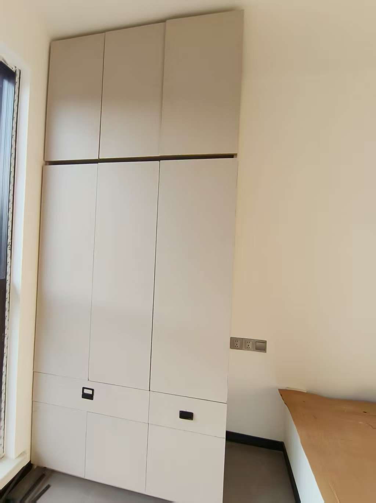
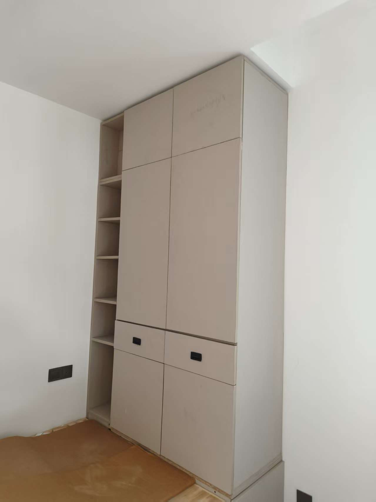
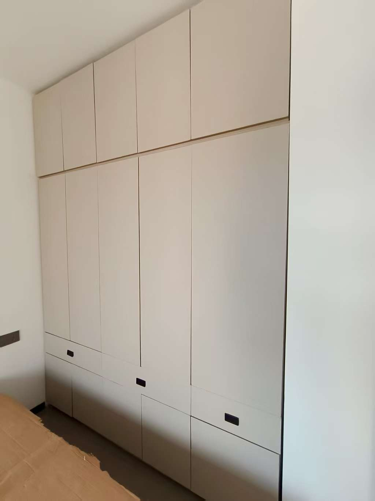

- Content
  {:toc}


木工日程安排：

- 地砖铺完，美缝做好，木工可以开始。铺设地砖的时候准备选择好木工的板材，木作工具等，做美缝的时候即可下单发货。
- 整体节奏：先打柜体，再打抽屉，再打床底部抽屉，再打书桌。
- 房间柜体节奏：先打小书房、二楼俩次卧。通过练习了熟练度，再打来二楼主卧及一楼主卧，保证一楼主卧的成品品质。

# 木工理论篇

## 木工工具

**实践前**

- 切割剪裁：推台锯、导轨锯、电圆锯

- 修边开槽：锣机、修边机、封边机（木工封边机热熔胶颗粒中温高温封边条专用胶）

- 提效神器：二合一开槽工具 手电钻 木工夹

- 其他小工具：羊角锤 橡皮锤 螺丝刀

- 辅材：木工白乳胶 发泡剂 结构胶 二合一连接件 滑轨

**实践后**

- 十字开口靠条，须手动现场制作。

- 层板侧板固定导孔器，须手动现场制作。

- 二合一连接件打孔中线定位器，须手动现场制作。
  
  - 网上购买了一个18mm宽（刚好一个板子的厚度）中心带孔的铁片。
  
  - 层板与侧板摆样后，铅笔沿着层板两边划线。
  
  - 拿开层板，用铁片沿着两条线贴合放好，铅笔在铁片的中心孔画点。
  
  - 对点连接划线，就是中线。
  
  - 然后再使用网上买的开孔定位器找到中线上面的开孔位置。

- F夹、G夹

- 电钻两把

- 修边刀（要好点的，切边倒角快速干净美观的，否则做出来又慢又丑）

### 推台锯

**推台锯切割检查清单**：

| 检查项    | 说明                 | 是否完成 |
| ------ | ------------------ | ---- |
| 电源与急停  | 插头插好，急停旋钮未按下       | ⬜    |
| 主锯锯片   | 是否牢固无松动、锋利，转动顺畅    | ⬜    |
| 划线锯    | 划线锯片是否居中主锯片，启动无异响  | ⬜    |
| 台面清洁   | 无锯屑、工具、电线等杂物阻碍推料   | ⬜    |
| 推台滑轨   | 滑动顺畅无卡顿，止动螺母上紧     | ⬜    |
| 尺寸标尺校准 | 靠尺刻度与实测尺寸是否一致      | ⬜    |
| 吸尘系统   | 集尘器或吸尘管连接良好        | ⬜    |
| 安全装备   | 佩戴护目镜、耳罩、防尘口罩（必要时） | ⬜    |
| 板材准备   | 面材朝上，封边方向已标记清楚     | ⬜    |
| 工具准备   | 推料棒、软尺、笔、标签纸是否已备好  | ⬜    |

**🧭 MaxCut → 封边 → 组装 标准操作流程**

·         🔧 一、MaxCut开料排版

1.    正确设置封边厚度（如每边1.5mm）；

2.    确保排版时按净尺寸 - 封边厚度 x2；

3.    输出 PDF 排版图 + 切割清单，标明每块板件编号及封边方向；

4.    优先选择“大件优先”原则排版，减少余料浪费；

5.    导出含“锯缝”设定的精准尺寸（如锯缝为3mm）。

·         🪚 二、推台锯切割流程

6.    启动顺序：划线锯 → 主锯；

7.    按照清单依次切割 → 每切一块，立即贴编号标签；

8.    切割顺序建议：长直边优先，需封边方向优先；

9.    小件最后切，防止丢失或飞料；

10.  每切10块左右停下清理台面和锯屑。

·         🧵 三、封边（人工热风枪或封边机）

11.  确认封边方向，贴好封边条；

12.  热风机：温度约180-200°C，沿边缓慢平推；

13.  压边 → 修边刀修齐 → 锉刀斜角处理；

14.  确保封边不遮挡后续打孔位置；

15.  粘贴完毕后再次贴标或拍照留档。

·         🔩 四、预打孔与组装

16.  先定位打导孔（2.5~3mm），再拧 35~40mm 螺丝；

17.  横隔板与立板连接建议间距15~18cm打一个螺丝；

18.  可辅助使用 F30 直钉加强初步定位；

19.  所有结构面打孔时注意不要打在封边上；

20.  拼装过程中用夹具辅助定位更稳。

**⚠️ 额外避坑提示**

| 类别     | 避坑点        | 对策                 |
| ------ | ---------- | ------------------ |
| MaxCut | 锯缝/封边设定不一致 | 统一标准后使用“克隆规则”批量设置  |
| 切割     | 板件贴错标签     | 每切完一块立刻贴编号         |
| 推台锯    | 锯口崩边严重     | 开启划线锯、贴美纹纸保护、面材朝上  |
| 安全     | 推料失控       | 使用推杆/侧推板，双手远离锯片    |
| 封边     | 多余胶未清理     | 趁热用刮刀清理，不然后期难处理    |
| 组装     | 忘记导孔       | 封边处极易裂板，建议所有螺钉处都预钻 |

### 二合一连接件

1. 开槽：使用锣机开槽，深度不能太深，以垫片齐平或略低于板子边缘为准，太深螺丝够扣不到，太浅板子对不平。

2. 固定：垫片顺一个方向，用自攻螺丝打进去固定，用3.5 30cm的就足够。

3. 定位：另一张板子一定要在二分之一厚度（一般是0.9cm）处划线，然后用定位神器确定打孔位置。

4. 打孔：先导孔一定要沉孔，然后上螺丝。

5. 组装：挂上即可。

## 常识避坑

- 板子厚度：18mm

- 背板厚度：6mm

- 单个抽屉建议≤80cm宽、≤25cm高，否则推拉阻力大易下垂，一般书桌抽屉高度：12cm。

- 抽屉滑轨：两个加起来要预留2.6cm（单个1.25cm），用三节滑轨/隐藏滑轨，不推荐普通二节轨。

- 所有隔板或抽屉的“宽度”不要超过 90cm，超宽会导致下垂或使用不便。

- 柜体高于2米时建议加中层隔板或用金属连接件加固。

- 开料需设置锯口尺寸：开料前先测量一个角料的整体长度，开料后两段加起来，确定锯口宽度，一般来说是3mm，这个在开料环节非常重要。

- 抽屉内部净宽必须减滑轨尺寸（一般26mm），否则抽屉会做不进去。

- 柜门门板对齐建议用调节铰链精调，有三向调节功能。

- **常见尺寸参考**：
  
  | 区域尺寸 | 高度cm    | 说明  |
  | ---- | ------- | --- |
  | 长衣区  | 130~150 |     |
  | 短衣区  | 85~100  |     |
  | 上柜   | 25~40   |     |
  | 抽屉区  | 15~25/格 |     |
  | 裤架区  | 70~100  |     |
  | 被褥区  | 35~50   |     |
  | 书架层板 | 25~35   |     |
  | 鞋柜隔层 | 15~20   |     |
  | 书桌台面 | 72~76   |     |

- **安装预留公差**：安装公差 = 给五金件安装、开关预留的“余量空间”，防止尺寸过紧导致装不上或无法顺畅使用。举例说明：
  
  - **①抽屉滑轨安装**
    比如你买的是一对 450mm三节滑轨，标称左右各占12.7mm

    那么抽屉外宽 = 柜体内宽 - 12.7*2 ≈ 柜体内宽 - 25mm

    但你不能刚好减25mm，需要再 多留1~2mm的余量，避免滑轨卡死或刮擦。
  
  🟡 建议：滑轨安装预留 26~27mm（总间隙）
  
  - **②门板与门板之间**
    如果两个门板紧靠，毫无缝隙：
    1、热胀冷缩时可能互顶变形
    2、门铰链调节空间不足，导致门关不紧或歪斜
  
  🟡 建议预留公差：
  
  - 门与门之间 ≥2mm
  
  - 门与柜体边框 ≥1.5mm
  
  - 抽屉面板与面板之间 ≥2mm
  
  ✅ 简单记忆口诀：
  **滑轨抽屉让 2~3 毫米，柜门间隙空 2 毫米，宁松不紧，后调不累！**

## 木工软件

 **木工计算器APP**

1. APP内滚动底部工具栏，先选【柜体】（一般是第一个），设置整体框架的尺寸，组装方式。注意要把进深设置成和深度一样。

2. 区域划分，使用隔断将柜体布局做下大致划分。

3. 精确确定区域的尺寸，选中隔断的线条，此时APP会显示出间距，手动点击数字然后修改确定。

4. 抽屉。抽屉一般显示的不对，这个只是做设计演示用，并不做实际开料用。

5. 柜门。只做演示用，不做开料使用。

6. 使用3D，点动画，可以旋转查看，点击【动画】可以看柜门抽屉打开关闭的动态效果。

7. 保存为【XXX设计版】。

8. 对设计版打开删除柜门和抽屉，保存为【XXX开料版】。也即抽屉和柜门在柜子主体制作环节暂不考虑。然后导出【开料清单】。

**使用技巧**：

- 适当显示和隐藏组件，有时候可能不好选择，则可以先隐藏其他组件。

**[MaxCut](https://maxcutsoftware.com/)**

功能：算料优化。超级好用，强烈推荐！

**书桌计算（自己设计开发）**

参见项目：[bigsinger/woodworker: 木工计算器](https://github.com/bigsinger/woodworker)

## 木工流程

**整体流程**：

- 【测量】：可以记录下实际尺寸和使用尺寸，使用尺寸可以略小于实际尺寸，预留点缓冲空间。考虑电源、插座、空调管等空间干涉问题。

- 【草图】：确定大致框架尺寸，根据生活需要规划功能区域：挂衣区、抽屉区、层板区。吊柜与地柜区分。可以用铅笔画出投影图草图。

- 【设计】：使用木工计算器APP设计设计图。可见面标记（后续决定封边）。需要注意在该APP中的概念：
  
  - 【深度】 = 测量总深度 - 柜门18mm - 背板厚度6mm。
  
  - 【进深】 = 深度。

- 【检查】：检查并推演组装时是否有问题，检查点：
  
  - 组装方式；
  
  - 长宽高尺寸，选中立板隔板查看尺寸是否正确，柜门背板是否考虑进去。

- 【算料】使用 MaxCut 算料优化（注意先测出锯口，然后设置：Settings → Layout - Saw Kerf），添加切件，注意备注名称，检查是否有顺带的需要开料的一并添加。【锯缝】一定要填写正确。优化后，点【报告】-双击【作业布局图】，生成的PDF打印出来。

- 【开料】：开料的先后顺序：先大后小，见光优先原则。对开出的板材贴标签：编号、名称、朝向，便于后面组装。

- 【开槽】：检查是否需要，主要是大的柜子如果中间还有立板的话就可以开槽口去咬合更加坚固。

- 【摆样】：摆样拼装预演，检查是否无误，确定见光侧并用铅笔做上标记。

- 【封边】：根据摆样情况确定见光侧，根据需要进行封边。欧松板，理论上需要全部封边，但实际组装操作中，那些要参与结构拼接（需要打孔、榫接、胶合）的边，不要封边，否则影响结构牢固性和施工便利性。见光面（外露部分）必须封边、藏在结构内部但暴露在空气中（如柜体内部横隔板的前沿）建议封边（接触空气容易吸潮）。

- 【组装】：务必使用木工夹具，需要敲击时尽量橡皮锤敲平。
  
  **组装顺序：卧倒组装（初学者推荐）：**
  
  - 先在地上把：两侧侧板 + 底板 + 顶板横向拼装起来；
  
  - 用螺丝、二合一连接件固定成一个“框架结构”；
  
  - 打导孔（2.5~3mm）；
  
  - 再拧入 40mm 自攻螺丝；
  
  - 二合一锁扣使用15mm~20mm的自攻螺丝，不宜太长。
  
  - 再整体立起来，然后安装中间横隔板、竖隔板、背板等。

    **注意技巧：**

- 先装底板，用重力定位更稳；

- 横隔板推荐从底部往上装；

- 最后装背板时再做整体方正调整（背板起稳定和校正方形的关键作用）。

- 木工夹夹住，F30打几个直钉固定（实践发现无法固定，30直钉太软了）；
  
  如果立板不可见，可以使用自攻螺丝（40mm）先在侧板导孔再打入（2/3的长度，40mm导25mm，35mm导20mm~25mm，如果是横隔板连接侧板，则侧板直接导孔打穿，横隔板无须打孔）。如果立板可见且没有见光板封住，则需要使用隐藏式二合一套件连接。

- 【固定】：靠墙打一些免钉胶，防止倾倒。高柜顶部必须膨胀螺丝+L型码或金属件固定，防倾倒，防小孩攀爬。顶封板/踢脚线：如果有，统一收口收边。顶部垫块（天花吊顶与柜体之间），可塞木条保持垂直稳定。


# 木工实践篇

## 床

从榻榻米的设计中发现了一个很香的方案，就是用砖起床体，下面留空间做抽屉储物。

**优点**：

- 结实耐用，承重能力强。
- 增加储物空间，提高空间利用率。
- 环保，根本就没有甲醛。
- 造价便宜，比买床便宜多了。

**缺点**：

- 不可移动，限制了房间布局的灵活性。
- 需要额外的装饰（如涂料、瓷砖等）来提升外观。例如非抽屉开洞的其他外立面需要腻子粉刷下。

**施工方法：**

- 以最薄的砖来砌，砖的外边沿与床的放线的边线内侧对齐即可，砌的高度在45~55公分以内。
- 高度要一致，否则后期放床板不会平整。
- 见光部分的墙体要刮腻子，为了美观。
- 留口部分后期是做抽拉移动的抽屉，只要做好地面的平整即可。
- 床体内部的空白地面空间做好平整度即可，无须贴砖，后期是抽屉的位置，方便滚动即可。

| 房间           | 留口方式                                                     | 砌砖方式                    |      |
| -------------- | ------------------------------------------------------------ | --------------------------- | ---- |
| 小书房         | 三等分，外侧留口（南面）。开口的宽度约55公分（总长度去掉4堵墙的厚度再除以3） | 南北向砌砖，三等分共4堵墙。 |      |
| 二楼次卧（西） | 三等分，外侧留口（西面）。开口的宽度约55公分（总长度去掉4堵墙的厚度再除以3） | 东西向砌砖，三等分共4堵墙。 |      |
| 二楼次卧（南） | 二等分，脚头留口（东面）。开口的宽度约65公分（总宽度去掉4堵墙的厚度再除以3） | 东西向砌砖，二等分共3堵墙。 |      |
| 二楼主卧       | 二等分，脚头留口（西面）。开口的宽度约70公分（总宽度去掉4堵墙的厚度再除以3） | 东西向砌砖，二等分共3堵墙。 |      |
| 一楼主卧       | 二等分，脚头留口（西面）。开口的宽度约70公分（总宽度去掉4堵墙的厚度再除以3） | 东西向砌砖，二等分共3堵墙。 |      |

- **红砖尺寸：**标准尺寸：240mm x 115mm x 53mm
- **空心砖尺寸：**
  - 常见尺寸：190mm x 190mm x 80mm、240mm x 115mm x 80mm
  - 其他规格：390mm x 190mm x 190mm、240mm x 200mm x 115mm、240mm x 120mm x 115mm、390mm x 190mm x 90mm

**床板部分**：

1. 直接网购床板，注意横放竖放的不同。
2. 板子底部两侧靠近墙体的部分用F30直钉固定一些小卡条，形成`π`状，放置到床体上，这样床板不会左右移动。
3. 观察底部是否平整，如果不平整，后期可以用发泡胶打一下。注意打的时候应先在各个床体上方加垫同等尺寸的木条固定，然后上方再放置床板，这样目的是床板是可拆卸的。有个比较简单的方法：网购堵洞胶泥垫一下，也可以在上面再加垫一层薄背板，最后放置床板压平整，时间久了胶泥变干后就固定了，以后床板就是平整的了，不会有任何异响。

## 柜子

步骤：测量尺寸 - 设计方案 - 开料 - 封边 - 组装框架 - 安装踢脚板 - 安装背板 - 安装侧板 - 安装柜门

1. **测量尺寸**。测量空间尺寸，确定好要制作柜子的大小。
   - 宽度要减去 2 个侧板的厚度（2 个木板厚度）。
   - 深度要减去一个背板的厚度。
2. **设计柜子**。可以使用[**木工计算器**](http://www.m1page.com/s/rztq7v)软件来完成。需要注意以下几点：
   - 顶部如果做个挡板的话，顶部挡板高度可以设置为 2 个木板厚度。侧板高度不变，顶部横板向下移动顶部挡板高度。
   - 隐藏式抽屉，隔板的进深适当小一点。
3. **开料**。
   - 软件可以完成开料，但是考虑到横板和竖板部分可以使用榫卯结构，不要完全参考软件的开料算法，使用榫卯开槽的方式更加坚固。比较小的隔板可以按照开料算法切割。榫卯开槽注意横板开口向内，竖板开口向外，分别开板子宽度的一半。
   - 靠墙的侧板其实不用整张板，只需要一个较窄的板条即可，见光部分做个封边处理即可，里面靠墙看不到。
   - 见光的侧板须用整张板。
   - 隐藏式抽屉，隔板的进深适当小一点。
4. **封边**。不用全部边都封，见光的封边即可。
5. **组装框架**。先大后小，顺序上先组装尺寸大的板子，再组装小的隔板。
   - 先组装具有榫卯结构的横板竖板，便于框架的成型和固定。
   - 再组装侧板。
   - 再组装隔板。
6. **安装踢脚板**。踢脚做法：预留8-10cm，底板抬高。做密封，防虫蚁。凹进去一个板厚度，防踢。其实就是和柜体做齐平即可，后面安装上柜门就是凹进去的效果。还可以方便后面做免拉手柜门。注意要制作无钉眼的。如果柜子较宽，为考虑支撑，可以在底部再加几个支撑用的踢脚支撑板。
7. **安装背板**。柜子翻过来朝下，测量对角线，调整使对角线长度一致。切割背板并钉上背板，使用码钉枪固定。如果柜体尺寸较大，没有足够大的背板，也可以按照柜子的布局分别安装背板。
8. **安装侧板**。主要是为了视觉效果美观。
9. **安装柜门**。可以借助铰链神器开槽，铰链需要注意是采用直、中弯还是大弯，安装铰链，最后安装柜门拉手。

省钱环保的方案：货架三角铁组装、砌砖。

### 书房

**犄角：**

整体方案：打一个仅有三面的框架放进洞里，盖上盖板。

1. 打框架。框架共有三面，左侧1.8厚度，前后为背板，前后板压左侧板。高度矮床体一个板材的厚度。前后背板长度为洞左右宽度，左侧板长度为洞前后宽度减去两个背板厚度。
2. 在右侧板低床体1.8公分，前后各打一个小档条（AB）。
3. 在左侧板的前后两端与顶部边缘齐平处各打一小档条（CD）。
4. 盖板，左右长：洞左右长减去1.8公分；前后宽：洞前后宽减去两个背板厚度。
5. 放进框架，盖上盖板。

【角落】
1、左右夹后，左右后夹上下。底板抬高1cm做防潮缓冲，各加小边条垫一下即可。顶板与其他侧板齐平。
2、放盖板，暂不封边 暂不固定，根据实际情况来定。

【柜体】
1、先拼十字架，开槽卡住。
2、放左右侧板，木工夹具夹住，放隔板，F30直钉固定。
3、导孔（沉孔），40mm自攻螺丝固定。
4、顶板底板与侧板固定，同样导孔再上自攻螺丝。

【书桌】
1、先拼隔板与2块小立板，用木工夹具固定，外侧三者对齐。
2、拼背板，背板压立板和隔板。
3、拼左右侧板与隔板，侧板要前凸一个板厚，方便后面与抽屉面板齐平。
4、盖上桌面面板，不固定死，为了方便后期上抽屉滑轨。

【床洞抽屉】
1、底板在下，四个围板在上，左右夹前后。
2、固定的时候使用木工夹具，然后F30固定即可，如果想要更结实可以打点自攻螺丝。

## 抽屉

柜体的抽屉空间留好后，怎么制作抽屉呢？总结了一个比较简单快速的方法。这里的抽屉面板上下比前板分别高 1 个木板厚度。

步骤：测量面板尺寸 - 确定底板尺寸 - 确定侧板前后板尺寸 - 开料 - 组装抽屉盒 - 安装滑轨 - 安装面板。

抽屉的尺寸需要考虑后期滑轨的安装，抽屉立板尺寸 - 抽屉盒的外径尺寸要在2.5cm（2.6cm也可），不能做大了也不能做小了，否则后期安装滑轨会有很大的问题。算料我也写成了代码自动完成，提高效率且避免出错，参见项目：[bigsinger/woodworker: 木工计算器](https://github.com/bigsinger/woodworker)

1. **测量面板尺寸**。把要做抽屉的空间尺寸均分，这样可以做到非常精细。例如想做上下 2 个抽屉，那么只需要把高度均分即可。考虑到面板之间、面板与柜体之间的缝隙，可以适当留1毫米缝隙。
2. **确定底板尺寸**。这块主要考虑到抽屉是底板被四边夹的情形。底板宽度等于：柜体内径减去 2 个木板厚度，再减去两个滑轨宽度，再减1毫米弹性空间（安装的滑轨使用起来可能更流畅一些）。底板深度等于：柜体进深减 3 个木板厚度（前后板以及面板）
3. **确定侧板及前后板的尺寸**。这块主要考虑到抽屉是侧板夹前后板的情形。
   - 侧板的长度：底板的长度（深度）加 2 个木板厚度。
   - 侧板高度：面板高度减去 2 个木板厚度。
   - 前后板的长度：底板宽度。
   - 前后板的高度：侧板高度。
4. **开料**。面板、前后板、左右侧板、底板。
5. **组装抽屉盒**。需要注意的是，左右夹前后，四边夹底。（请自行考虑为什么？）
6. **安装滑轨**。在柜体内，从下往上确定滑轨位置。
   - 第一层垫 1 个木板厚度，放上滑轨外轨固定。滑轨的外侧位置减去一个厚度对齐，也即缩进 1 个木板厚度（给面板的厚度留的）。
   - 第二层垫 1 个抽屉面板高度（注意前面说了，几个抽屉是均分，垫一个面板相当于是定位到了上一层的抽屉），再垫 1 个木板厚度，放上滑轨外轨固定。
   - 多层抽屉以此类推。
   - 滑轨内轨直接在抽屉的侧板底部对齐固定。
   - 对入滑轨，抽屉盒就安装好了。
   - 滑轨想要安装得靠中间一些怎么办？加几个板厚度的靠山限位。上述步骤不变，内外轨分别多加一个限位垫上即可。
7. **安装面板**。从下往上安装，底部可以加一个小小的垫片（厚度略等于抽屉缝隙宽度即可），用夹子夹住面板和前板，钢钉固定，最后螺丝打进去，上拉手。

隐藏式抽屉的制作，要把柜体的空间留好，注意考虑铰链的宽度，空间留好后抽屉的制作方式不变。

**滑轨**

**滑轨尺寸参考：**

```
滑轨尺寸参考：
20cm/08寸【21-25深度适用】
25cm/10寸【26-30深度适用】
30cm/12寸【31-35深度适用】
35cm/14寸【36-40深度适用】
40cm/16寸【41-45深度适用】
45cm/18寸【46-50深度适用】
50cm/20寸【51-55深度适用】
```

**滑轨安装方法**：

1. 拆卸滑轨，注意方向不要摆错；

2. 安装时固定区滑轨区底部都垫加一个相同的高度（例如一个板子的厚度），则安装好后两个就是对应的，且抽屉底部会悬空1cm高。 【怎么下移一点呢？】如果先安装好滑轨最后再安装抽屉底板，这样就可以充分利用好下方的悬空部分了。但是如果先安装好了抽屉底板，想要抽屉悬空2~3mm，理论上滑轨要垫得比固定区稍高几毫米，组装好底板的抽屉放置在平整的地面上，滑轨下面加垫一个木板和一个背板（6mm），这样滑轨相当于抬高了6mm，这样抽屉就会下移6mm，这样底部悬空就只有3~4mm了。

3. 滑轨固定区无须缩进，滑轨区头部向内缩进2-3mm避免抽屉面板装上后凸出柜体前脸。

4. 抽屉与柜体尺寸确认。抽屉左右净空的距离减去抽屉盒左右外围的宽度要在滑轨要求的尺寸范围，

   `确保抽屉外宽 = 柜体内净宽 - 滑轨厚度 x 2`

   常规三节滑轨厚度为 12.7mm，所以左右预留 25.4mm（通常取 25mm 即可），需要严格控制在**26mm**+-1mm，太小了滑轨推不进去很卡，太大了滑轨会脱离固定区不结实容易坏。

## 榻榻米

这里制作下面带万向轮抽屉的榻榻米，地板还是要做，可以贴砖。榻榻米底下抽屉可以做4个，每个抽屉宽度大概不到 50 公分。因为做了抽屉，考虑到主体的稳固，可以做四个框架拼接，上面再铺一张板材。每个框架的横梁竖向安装，横梁宽度 6 ~ 10 公分，每隔 30 公分打一个横梁（密一点也行），一定要铺平，这样受力才均衡。

稳固性考量：

- 板材可以使用厚度大一些的（例如 4 ~ 6 公分厚度），如果没有较厚的板材，可以用现有板材拼接。
- 立板压侧板（最里侧），立板压横梁，横梁竖向固定，横梁密度高一些。
- 框架两边额外多加 1 个侧板增加稳定性。
- 增加一个背板，用整板来做，把框架的内侧板固定在上面。

步骤：确定主体尺寸 - 计算框架尺寸 - 开料封边 - 组装框架 - 安装背板侧板 - 拼接主体 - 制作抽屉。

1. 确定主体尺寸。结合实际房间大小布局，确定榻榻米的方位大小，一般榻榻米高度 40 公分较为舒服（因为实际使用还会铺上床垫），宽度 1.35 米，长度 2.0 ~ 2.1 米。

2. 计算框架尺寸。如果用正常的免漆板，因为厚度不够，建议是支撑位置用两块板拼起来的方式。

   - 框架的横板长度就等于总长度除以4 ，再减去 4 个木板厚度。考虑到稳固性，都用立板夹横梁的方式，背板也用 2 个木板厚度，最里面的背板用完整的

   - 立板的长度只需进深（榻榻米宽度）减去 1 个木板厚度。

   - 立板的高度等于榻榻米高度减去 1 个木板厚度。

   - 横梁宽度 6 ~ 10 公分，每隔 30 公分一个横梁。

3. 开料封边。大部分地方均不需要封边，见光部分封边即可（立板外侧，抽屉盒）。

4. 组装框架。立板夹内侧板，立板夹横梁，横梁竖向安装，每隔 30 公分打一个横梁。一定要铺平，这样受力才均衡。

5. 安装背板侧板。最里面放一整张，严密合缝，用以固定。在推入内侧板前，把两边侧板与内侧板固定好，形成U字型，然后推进去。

6. 拼接主体。把框架逐个往里面放，拼接成型，两边的框架侧板与主体侧板固定。所有框架之间应该稍微紧凑一些，以保证稳固，最后所有的框架的内侧板与背板固定一起。

7. 制作抽屉。制作方法同常规抽屉，只是不需要制作抽屉面板，只需要制作抽屉盒即可。因为底部要安装万向轮，抽屉的地板不要用薄的板材，用柜体的板材即可。

   - 每个框架里面做俩抽屉连接（类似火车车厢），连接处可以开个小孔，做个东西连接一下即可。之所以不做成一个大的抽屉，主要是在小的房间里不方便抽拉出来。
   - 抽屉做成完全一样的，方便在换季的时候随意调整抽屉位置，这样就不用来回腾挪衣物了。
   - 不做抽屉面板，稍微有点缝隙也没有关系，因为床单能盖住不会影响美观，留一点缝隙也方便透气。

优化改进方案：

为了考虑榻榻米内侧和左右两侧的透气防潮，可以把上述的U字型侧板换掉，在U字型位置的上下各打一圈木条固定在墙体上，框架再固定在这些木条上。这样相当于榻榻米的主体与墙壁留有一点间隙，不太容易潮湿发霉。

环保省钱的做法：

使用货架三角铁组装主体，抽屉同上。

更省钱更环保更简单更稳固的方案：

砌砖，砌个E字型的即可（也可以多砌一个隔断），高度40公分。抹上水泥做平，上面铺上板子，抽屉同上。如果是在装毛坯房，强烈推荐这个方案。

## 木工计划

- 5.17：床板制作 书房夹角柜体制作 主要目的：练习木板切割、封边、组装、工具使用、熟悉流程、确定下次改进部分；
  
  - 此次推台锯没有按时送到，临时使用电圆锯切割的，没有办法推大板，只能切下小料，临时购买的靠山神器不够精准也很重也无法固定德力西7寸电圆锯，后面就是测量尺寸划线按照线路切割的，勉强切出了床板。
  
  - 练习了二合一套件，对精度要求比较高，对深浅也有要求。
  
  - 练习了自动螺丝及导孔，这个比较简单，在不见光的地方尽量用自攻螺丝。
  
  - 改进：尽量使用推台锯；欧松板要全部封边，使用手持封边机+带胶封边条，不要用自动封边机，那个配套太复杂了还要用气泵，不适合家庭及DIY。

- 5.24：书房床板制作 书房外侧柜体制作 书房书桌制作。
  
  - 此次使用的推台锯WJ600B使用还算简单，小白可以立即上手，组装简单但耗时，毕竟东西比较多且重，一个人的话也要组装半天。刻度精准，只需调好靠山尺寸直接推板即可，锯口很平整。不足之处：买的是手动升降的，这个切十字卡口的时候就不方便了，因为需要把子锯下调，这样每次手动调整就很麻烦。只能上电圆锯了。切大板的时候还是不太方便，仍然需要两个人配合才行。不过整体还算好的了，基本上符合我的预期：小白也能很好地使用。
  
  - 切板顺利后，后面很快。 封边很慢，且修边不是那么的直溜，拐角处处理得不好，封边特别耗时。
  
  - 组装也特别耗时，有一个2.1米x1米的衣柜，组装了连续8个小时，尺寸还不那么完美。这个后面需要想办法利用工具。组装完成后框架还是有点晃动，钉上背板后就很牢固了，不会晃动。
  
  - F30直钉枪不完美，不能彻底打平，还要用锤子二次敲击。
  
  - 电钻只有一把，需要频繁更换钻头与批头，特别浪费时间和体力，后面需要补充一把。
  
  - 二合一连接件的胖钉位置特别容易开错，后面需要使用工具，网上有一个小神器但是那个也只是在定位好线之后再定孔的，中线的位置没有搜到工具，可以自己设计制作一个。
  
  - 二合一连接件锁扣使用的自攻螺丝最好是15mm~20mm的，不宜太长，欧松板容易撑爆。
  
  - 自攻螺丝的确都需要先导孔，不然木板容易撑爆。
  
  - 连接两个板子的时候使用35mm~40mm的自攻螺丝即可，太长不行，欧松板容易撑爆。
  
  - 层板与立板固定的时候，打钉的位置很难找，浪费时间且不准备，很容易打偏。搜索工具没有找到，后面需要自行制作一个。
  
  - 木工夹具很有用。
  
  - 书桌的设计可以整理成公式，使用电脑计算用料，节省时间。

- 5.31：二楼南次卧柜体制作（左右均不见光，直接上F30直钉和自攻螺丝，相对简单一些）。这个柜子的宽度比较大，将近两米，高度有2.7米，所以工复杂度和工作量也是比较大的，第一天晚上直接干到夜里十二点整。第二天打的上柜，结果左右方向搞反了，为了和下柜保持一致，无奈只好调转方向，让踢脚朝上了，这个也是很遗憾的地方，实在是太累了，没有拆开重新组装。

- 6.7：此次带了水平仪，用来定位和校准，非常准确快速。这次两天打了西次卧的下柜、上柜、书桌、书房角落书架、鞋柜。效率明显比之前高很多。

- 7.12: 今天活干的出去的顺利和熟练，切板切了四张板子，打了七个床底大抽屉，把两个柜子的柜门装好了，非常的美观。这次干活就是非常的大胆，状态不错。

- 后面是零碎活，以及其他活掺杂着干了。

- 8.1: 推台锯二手出掉，购入价2840，1800出掉的，感觉还行。至此，木工活全部结束了。

## 开料记录

已备份到`images/zhuangxiu`目录下。

## 成品效果





## 木工经验

- 开料时，如果靠山尺寸不够长时，可以用减法，一定要减去锯口，否则切出的板子会少一个锯口的长度。

- 每次开料时，一般最后一张板会有一些剩余，下次可以接着用，做**虚拟开料**。废旧的余料也可以通过虚拟开料来充分利用。具体做法：例如剩余一块500x1220的板子，那么下次算料的时候就假装要切一个(2440-500-2)x1220的板子，2mm是给锯口预留的。则MaxCut算料的时候就会充分利用上这块余料了。

- 算料一定要用软件或自己写代码自动计算最好，提高效率且减少出错机会。

- 柜子组装中，框架成型后有时会有晃动，打上背板基本上就很稳固了。

- 鞋柜的背板与层板打上直钉后，层板就不需要立板了，美观又稳定。

- 柜门算料的时候，因为需要四边封边，需要减去2个封边的厚度，如果有与其他柜门或面板接触的地方，各自让1mm。

- 水平仪非常好用，高效准确。可以用来定位钉眼位置，用来调校板子上下左右的距离。

- 垂直固定的时候（例如层板与立板固定），欧松板最好用35mm的自攻螺丝，太长容易爆。

- 任何需要使用自攻螺丝的地方，都需要预先导孔，导孔深度根据使用的螺丝的长度而定。

- 固定背板的时候，使用F25的直钉即可，可以使用F30的但没必要。

- 使用直钉枪的时候，最好不要按着钉枪打，如果它的力度打不穿你硬按着打，非常容易损坏撞针。如果打不进，有点冒钉，事后用锤子二次敲击下即可。

- 导孔的电钻和打螺丝的电钻，各备一个，如果只有一个电钻，换头非常浪费时间和体力。

