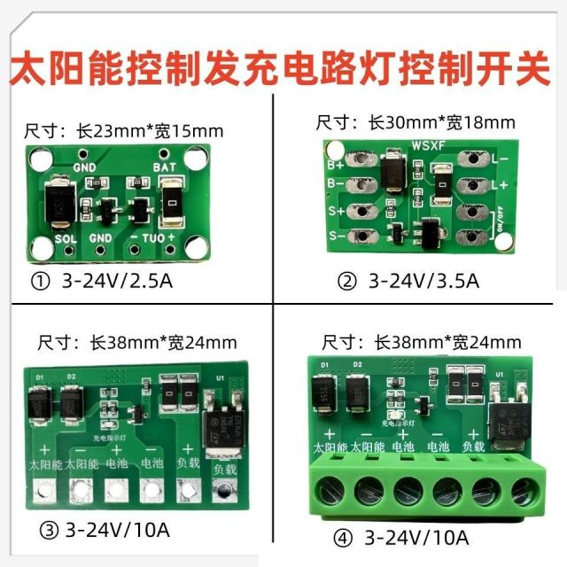
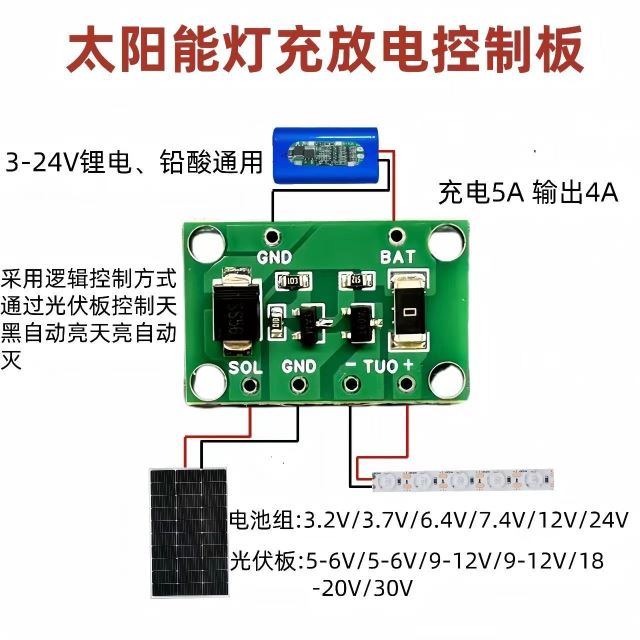
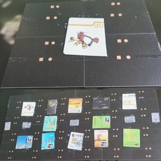
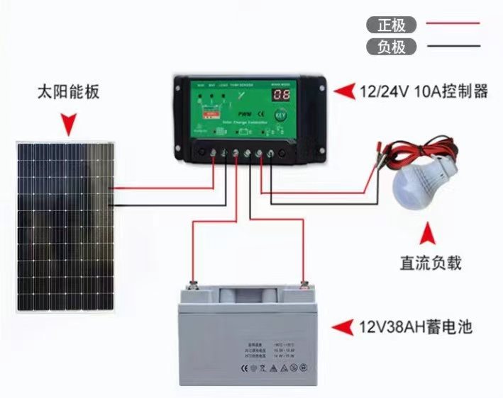

- Content
  {:toc}

# 家电

## 强电箱

因为一共四层，配置了两个强电箱，一楼有一个，负二有一个，均是暗装。所需购买的材料清单：

第一个强电箱所需的材料：

- 强电箱空箱32回路1个
- 63A带漏保1个（380v）
- 20A带漏保1个（用于冰箱）
- 1P 20A双进双出12个

第二个强电箱所需的材料：

- 强电箱空箱18回路1个
- 63A带漏保1个（220v）
- 1P 25A双进双出6个

辅料：

- 扎带（20cm）50根。

安装方式：暗装。

如何选购：

1. 空箱子单独购买，且无须太好的，一般的就行，两个加起来110多点。空箱子的回路数，只是一个容量大小的问题，好比车位，可以停32辆车子，但是车子实际上并没有买32辆。而且尺寸大小对价格的影响并不大，因此适当买大点无所谓，这样也方便后期扩展电路。
2. 其他模块，就是根据实际电路设备的需要购买具体的数量，电工开多少就按照清单购买即可。这些就好比是实际的「车子」，根据实际使用情况购买。尽量选择好的品牌购买，例如施耐德。辅料扎带购买的时候让店家赠送即可，无需单独购买。以上两个电箱的模块在一起刚好1000块。

## 空调

设备选型，尽量选择独立式空调，好处：性价比高（价格上就几乎便宜一半），维修方便，灵活可控（用的时候再买，不用的时候可以先不买的）。缺点：比较占用空间，设计美观性不如中央空调好，非常考验设计功力。综合起来看，最终定的是独立式的空调，需要空调的区域每个独立，不采用中央空调或风管机。

现在想想，真是幸运啊！这个选择真是非常明智。

定好设备选型之后，就要考虑怎么布局的问题，独立的空调一共有六处，太多了，需要对打孔及内外机的位置进行综合考虑，还需要考虑美观性，物业管制等。这个是非常花费时间和精力的，所幸功夫不负有心人，最终也定下了比较好的方案。

- 一楼客厅空调外机在墙角，直接在下面打孔到院子，外机就在院子洗衣机旁边。
- 一楼主卧和二楼主卧的外机在院子地面，一字排开放在墙角，管线顺着墙角向上走，开孔进去。
- 二楼两个次卧空调内机放在近门头位置，外机与小书房的外机均放置在厨房顶部的背阴区域，共放置三台。

虽然说小书房那边有三台外机，但是同一时刻住满人又是需要开空调的季节还是少数，所以影响不大。六部空调并不会一次性去购买，前期肯定只需要购买一两台，如果有常住的人口了再添置其他空调设备，因此极大地减少了预算和浪费。


## 灯具

### 灯带

1. 不要买贵了，基本上都很便宜，是超便宜那种。
2. 最好接上感应灯，方便实用。
3. 最好可以买多种颜色的，方便开启氛围效果。
4. 如果不嫌贵，也可以接小米智能家居，那也挺好，方便以后App直接调节。
5. 统一电压，如果是接民用电，可以统一使用220V的，这样避免额外购买变压器，买接线夹接线，方便安全。如果是使用太阳能供电，需要同一个一个低电压，例如5V/12V/24V。考虑到太阳能供电设备，其实是不推荐5V的，因为电压越低，太阳能供电系统需要供的总功率不变的情况下，电流就越大，不是很安全。比较推荐24V，其次是12V。

### 感应灯

说明：本段内容是在现有房子里DIY的，为卫生间增加一个感应灯，如果是装修阶段可以做好充分规划设计。

1. 关闭电源。安全起见，最好关闭家里的总闸开关。方便起见，这里只关闭了卫生间的所有开关，并叮嘱家人此时不要使用，带上橡胶手套。

2. 摸排线路。取下吊顶扣板，排查清楚各个线路的功能作用，以及哪些是火线哪些是零线。方法是：缠开接线处的黑色胶带，依此打开卫生间开关，用电笔逐个测量。排查结果如下：

   ```
   加热开关1：面板的棕色和绿色火线亮，断开绿色接线，两边居然也都亮灯，这一点是着实没有想到的，所以一定要做好安全防护。
   加热开关2：浴霸的浴霸灯和暖风扇。
   照明开关：面板照明指示灯亮，白色火线亮。
   换气开关：面板换气灯亮，换气工作，红色火线亮。
   吹风延时开关： 面板绿色火线，断开接线，面板绿色线不亮，民用电线绿色亮。
   蓝色线：面板的蓝色线和民用供电的蓝色线均为零线。
   ```

3. 确定电源线。从上面摸排的现状来看，是比较混乱的，不过因为只需要一路电源，所以就暂定使用「照明开关」那一路，这一路目前并没有开启任何的照明灯，只是一个指示灯的作用，照明灯被师傅从另外的线路接了。基于尽量少动的原则，只把「照明开关」那一路拆开，其他的线路用胶带缠好。白色的这根面板线，也用胶带封好，多出来的民用火线作为电源火线。从蓝色零线的接线处额外再接一根线出去，作为电源的零线。

4. 确定电压。考虑到用电安全性，我一般喜欢操作低电压（5V/12/V24V），后期可以随便玩，我这里选定的是5V。

5. 安装变压器。使用220V转5V的，或者使用类似于USB充电插头的方式。我这里使用的是后者，简单便宜，其实就是模拟充电器的作用。PDD直接买一个这样的模块，几块钱，店家赠送接线夹，将200V的火线零线直接夹进去，模块另一头就是一个USB接口，输出5V的直流电压。

6. 安装感应器。感应器选择在进门头顶的第二块扣板，取下扣板，开一个2公分左右的圆孔，将嵌入式的人体感应器安装上面。取一根USB充电线，截断一头并剥线，正极接感应器电源正极，负极接感应器电源负极。另一头USB插头直接插入变压器的USB插口。

7. 安装灯带。这里选择的是50cm长3mm宽的5V灯带，带背胶，3块钱左右，商家还带了USB线。正极接感应器的负载正极，负极接感应器的负载负极。如果长度不够，可以使用其他数据线进行延长。灯带亮灯部分做好隐蔽工程，这里选择的是极窄的灯带，直接粘在门头上方或者吊柜的顶部边缝处，完全看不到。

8. 通电测试。打开卫生间的开关，进门测试，效果极佳。亮灯时长可以通过调节感应器的背部参数来实现，所以在买感应器的时候最好买适合自己的模块，这里设置的是默认亮1分钟。

### 屏幕灯

一开始买的是小米的电脑屏幕灯，199元，一开始觉得很高端，但是随着自己DIY之后就想着自己动手做一个。总成本15元左右，瞬间觉得小米的电脑屏幕灯不香了。

1. 灯带一根，50cm长，颜色根据需要选择，有单色、三色、七彩的，基本上这个长度也都是几块钱一根，还送线。
2. 人体感应器一个，这里因为是给电脑屏幕做灯，感应器最好小巧一些，这里选择了一个8.6mm大小的，非常迷你，11块。
3. 灯带的正负极接到感应器的负载正负极。
4. 取一根USB数据线，小头截断，正负极分别接到感应器的电源正负极上。
5. 制作外壳。网上几块钱买一个感应灯，因为设计不好用，将它拆解掉，主要是用它这个外壳。感应器在外壳一头朝外安装，这样人来的时候就能感应到。灯带塞入外壳，从上往下照明。USB线从外壳的内侧中间部分开孔引线，插充电电源。外壳吸附到电脑屏幕上方。
6. 拓展。可以在USB数据线上截断安装一个物理开关，实现强制开关或调节亮度颜色的功能。

补充说明下网上的买的感应灯的不足：

1. 内置电池，这样就必须经常性充电，内置的电池容量很小，也不安全。
2. USB插口在一端，这样就会有线露出，影响美观。其实应该在内侧中部。
3. 感应器朝下，本身这个感应器就比较小，如果朝下的话感应很不灵敏。
4. 开关是按下式。因为是吸附式的，按压的时候灯具会滑动，非常不方便。但是它好的地方是，提供了三种模式：按一下是常量模式，按一下闪烁时是感应模式，再按一下是关闭。

所幸东西便宜，就买来拆解后只用它的外壳了。我感应器模块选择的是迷你的比较贵，如果是个头大的也就几块钱，这样成本还可以更低。

# 太阳能入门篇-有趣的玩意

## 从DIY一个小玩意入门

先从一个最简易实用的太阳能项目说起：花盆氛围灯，实现天黑自动亮天亮自动灭的效果。

只需要四样东西即可完成：

1. 首先需要一个太阳能板，选择好合适的电压数，一般选择6V的即可，我选择的是一个22cmx13cm大小的，刚好可以放到花盆的背面，不影响美观。

2. 然后是蓄能电池，选择的是一个`18650 3.7v 1300mA`的单节锂电池，是从孩子的废旧玩具里面拆出来的，废物利用。

3. 负载就用逢年过节用到的灯串，也是废物利用。这种灯功率极低，实际使用下来发现上面的一节电池，每天可以供该灯串彻夜都亮着。

4. 购买一个太阳能控制器，能控制天黑自动亮灯天亮自动灭灯的就是它，有如下的款式：



东西都不贵，大概几块钱，可以在电商平台做活动的时候屯几个，一两块钱就能买到。接线方式有焊接的，也有直接拧螺丝的，当然前者会便宜一点，不过焊接得有相应的工具，否则到时候接线不好接。拧螺丝的会相对贵一些，但是使用确实是方便的。

接线方式也比较简单，如图：



按照如图的方式进行接线，然后太阳能板放置于花盆的向阳的一面，电池、控制器放在太阳能板和花盆的夹缝中，这样从正面看是看不到任何杂乱的场景的，最后将灯串分布到花花草草上，就大功告成了。

## 入门总结

最后，根据这个小项目进行系统性地梳理总结下。整体思路是：

- 根据需求选择设备；
- 根据设备选择蓄能电池；
- 根据电池配备太阳能板；
- 选择控制器。

### 负载设备

根据实际生活需求，选择合适的负载设备，一定要注意功率、电压、安全电流等参数。

这里推荐一些比较有意思的小玩意：

- 灯串：实现氛围灯效果；
- 造雾器：盆景造雾，或实现加湿效果；
- 电泵：水循环，或喷泉、瀑布效果；
- 小风扇：空气循环流动；

### 蓄能电池

根据负载设备的功率、电压等参数，选择蓄电池。蓄电池的电压要略低于太阳能板的电压，否则无法充电。如果是小型项目，建议选择3.7V的锂电池，根据负载功率选择电池容量。

例如想要一个5V4W的LED灯在天黑后给鱼缸照明5个小时，则需要的总功率是：4W x5 = 20W。

可以选择3.7V的电池，容量需要配备：20000 / 3.7 = 5405mA，也就是说可以选择一个5000mA左右的电池即可。

如果需要用到控制器，一定要选择充放电使用统一路线的电池，否则接线会比较麻烦，因为目前的控制器无法接充放电不同路的电池。

**注意：**充放电不同路的电池，拆线后也无法接成重放一路的，这个实验过，没办法，问了商家也是不行。

但也并不意味着充放电不同路的电池就没有用途，例如在制作喷雾或喷泉瀑布效果的场景，夜里开启没有人观赏意义不大，就是需要白天启动的，那这个时候就可以用这个充放电不同路的电池。在控制器的电池的正负极两个接口，连接上该电池的充电的线路（正接正，负接负），负载端就不用接了，在电池的放电线路那一端直接接负载就好了。这样实现的效果就是边冲边用。如果太阳能的功率大于负载功率，则电池电量会有剩余，则天黑后负载会持续工作，直到电量用完为止。如果太阳能板的功率接近负载功率，或者不会有太多的剩余，那就不需要控制器，可以直接太阳能板的线路对接负载，这样就是直接在白天工作了。

如果需要用到家用，可以选择品牌的蓄电池，不建议选择锂电池（:warning:**安全隐患**），根据负载设备的功率数计算电池容量，总的逻辑跟上面是一样的。只不过电压要高一些，一般是12V或者22V。

### 太阳能光伏板

最好买散装的，自己进行连接，这样总预算会低很多。太阳能板的电压一般要略高于蓄电池的电压，否则无法充电，一般在购买的时候商品详情会注明适合的电池电压的。

DIY的电压一般是6V，大点的板子一般是12V/24V，根据实际需要来选择（结合负载和蓄能电池的电压）。

这里选择6V的，以蓄能20W为例，假设散装的一片为0.6W，一天的有效光照为5小时计算，则一片板子大约功能 0.6W * 5 = 3W，则板子的数量为 20/3 ~= 7片。

太阳能板的连接方式有两种：串联、并联。

- **串联**时，电压是累加的，例如想实现12V的电压，就可以用两块6V的进行串联。**接线方式**：一块板子的正极接下一块板子的负极，以此类推。
- **并联**时，电压不变，电流累加。**接线方式**：所有板子的负极相连，所有板子的正极相连。

测量区域尺寸及太阳能板材选型：

```
现在你是一个专业的设计者，目前需要对一块区域铺设太阳能光伏板，该区域的尺寸为：76.4cm x 44.5cm。

目前可供选择的太阳能光伏板的型号及尺寸如下：
A型号：12.5cm x 8.9cm
B型号：15.95cm x 8.2cm

请问选择哪种型号进行如何排列布局能够最大化，且减少材料的浪费。
```

**排版布线流程：**

1. 排版。排好大致布局，正负极一定要摆对了。
2. 四个小块拼一起，用502胶水将废旧的卡片粘在这4块太阳能板中间固定。选用502胶水的好处是，干的特别快。注意不要在接缝处附近涂抹胶水，否则胶水会漏到另外一面与桌面粘接，或者造成太阳能板正面花掉，切记！
3. 四小块拼成的板子再以四块按相同方式拼凑粘接。
4. 其他接缝处用胶带或小卡片粘接，做进一步的加固。
5. 布线。正负线最好分开，红线一般接正极，黑线接负极。
6. 用打火机在接线处的位置去电线外皮。一边用胶带固定，方便后续的去皮工作以及焊接。这一步的工作量很大，最好买带接线的太阳能板，方便。
7. 焊接。电烙铁。



### 太阳能控制器

如果想要实现天亮充电天黑放电效果的，就需要一个控制器，否则可以不需要，但是建议还是上一个，可以用来在充电的时候给蓄电池做保护。

接线方式：参考前图。

测试方法：

- **测试供电与负载**：太阳能板不连接，先连接电池和负载，这个时候因为太阳能板没有连接，此时控制器检测不到充电电压，会启动放电模式，此时负载应该是能正常工作的。如果没有正常工作，需要检查：电池是否有电、电池参数是否匹配、负载是否正常、负载参数是否匹配、控制器接线是否正确。。。
- **测试充电**：太阳能板连接控制器。对于有充电信号灯的控制器，太阳能板拿起灯亮，太阳能板覆盖灯灭。

### 商家

**小板**：

- **桃桃新能源2店**：小片的单晶硅太阳能光伏板，可以根据实际需要购买尺寸，注意总体价格。
  - 14.2cm x 6.2cm（88cm²），6V6片不带线送USB接口，7.7元。
  - 8.6cm x 8.6cm（73.96cm²），6V6片不带线送USB接口，6元。
  - 14.4cm x 7.4cm（106.56cm²），6V6片不带线送USB接口，7.7元。
- **有光新能源**  ：
  - 8.4cm x 6.1cm（51.24cm²），单晶硅，买10片送2片，不带线的10片8.4元，带线的10片9.2元，推荐买带线的，后期施工方便。
  - 11.3cm x 4.8cm（54.24cm²），单晶硅，买10片送2片，带线的10片9.2元。
  - 14.13cm x 8.78cm（124cm²），多晶硅，1W5V，买10片送2片，带线的10片15.6元。

**大板**：

暂未找到合适的，有了再记录。

# 太阳能进阶篇-双供电系统

## 需求设计

需求：家装电路设计，考虑双供电系统，分别是：民用电（220V的交流电），太阳能。

要求：

1. 该双供电系统需要有一个开关来切换任意一个供电系统，这个开关可以人为切换，也可以根据太阳能储能设备的电量自动切换。
2. 该双供电系统统一输出24V直流电，两个供电系统都需要配备一个电压转换设备。
3. 太阳能供电系统需要配备一个储能设备，用于储能。
4. 家用所有照明设备统一使用24V直流电，一律使用该双供电系统。
5. 照明设备的总线路开关按照楼层划分，一层楼有一个总控，每个设备有自己的控制开关（物理开关或感应开关或智能控制均可）。

思路：


## 设备选型

| 设备类型             | 设备推荐                                                                    | 功能描述                                                                 |
| ---------------- | ----------------------------------------------------------------------- | -------------------------------------------------------------------- |
| 太阳能电池板           | 高效率太阳能电池板（如LG NeON R或Trina Solar）                                       | 提高太阳能系统的发电效率，确保在有限的空间内最大化能量产出。                                       |
| 自动转换开关           | ATS（自动转换开关）或智能电源管理系统                                                    | 根据太阳能储能设备的电量自动切换供电源，允许用户手动切换。                                        |
| AC/DC电源适配器       | Mean Well LRS-350-24                                                    | 将220V交流电转换为24V直流电，供照明设备使用。                                           |
| 太阳能逆变器           | SMA Sunny Boy 3.0-4000TL                                                | 将太阳能电池板产生的直流电转换为24V直流电。                                              |
| 储能电池             | LG Chem RESU 10H                                                        | 储存太阳能电池板产生的多余电能，供夜间或阴天使用。                                            |
| 24V直流LED照明灯具     | 根据实际需求选择                                                                | 直接使用双供电系统提供的24V直流电。                                                  |
| 智能配电箱/断路器        | 施耐德电气Wiser系列                                                            | 实现楼层照明设备的集中控制和远程监控。                                                  |
| 智能家居中央控制器        | 根据协议选择（KNX、Z-Wave、ZigBee）                                               | 集成和管理家庭智能设备，包括照明、电源切换、储能设备等。                                         |
| 智能电表             | 根据实际需求选择                                                                | 监测和记录家庭的能源消耗。                                                        |
| 漏电保护器            | 根据实际需求选择                                                                | 保护电路免受过载和漏电风险。                                                       |
| （以下为可选）          | /                                                                       | /                                                                    |
| 智能能源管理系统智能能源管理系统 | 智能能源监控器（如Enphase Energy Monitor）智能能源监控器（如Enphase Energy Monitor）        | 实时监控太阳能系统的发电效率和家庭能源消耗，提供数据分析和节能建议。实时监控太阳能系统的发电效率和家庭能源消耗，提供数据分析和节能建议。 |
| 充电控制器太阳能电池板      | MPPT太阳能充电控制器（如Victron SmartSolar MPPT）高效率太阳能电池板（如LG NeON R或Trina Solar） | 优化太阳能电池板的充电效率，延长储能电池的使用寿命。提高太阳能系统的发电效率，确保在有限的空间内最大化能量产出。             |
| 智能照明控制充电控制器      | 智能照明系统（如Philips Hue或LIFX）MPPT太阳能充电控制器（如Victron SmartSolar MPPT）         | 通过智能手机应用或语音助手控制照明，实现定时开关、亮度调节和场景设置。优化太阳能电池板的充电效率，延长储能电池的使用寿命。        |
| 无线通信模块智能照明控制     | ZigBee或Z-Wave通信模块智能照明系统（如Philips Hue或LIFX）                              | 用于智能设备之间的无线通信，实现集中控制和远程监控。通过智能手机应用或语音助手控制照明，实现定时开关、亮度调节和场景设置。        |
| 家庭网络路由器无线通信模块    | 双频Wi-Fi路由器（如Google Nest Wi-Fi或Netgear Nighthawk）ZigBee或Z-Wave通信模块       | 提供稳定的家庭网络连接，支持多个智能设备同时在线。用于智能设备之间的无线通信，实现集中控制和远程监控。                  |
| 紧急备用电源家庭网络路由器    | UPS（不间断电源）或便携式发电机双频Wi-Fi路由器（如Google Nest Wi-Fi或Netgear Nighthawk）       | 在电力中断时提供临时电源，确保关键设备（如医疗设备）的正常运行。提供稳定的家庭网络连接，支持多个智能设备同时在线。            |
| 漏电保护器紧急备用电源      | 带有漏电保护功能的智能断路器UPS（不间断电源）或便携式发电机                                         | 在检测到漏电时自动切断电源，提高家庭用电安全。在电力中断时提供临时电源，确保关键设备（如医疗设备）的正常运行。              |

## 实施过程

在选购材料的时候，发现杂七杂八加起来还挺不便宜的，而且选择设备还要考虑各种型号和效率，选择成本很高。后来仔细想了下，自己通过太阳能发的电与从国家买的电相比，能又便宜多少呢？自己发电难道比国家发的电性价比更高吗？显然不会。因此折腾这些似乎没有意义，权当娱乐玩耍了。

设备选择需要提前注意：

- 在实际选择变压器时发现，超过300W的就需要风冷了，因此不建议选择那么大功率的，可以选择300W以内的，例如250W或240W或200W。然后根据功率和路数进行分配功率，使得总功率不超过变压器的功率。
- 低配版选定电压为12V。
- 因为一路限定了功率为20W，所以每一路的电流应是在2A左右，分线器的电流控制保险起见就控制在2A，稍微留点空间5A，但是一定要注意总功率不能超。
- 蓄电池。MPPT控制器要先接电池，按照要求来接。

|             | 选择说明                                                                                                                                   | 低配版                                                      | 高配版                  |
| ----------- | -------------------------------------------------------------------------------------------------------------------------------------- | -------------------------------------------------------- | -------------------- |
| 统一电压        | 统一确定一个即可，一般是12V、24V。                                                                                                                   | 12V                                                      | 24V                  |
| 输出功率        | 核算每层的路数，以及每路的功率数，进行汇总即可。一楼7路，二楼2路，负一2路，负二2路，一共13路。现在的LED灯，20W已经很亮了，一共是13 x 20 = 260W。                                                  | 250W                                                     | 1000W                |
| 太阳能光伏板数量    | 按照每天有5个小时的采光，除了供电外还要留给蓄电池的充电，考虑到上述照明设备也无须全部一起常亮，太阳能光伏板总功率设计为和使用功率相同。                                                                   | 250W  可以搭配：100W x 3 或 200W x 2 或 300W x 1。太阳能电压应该选择18V的。 | 1000W。太阳能电压应该选择36V的。 |
| 蓄电池容量       | 按照每天有5个小时的采光，全部用于蓄电池的充电。                                                                                                               | 300W x 5 = 1.5千瓦时（即1.5度）的电量                              | 5千万时                 |
| 光伏板到蓄电池的电线  | 为了可扩展性，可以统一使用4平方的光伏线。                                                                                                                  | 300W，需要2.5平方的线。                                          | 1000W，需要4平方的线。       |
| 蓄电池到照明设备的电线 | 这个就正常加装的线缆即可。                                                                                                                          | 20W，12V，0.5平方足够。                                         | 1.5平方                |
| 变压器         | 转换民用电的变压器，这个要注意输出功率。负载的功率就要大于上面的「输出功率」，否则会带不动。超过300W的就需要风冷了，因此不建议选择那么大功率的，可以选择300W以内的，例如250W或240W或200W。然后根据功率和路数进行分配功率，使得总功率不超过变压器的功率。 | 12V，250W  ，21A                                           | 24V，1000W，41.6A      |
| MPPT太阳能控制器  | 主要是看效率。前期可以购买跟光伏板组合的套餐，后期不满意可以更换掉。                                                                                                     |                                                          |                      |
| 蓄电池         | 磷酸锂铁                                                                                                                                   | 12V150AH的即可，或者12V100AH。                                  | 24V200AH             |

安装：

阶段一：接通民用电供电并测试。

- 从总表的空气开关处引一路民用电（设为总表A路），接变压器。
- 变压器的输出端接「双电源自动切换开关」的输入端，另一个输入端是蓄电池的，因为这个时候不着急买的，可以先留空不接。
- 「双电源自动切换开关」的输出端接「分线器」（相当于是第二个空气开关）。
- 「分线器」的其他路数接各种设备的线路即可。
- 打开总表A路的开关通电，打开「分线器」的总开关，检查各路设备工作是否正常。

阶段二：接通太阳能功能并测试。

- 架设光伏板，可以用三角铁制作一个倾斜45度的支架放置光伏板，也可以把光伏板粘在屋檐斜坡上。
- MPPT控制器先接蓄电池，需注意正负极。有些蓄电池是接线柱，可以用线鼻子接入。
- 光伏板接入到光伏线路，需注意正负极。
- 光伏线接入到MPPT控制器，需注意正负极。
- MPPT控制器输出端接入到「双电源自动切换开关」的主输入端，民用电改到次输入端。
- 查看MPPT控制器的面板数字，测试各路设备工作是否正常。



# 太阳能优化篇

- **背景：**前期低估了太阳能的效果，太阳能供电设计得太保守，实际上完全可以设计成全屋通过太阳能供电，且还有富裕。无奈现在装修已经完毕，水电不好大动了，只能做一些优化提升工作。

- **需求：**尽可能多地利用现状优化提升太阳能的利用，且尽可能地的成本实施。

**计划：**

- 测量可以铺设太阳能光伏板的区域尺寸；
- 根据尺寸及板子备选型号计算板子数量、价格，这个可以参考前文咨询GPT的方式让AI自动计算；
- 根据计算结果累积总功率，然后乘以平均日照（这边以4~5小时计算），得出每日发电度数；
- 根据日发电度数以及家庭总负载功率，计算蓄电池的容量；
- 弄清楚家庭民用电供电的总电源总线路在哪里，是否可以改动为民用电和太阳能双供电；
- 大致设计太阳能光伏板的线路走向，蓄电池位置；
