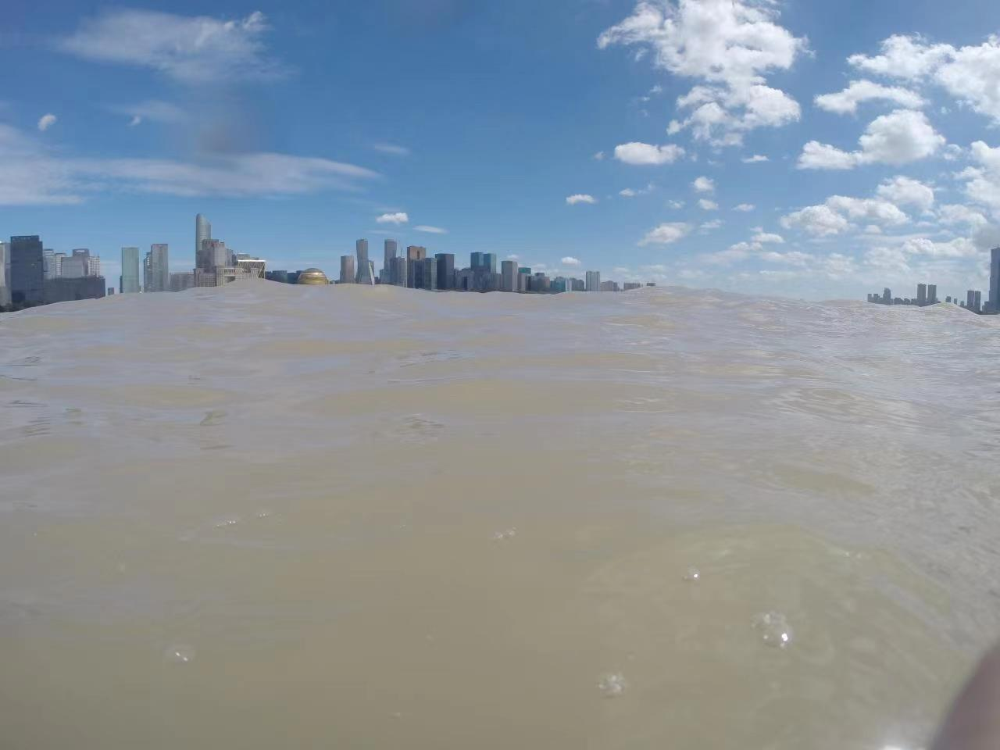

---
layout:		post
category:	"other"
title:		"横渡钱塘江"
tags:		[]
---
- Content
{:toc}

2015年首次报名，激情满满，好像还不用摇号，报名成功也测试通过，可惜遇到台风天取消了。

2022年想着了却下心愿，可惜没有报上名，报名的人是越来越多了。

2023年跟同学一起报名，幸运的是两个人一起摇号成功（概率还是蛮低的），可惜遇到台风天，加上杭州亚运会赛事，后面没有合适的举办时间，也取消了。

2024年保留2023年的名额，同学因为太忙放弃了，我想着了却心愿，还是继续参加了。因为以后再参加还要摇号，就不一定能摇中了。而且身体是一年比一年差，再不游以后可能就游不动了。

最怕的不是下江游泳，而是体能测试，测试需要在25分钟内完成800米，因为平时锻炼比较少，加上疫情之后心肺功能很差，游起来特别喘特别累。去年好不容易测试通过了，可惜取消了。今年虽说保留了名额，但是仍然需要体能测试，今年身体感觉比去年要差。通知体能测试的时间比较紧，平时都没有锻炼，临时抱佛脚去体育馆游了几次，每次都不能在限定时间内完成。

一直拖到最后的时间才去做的体能测试，状态不太好，一下去节奏就乱了，眼镜还进水，游得相当累，时间是超了，不过教练给放了水，给我过了。因为眼睛进水，当天之后的眼睛看东西一直都是雾蒙蒙的，感觉特别涩，晚上睡一觉次日才恢复正常。这体能跟2015年及以前的时候相比，真是差的不是一星半点。

体能测试通过，后面就不怕了，做的最坏的打算是：到时候就在江里慢慢游就行，完成就好！

时间定的是7月28日（星期日），前几天来了台风「格美」，下了几天雨，好在周五晚上就结束了，周六多云，周日天气就放晴了。这次没有受到台风天气的影响，终于如期举行了。

虽然做了最坏的打算，但还是比较紧张的，毕竟有那么长的距离，直线距离是1.2公里，考虑水流影响需要斜着游，实际距离可能要在1.5公里以上，游这么远还是很有挑战的。

周日这天是个大晴天，太阳暴晒，乘坐公共交通到达奥体中心，地铁车厢能看到许多跟屁虫，到站后有接驳车运送，人是真多，大多都有组织，我是一个人单独行动的。按照现场要求，换好衣服，把衣服、背包、手机塞到跟屁虫里面，这跟屁虫空间其实还是很可以的，能塞不少东西。饮完一瓶红牛，跟着人流一直到江边。

下水点是坐观光游船的地方，终点是城市阳台。已经有不少人在游了，远远的能看到显眼的跟屁虫在江里面漂浮。很多人游的方向都偏了许多，岸上的志愿者说是因为水流影响的，告诉大家应该朝着什么方向游。心里面开始忐忑起来，如果这样的话，说明水流影响很大，需要消耗更多的体力，还不知道游成什么样呢。

心想，反正都有开始的那一刻，也都有结束的那一刻，既然决定要参加，就有下水的那一刻，早晚都要下，那就下吧。看着一个个的像小鸭子一样往水里跳去，我也跳下去了，还好水温不凉，特别舒服。然后就仰泳慢慢游起来了。

天空特别蓝，还有一些白云在飘，躺在江面上仰泳，感觉自己就像躺在大草原上看天空一样。太阳毒辣，就像是一个大火炉在炙烤着，白云就像是被煮开的水一样在翻滚，又很快被风吹走。

因为耳朵老爱进水，塞了耳塞，不太听见外面的声音，一开始状态还挺好，反正就躺着慢慢游，到了江心，就听见救援人员在喊，抬起头来发现他们示意我改变方向，原来已经游偏了，就调整方向继续游。但是后面的状态就不太好了，可能是体力消耗了一部分了，而且江心的浪比较大，仰泳比较费劲，经常有水呛到。抬头看看，已经离出发的岸边很远了，不过到对岸也还有很远的距离，大概是过了一半了。一直仰泳脖子酸疼，害怕抽筋，后面就不断变换泳姿，吃力地游着。奇怪的是，后面的浪越发的大了，简直像大海里的波浪。水也比较浑浊，带着泳镜、戴着泳帽、耳朵塞得紧实的耳塞，时间久了会有一种特别压抑之感，让人喘不过气来。拖鞋挂在跟屁虫的绳子上荡来荡去得难受（拖鞋塞进跟屁虫里面会比较好一些），这一会游得特别难受，坚持了好久。好在这次泳镜没有进水，也没有起雾。

大概快到对岸还有两百米的时候，状态才回来，浪也小了，呼吸节奏也有了，进入到了热身的状态了，也不感觉喘了，而且越是胜利在望，就越感到轻松和有信心，然后就蛙泳一口气游到了岸边。

岸边的淤泥很多，不过非常软，大家都站在水里拍照，我也拍了一些留作纪念。越往岸边走，淤泥越深，埋过了腿根，吸力特别大，举步维艰，很多人都是用爬着的方式上岸的。

大家扎堆领奖牌，人超级多，不给二维码还不给领，我的二维码在水里泡掉了，无法领奖牌，就先去淋浴了。淋浴就一个小棚子，人也超级多，中间还停水了，运来一车水给冲洗的，等了比较久才冲洗好。再去领奖牌，还是不给，非要次日去游泳馆去领，好在有一个工作人员没那么死板，让我报了姓名给领了。然后拍照打卡。

回到家冲澡的时候，发现脸和背都晒的红红的，着实晒伤了。

整体感觉还好，只要慢慢游，总能完成，两边比较容易游，江心浪大比较费力。江水非常浑浊，在水下什么都看不到。之前一直好奇钱塘江的水是淡是咸，尝了下，是淡的，满足了一下好奇心。之前总觉得下到大江大河里面，会有一种莫名的恐惧感，这次完全没有，身边有许多人一起在游，还有巡逻的救援人员，就感觉特别有安全感。没有好奇江有多深，下面有没有水草之类的，总之没有那种对深水的莫名恐惧，这点是出乎我意料的。江水温度适宜，非常舒服，太阳很大需要做好防晒。还有就是在江里面游，因为水流和风浪的影响，要比在游泳池游难度大很多。

