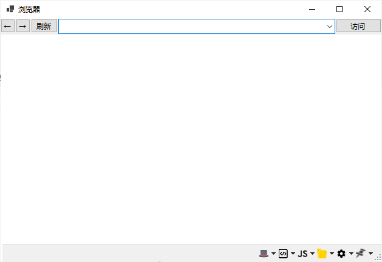
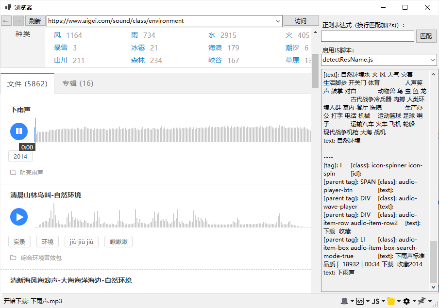

---
layout:		post
category:	"program"
title:		"资源下载的终极利器-资源轻松简单下载"
tags:		[c++]
---
- Content
{:toc}
# 缘起

​	经常会有朋友问起：某FM的音频文件怎么下载？某网站音效素材mp3怎么下载？等等之类。


​	于是便介绍了一下如何使用谷歌浏览器配合猫爪插件快速下载音频的方法，但是无奈电脑小白太多，很多操作配置并不会，有这功夫倒不如直接帮忙下载好了文件发与TA便是。


后来想了想，何不写个足够傻瓜的工具？实现一键点击下载。


# 设想

- 编写一个工具软件，要足够傻瓜便捷，一键下载。
- 该软件内置一个chrome内核的浏览器。
- 在浏览器层面拦截资源访问，判断一下，如果是需要的多媒体资源，进行自动下载。
- 不从网站的协议、接口、加解密入手，实现以不变应万变的**万能方法**下载资源。
- 多媒体文件还可以进行**人性化命名**，也就是网页浏览页面，点击自动下载且自动命名好。这个功能点想法很大胆，但是效果很惊艳，也是做到最后面才突发奇想的。


# 实现

​	想法很好，但是平时时间比较零碎，所以采用敏捷方法，使用csharp开发。好在现在Visual Studio已经到了2019，.NET已经到了5，工具和语言都很方便趁手，写起代码来也算是轻松愉快地进行。


**界面构想1**：主界面就打算设计成一个简单的浏览器窗口，访问资源网站，看到哪个音频点击哪个即可下载，足够傻瓜便捷。底部一个状态栏用来显示日志信息，同时可以添加一些功能按钮，用来拓展功能。



​	这里使用的是winform，没有使用WPF，为的还是快捷，拖放控件快速搭积木实现原型即可。

​	使用VisualStudio的**NuGet**功能快速添加cefsharp模块，这个就是基于chrome引擎的浏览器模块，后面简称cef（或cef浏览器）。选择x64 CPU，其他模式暂不考虑，先能用起来再说。


参考：[Using CefSharp to capture Resource Response Data (body) - Stack Overflow](https://stackoverflow.com/questions/45816851/using-cefsharp-to-capture-resource-response-data-body/45818741)，实现在浏览器层面的资源访问拦截，完整代码如下：

```c#
using CefSharp;
using CefSharp.Handler;

namespace ResDown {
    public delegate bool Callback(MessageType messageType, object obj);

    public class ResourceRequestHandlerExt : ResourceRequestHandler {
        private string userAgent;
        public Callback mCallback;

        public ResourceRequestHandlerExt(string userAgent, Callback callback) {
            this.userAgent = userAgent;
            this.mCallback = callback;
        }

        protected override CefReturnValue OnBeforeResourceLoad(IWebBrowser chromiumWebBrowser, IBrowser browser, IFrame frame, IRequest request, IRequestCallback callback) {
            var headers = request.Headers;
            headers["User-Agent"] = userAgent;
            request.Headers = headers;
            string resUrl = request.Url;

            if (request.ResourceType == CefSharp.ResourceType.Media && star.settings.IsAutoDownMedia) {
                Settings.mediaResourceList.push(resUrl);
                mCallback?.Invoke(MessageType.on_got_media, null);
            } else if (request.ResourceType == CefSharp.ResourceType.Image && star.settings.IsAutoDownImage) {
                Settings.imageResourceList.push(resUrl);
                mCallback?.Invoke(MessageType.on_got_image, null);
            }
            return base.OnBeforeResourceLoad(chromiumWebBrowser, browser, frame, request, callback);
        }
    }
}
```

​	代码非常简短，就是在浏览器访问资源前判断下资源类型（这里判断是图片或者是多媒体资源），把资源URL回调出去（传给了主进程再进行下载）。这里User-Agent做了可配置，实际上也可以不用额外设置。是否下载图片或者多媒体也都设计成了可配置，这块是明智之举，实际上工具能力泛化了，可以下载图片使用，也可以下载音频视频。


至此，流程基本跑通，想法基本可靠。下面一个难题是，每次点击下载的**资源文件命名问题**。以何种规则命名呢？如果以URL路径中的文件名作为本地文件名，势必太乱，而且资源文件多起来之后很难分别是哪个跟哪个，很不友好。后来就提出了大胆设想：网站上的资源都是有名称的，供网友查看，那能不能把网页上的名称给利用起来，在使用者点击的时候，先把这个资源名称获取到后，再自动下载呢？其实是可以的。


首先想到的是利用 **JavaScript** 脚本获取鼠标点击的资源在网页中的元素，然后随着这个被点击的元素顺藤摸瓜找到资源名称。一般来说点击的元素的名称都不是资源的名称，但是可以预见，显示资源名称的元素离被点击元素肯定不远，做个简单的规则查找即可。


本人对JavaScript并不熟悉，也不喜欢这个蹩脚的语言，后面写的代码都是临时搜索拼凑整合的，将就看下。


先在chrome的控制台中做调试分析，发现确实可以，参考：「JavaScript获取网页点击时候的元素信息」。于是更进一步，编写查找资源名称的代码，如下：

```js
//detectResName.js

var findSubStr = function (s, pre, tail) {
    var p1 = 0;
    var preLen = 0;
    var p2 = s.length;
    if (pre != null) {
        p1 = s.indexOf(pre);
        if (p1 == -1) p1 = 0;
        else preLen = pre.length;
    }
    if (tail != null) {
        p2 = s.indexOf(tail, preLen);
        if (p2 == -1) p2 = s.length;
    }
    s = s.substr(p1 + preLen, p2 - p1 - preLen);
    return s;
}

document.onclick = function (evt) {
    var evt = evt ? evt : window.event;
    var e = evt.srcElement || evt.target;
    var id = e.id;
    var className = e.className;
    var tagName = e.tagName;
    var text;
    console.log('\r\n----\r\n[tag]: ' + tagName + '\t[class]: ' + className + '\t[id]: ' + id);
    if (tagName == 'LI') {
        text = e.outerText;
    }else if(tagName == 'IMG') {
		console.log('img: ' + e.src);
	}

    // 根据域名添加规则解析
    var url = document.URL;
    var parent = null;
    var tryCount = 5;
    if (url.includes('51miz.com/')) {
    	tryCount = 3;
    }else if (url.includes('www.htqyy.com')){
    	text = document.getElementsByTagName('h1')[0].outerText;
		console.log('text: ' + text);
		console.setResName(text);
    	return;
    }else if (url.includes('tukuppt.com')){
    	tryCount = 1;
    }
    
    
    if (text == undefined || text == '') {
        for (var i = 0; i < tryCount; i++) {
            e = e.parentElement;
            tagName = e.tagName;
            console.log('[parent tag]: ' + tagName + '\t[class]: ' + e.className + '\t[text]: ' + e.outerText);
            if (tagName == 'LI') { break; }
        }
    }
	parent = e;
	text = e.outerText;
	

    // 根据域名添加规则解析
    if (url.includes('aigei.com')) {
        text = findSubStr(text, 'VIP\n', '\n');
    } else if (url.includes('tukuppt.com')) {
        text = findSubStr(text, null, '00:');
    } else if (url.includes('xxxxxx.com')) {
    } else {
        // 自动解析，取子元素中outerText最长的那个
        var maxLen = 0;
        var len = 0;
        var index = 0;
        var s;
        var pos;
        for (var i = 0; i < parent.childElementCount; i++) {
            s = parent.children[i].outerText;
            if (s.length < 5 || s.includes(':') || s.includes('-')) {
            	// 可能是日期时间
                continue;
            }
            len = s.length;
            //console.log('child: ' + s);
            if (len > maxLen) {
                maxLen = len;
                index = i;
            }
        }
        text = parent.children[index].outerText;
    }

    console.log('text: ' + text);
    console.setResName(text);
}
```

​	代码写的很不满意，但也无后续优化计划，如果有擅长JavaScript的朋友可以提供更优美的代码。大概思路是：先找到网页中被点击的元素，然后一直向上找父节点，一直找到节点的 **tagName** 为 **LI** ，认为是找到了资源列表中被点击的资源所在，然后再遍历该父节点的子元素取 **outerText** 属性。然后结合一定规则取出资源名称，如果规则比较复杂的，直接根据网站的URL添加粗暴直接的解析规则。

以上代码做了如下资源网站的兼容测试：

```
http://www.htqyy.com/
https://www.tukuppt.com/yinxiao/
https://www.aigei.com/sound/class/environment
https://www.51miz.com/so-sound/220452.html
https://www.qingting.fm/channels/332644/
https://www.ximalaya.com/youshengshu/4756811/
```

主要类型为：

- 列表模式
- 非列表模式


在chrome浏览器中实验完毕了，就可以集成到自己的软件中来。那么原来的界面设计可能就不够满足了，这个界面如何设计？既不影响原有的简单使用方式，又要增加强劲的功能。


**界面构想2**：

这个后来直接借鉴了谷歌浏览器的开发者模式界面思路，直接在原界面右侧设计一个侧边栏，作为软件的黑客工具栏窗口。该窗口可以通过底部状态栏的黑客（帽子图标）按钮隐藏和现实，隐藏时网页窗口布局自动扩宽，对原有界面影响不大。

工具窗口显示时，可以选择启用的JavaScript脚本列表，这里预置了三个（可拓展模式，以后相加可以随时添加并启用）：

- 空：选择时，网页加载后不加载自定义的JavaScript脚本。
- detectElement.js：选择时，网页加载后，在页面上随便点击即可显示元素信息，代码内容不在额外贴出，参考：「JavaScript获取网页点击时候的元素信息」。
- detectResName.js：选择时，网页加载后，在页面上随便点击即可显示元素信息，同时调用一个导出的JS函数，传递获取到的资源名称。


注意上面的JavaScript代码中，有一个接口函数：console.setResName，它不是原生就有的函数，而是封装导出的，在c#中导出JavaScript接口函数的方法如下：


先声明一个类型：

```c#
namespace ResDown {
    class ClassForJS {
        public delegate void OnWebLog(string msg);
        private static OnWebLog callback = null;
        public static void setCallback(OnWebLog log) {
            callback = log;
        }
        public void log(string msg) {
            if (callback != null) {
                callback(msg);
            }
        }
        public void log(string msg, int code) {
            if (callback != null) {
                callback(msg);
            }
        }

        public void setResName(string name) {
            Settings.resName = name.Trim();
        }
    }
}
```

再创建一个对象，并注册：

```c#
private ClassForJS objForJS = new();
ClassForJS.setCallback(OnWebLog);


browser.JavascriptObjectRepository.Settings.LegacyBindingEnabled = true;
browser.JavascriptObjectRepository.Register("console", objForJS, isAsync: true, options: BindingOptions.DefaultBinder);

/// <summary>
/// 网页日志输出
/// </summary>
/// <param name="msg"></param>
private void OnWebLog(string msg) {
    mContext.Post((o) => {
        if (this.txtWebLog.Lines.Length > 9999) {
            this.txtWebLog.Clear();
        }
        this.txtWebLog.Text += o + "\r\n";
        if (this.txtWebLog.Visible) {
            this.txtWebLog.SelectionStart = this.txtWebLog.TextLength;
            this.txtWebLog.ScrollToCaret();
        }
    }, msg);
}
```

上面讨了个巧，直接把对象注册为了**console**，通过导出一个**log**接口函数就算了接管了日志输出。再额外导出一个接口函数 **setResName**，用来接收获取到的资源文件名即可。这样实现的好处是，方便调试JavaScript脚本，一者软件可以直接拦截并显示日志；二是即使把JavaScript脚本拿到谷歌控制台里执行，也只需注释一行代码即可，大部分代码都是直接复用的。


# 效果

软件最终的实现效果是：

- 软件启动后，隐藏黑客工具栏窗口，默认加载「detectResName.js」脚本，默认只下载多媒体资源。这里为了方便演示，把工具窗口打开了。
- 浏览器栏有历史访问列表功能，可以在历史里选择URL，同时有自动完成功能。
- 访问某资源网站后，想下载哪个资源，点击播放即可，不用听完。这个时候脚本会执行，自动获取到资源名称，传递给csharp代码，然后下载资源的时候就使用这个资源文件名作为保存的文件名称。
- 全部异步，可以随便点击哪个资源名称均可，资源文件保存不会串名。对于多集的有声小说，也可以按照每集的名称下载。
- 那些需要登录或者需要会员的资源网站，均无须购买均可下载，也即只要能试听就能下载，既强大又便捷。





其他能力：

- 360doc这种禁止复制网页文本的，设计了一个禁用或启用页面JavaScript代码的开关（软件底部显示JS的按钮），关闭后，直接禁用网页JavaScript的执行，就可以直接复制网页里的文本，爽歪歪。


# 总结

​	以上，技术含量不高，权当做自己无聊「娱乐」了一把，感谢C#、VisualStudio、chrome。

​	但该方法其实是**万能方法**，任资源网站怎么变化，怎么加密，都绕不过去。即使通过URL直接下载的是加密的，其实cef里还有接口可以用，大概思路就是：网页上的资源总要渲染，总要让人听到看到吧，那就直接把渲染好的内存数据保存下来就好，这块实现起来可能会花点时间，我就没有写了，但是是可以突破的。相关的入手点，可以参考这几个关键词：OnResourceLoadComplete、MemoryStreamResponseFilter、GetResourceResponseFilter。