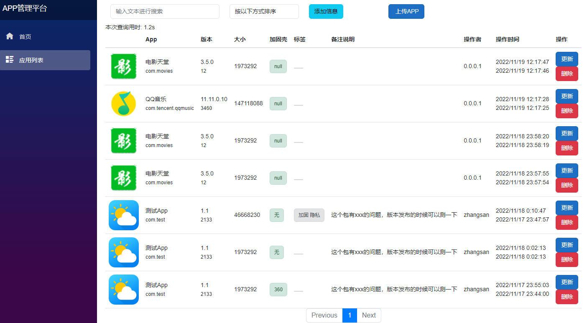

---
layout:		post
category:	"program"
title:		"C#Web开发之blazor体验"

tags:		[c#,blazor,net]
---
- Content
{:toc}


# 前言

先说结论：`blazor`做Web开发绝对好东西。对于我个人来说，有两个重要的原因：

- 特别喜欢`C#`；
- 特别不喜欢`JavaScript`；


在了解到`blazor`居然可以使用`c#`做Web开发且完全可以不用编写`JavaScript`代码时，第一感受是，居然有这么懂自己的东西，果断尝鲜体验！


网上大概也了解了一下，基本上都说得过于官方和理论，不够简单直接，这里直接说调研的结论。

- 使用`blazor`做web开发非常地高效（包括前后端），而且还是在资料不多的情况下（生态不太好，但绝对是好东西）。
- `blazor`提供两种模式：`WebAssembly`、`Server`；
- 建议使用 `Server` 模式，`WebAssembly`慢的受不了，一个简单的demo首次启动和每次刷新时都要将近 10秒钟时间，而相同demo项目`Server`模式基本是瞬间显示的。
- `WebAssembly`模式还有一个弊端：目前只有一个线程，容易出现 UI 界面卡死的问题。据说以后会改，谁知道啥时候呢。
- 简单的项目没必要搞什么前后分离，前后端分离也要看项目大小，小项目直接用混合模式也挺好的。
- 简单项目使用 `Server` 模式就可以完全前后端一锅端了，非常的简单高效。
- 如果前端设计能像客户端界面开发那样有控件拖放，就无敌了。


笔者本身不是做web开发的，但是对全栈比较感兴趣，在前几年也接触和体验了一下`SpringBoot`开发框架，参见：[SpringBoot极简教程](https://blog.csdn.net/asmcvc/category_8715905.html)，因为个人不喜欢`Java`更青睐`c#`，所以体验之后弄清楚如何使用及流程也就作罢了，日后并没有再接触使用。但是有了之前的了解，至少有了web开发的基础知识储备，因此此次使用`blazor`也会比较地快和顺利。这一次也会以一个具体的demo项目来做介绍：搭建一个局域网环境使用的`APP管理平台`。


背景是这样的：在很久之前我们团队就想搭建一个这样的内部平台，但是我们都是客户端开发（非前端开发），对这块没有经验也不擅长，也就作罢了。我们是做安卓安全研究的，日常会遇到各种各样的样本，具有重复使用的价值，但是都散落在组内各人自己的电脑里，没有汇总起来，时间久了也容易找不到。如果能在内网搭建一个这样的样本管理平台就好了，遇到新样本的时候上传上去，需要的时候检索下载下来。我们也想过用`共享文件夹`或`ftp服务器`的形式搭建，但是这都是单纯的文件上传和下载，没有样本的基础信息，并没有使用开来。


但这个需求也不算是刚需，只能说有了更好。但是在遇到`blazor`的时候，我就想大胆试一下，本身`C#`的开发效率非常高，心想应该花不了多少时间，于是开始构思：

- 需要有文件上传的功能；
- 需要有对APP样本文件进行解析的功能，并做基础信息的展示；
- 能检索和下载样本文件；


本着快速编程实现的想法，就想着如果能找到现成的代码改一改就行了，于是从`blazor文件上传`的关键词找到了这个demo：[File Upload with Blazor WebAssembly and ASP.NET Core Web API](https://code-maze.com/blazor-webassembly-file-upload/)，GitHub地址：[CodeMazeBlog/blazor-series at blazor-file-upload](https://github.com/CodeMazeBlog/blazor-series/tree/blazor-file-upload)。工程里面有两个项目，分别是server（服务端）和client（客户端）。这是一个前后端分离的项目，结构比较清晰，如果打算上手学习blazor，是一个非常好的入门练手项目。这是一个管理产品（product）的demo，基本上和我的需求类似，所以就拿这个开刀修改起来。遇到了一些坑：

- 这个前端是`WebAssembly`模式，问题很严重，就是前面提的速度超级慢和界面卡死问题；
- 服务端连接的数据库是`SQL Server`的，这个遇到问题不好解决花了一些时间，网上`MySQL`的资料多一些，好在及时换成了`MySQL`；


全程是以逆向工程的思路去实现的，遇到了非常多的问题，基本就是遇到一个解决一个，最终把项目跑起来了，效果图如下：



主要功能介绍：

- 打开链接 `http://[ip地址]:5000/apps `即可显示样本列表；
- 支持按照名称检索样本；
- 支持按照不同字段排序，默认按照更新时间倒叙显示；
- 支持一键浏览本地文件上传，服务端自动解析样本信息并入库；
- 支持样本信息的删除和更新；
- 默认局域网内http方式无登录授权访问；
- 点击图标下载样本到本地电脑；


后面的教程会以正向工程的顺序讲解，然后穿插一些实际修改demo项目的经验和问题。


# 一、数据库配置


## 1、数据库软件安装

- [MariaDB](https://mariadb.org/)，账号密码弄个测试的简单一点的：root/123
- 安装：[ODBC Connector - MariaDB Knowledge Base](https://mariadb.com/kb/en/mariadb-connector-odbc/)
- [Navicat](https://www.navicat.com/en/download/navicat-for-mysql)：可视化操作数据库，不用敲`SQL`命令，方面快捷；


## 2、VisualStudio连接MySQL

`VisualStudio`默认使用的数据库是`SQL Server`，先改为链接`MySQL`的数据库，这里使用开源的`MariaDB`。`VisualStudio`链接`MariaDB`数据库需要通过ODBC方式，因此需要安装[ODBC Connector - MariaDB Knowledge Base](https://mariadb.com/kb/en/mariadb-connector-odbc/)，然后进行ODBC数据源配置：

- 打开 `ODBC数据源管理程序`（Win + R 输入命令：`odbcad32` ）；
- 添加，选择：`MariaDB ODBC 3.0 Driver`，Name填：MariaDB，下一步；
- 选择：TCP/IP，ServerName填：127.0.0.1，User name和Password分别填：root 123
- Test DSN，提示成功说明配置正确，后面一路下一步即可。
- VisualStudio里打开菜单`工具` - `连接到数据库`，选择：`Microsoft ODBC 数据源`，刚刚的`MariaDB`名称，就能在`服务器资源管理器`里看到数据库链接了。


参考：

- [MariaDB + Visual Studio 2017 环境下的 ODBC 入门开发](https://www.cnblogs.com/joxon/p/mariadb-vs2017-odbc.html)

- 参考：[How to Use MySQL Database With .Net Core And Entity Framework?](https://www.geekinsta.com/mysql-with-net-core-and-entity-framework/)


## 3、创建数据库和表

- 打开`MariaDB`控制台，创建数据库：`CREATE DATABASE appdb;`然后`source apps.sql`;，`apps.sql`内容如下（可以在`Navicat`里设计，比较方便）：

```sql
/*
 Navicat Premium Data Transfer

 Source Server         : 127.0.0.1
 Source Server Type    : MySQL
 Source Server Version : 101100 (10.11.0-MariaDB)
 Source Host           : localhost:3306
 Source Schema         : appdb

 Target Server Type    : MySQL
 Target Server Version : 101100 (10.11.0-MariaDB)
 File Encoding         : 65001

 Date: 18/11/2022 00:16:42
*/

SET NAMES utf8mb4;
SET FOREIGN_KEY_CHECKS = 0;

-- ----------------------------
-- Table structure for apps
-- ----------------------------
DROP TABLE IF EXISTS `apps`;
CREATE TABLE `apps`  (
  `Id` bigint NOT NULL AUTO_INCREMENT,
  `Name` varchar(64) CHARACTER SET utf8mb4 COLLATE utf8mb4_general_ci DEFAULT NULL,
  `Package` varchar(100) CHARACTER SET utf8mb4 COLLATE utf8mb4_general_ci DEFAULT NULL,
  `Icon` longtext CHARACTER SET utf8mb4 COLLATE utf8mb4_general_ci NULL,
  `VersionName` varchar(32) CHARACTER SET utf8mb4 COLLATE utf8mb4_general_ci NULL DEFAULT NULL,
  `VersionCode` varchar(32) CHARACTER SET utf8mb4 COLLATE utf8mb4_general_ci NULL DEFAULT NULL,
  `ShellName` varchar(32) CHARACTER SET utf8mb4 COLLATE utf8mb4_general_ci NULL DEFAULT NULL,
  `Tags` varchar(64) CHARACTER SET utf8mb4 COLLATE utf8mb4_general_ci NULL DEFAULT NULL,
  `Memo` varchar(128) CHARACTER SET utf8mb4 COLLATE utf8mb4_general_ci NULL DEFAULT NULL,
  `Operator` varchar(32) CHARACTER SET utf8mb4 COLLATE utf8mb4_general_ci NULL DEFAULT NULL,
  `dbPath` longtext CHARACTER SET utf8mb4 COLLATE utf8mb4_general_ci NULL,
  `Url` longtext CHARACTER SET utf8mb4 COLLATE utf8mb4_general_ci NULL,
  `CreationDate` datetime(6) NOT NULL DEFAULT current_timestamp(6),
  `ModifiedDate` datetime(6) NOT NULL DEFAULT current_timestamp(6) ON UPDATE CURRENT_TIMESTAMP(6),
  `Md5` varchar(32) CHARACTER SET utf8mb4 COLLATE utf8mb4_general_ci NULL DEFAULT '',
  `FileSize` int UNSIGNED NULL DEFAULT 0,
  PRIMARY KEY (`Id`) USING BTREE,
  UNIQUE INDEX `index_id`(`Id` ASC) USING BTREE
) ENGINE = InnoDB AUTO_INCREMENT = 41 CHARACTER SET = utf8mb4 COLLATE = utf8mb4_general_ci ROW_FORMAT = DYNAMIC;

-- ----------------------------
-- Records of apps
-- ----------------------------
INSERT INTO `apps` VALUES (36, '测试App', 'com.test', 'https://appimg.dbankcdn.com/application/icon144/629336112d984dc1950f3992e0efdae0.png', '1.1', '2133', '360', NULL, '这个包有xxx的问题，版本发布的时候可以测一下', 'zhangsan', 'share\\app\\dytt8.apk', 'file:\\\\192.168.1.2\\share\\app\\dytt8.apk', '2022-11-17 23:44:00.872375', '2022-11-17 23:55:03.068345', NULL, 1973292);
INSERT INTO `apps` VALUES (38, '测试App', 'com.test', 'https://appimg.dbankcdn.com/application/icon144/629336112d984dc1950f3992e0efdae0.png', '1.1', '2133', '无', '加固 隐私', '这个包有xxx的问题，版本发布的时候可以测一下', 'zhangsan', 'share\\app\\184543_3.apk', 'file:\\\\192.168.1.2\\share\\app\\184543_3.apk', '2022-11-17 23:47:57.061125', '2022-11-18 00:10:47.843875', NULL, 46668230);
INSERT INTO `apps` VALUES (39, '测试App', 'com.test', 'https://appimg.dbankcdn.com/application/icon144/629336112d984dc1950f3992e0efdae0.png', '1.1', '2133', '无', NULL, '这个包有xxx的问题，版本发布的时候可以测一下', 'zhangsan', 'share\\app\\dytt8.apk', 'file:\\\\192.168.1.2\\share\\app\\dytt8.apk', '2022-11-18 00:02:13.713289', '2022-11-18 00:02:13.715084', NULL, 1973292);

SET FOREIGN_KEY_CHECKS = 1;
```

- 创建一个名为`AppInfo`的Model：

  ```c#
  public class AppInfo {
      //[Key]
      [DatabaseGenerated(DatabaseGeneratedOption.Identity)]
      public long Id { get; set; }
  
      // App名称
  
      //[Required(ErrorMessage = "Name is required field")]
      [StringLength(maximumLength: 64)]
      public string Name { get; set; }
  
      // 包名
  
      //[Required(ErrorMessage = "Package is required field")]
      [StringLength(maximumLength: 100, MinimumLength = 3)]
      public string Package { get; set; }
  
      // 图标
      public string Icon { get; set; }
  
      // 版本号
      [StringLength(maximumLength: 32)]
      public string VersionName { get; set; }
  
      [StringLength(maximumLength: 32)]
      public string VersionCode { get; set; }
  
      // 壳特征名称
      [StringLength(maximumLength: 32)]
      public string ShellName { get; set; } = "null";
  
      // 标签
      [StringLength(maximumLength: 64)]
      public string Tags { get; set; }
  
      // 备注
      [StringLength(maximumLength: 128)]
      public string Memo { get; set; }
  
  
      // 操作人员
      [StringLength(maximumLength: 32)]
      public string Operator { get; set; }
  
  
      // 数据库存储路径（相对路径）
      public string dbPath { get; set; }
  
      public string Url { get; set; }
  
      public DateTime CreationDate { get; set; }
  
      // 对应的是自动更新时间的数据库字段
      [DatabaseGenerated(DatabaseGeneratedOption.Computed)]
      public DateTime ModifiedDate { get; set; }
  
      public string Md5 { get; set; }
  
      public long FileSize { get; set; }
  }
  ```

- 服务端项目（`BlazorDemo.Server`）添加三方库：`Pomelo.EntityFrameworkCore.MySql`，然后修改`Startup.cs`函数`ConfigureServices`的代码为：

  ```c#
  var connectionString = Configuration.GetConnectionString("sqlConnection");
  services.AddDbContext<ProductContext>(opt => opt.UseMySql(connectionString, ServerVersion.AutoDetect(connectionString)));
  ```

- 服务端`appsettings.json`修改为：

  ```json
  {
    "Logging": {
      "LogLevel": {
        "Default": "Information",
        "Microsoft": "Warning",
        "Microsoft.Hosting.Lifetime": "Information",
        "Microsoft.EntityFrameworkCore": "Information"
      }
    },
    "ConnectionStrings": {
      "sqlConnection": "SERVER=127.0.0.1;UID=root;PWD=123; database=appdb;"
    },
    "AllowedHosts": "*"
  }
  ```


## 4、数据库迁移操作

在VisualStudio的PM控制台下输入命令。

```
Add-Migration Initial
Update-Database
Remove-Migration
```


# 二、服务器配置

一共需要设置 4 个服务器，分别是：

1. 部署前端的服务器；

2. 部署API接口的服务器；
3. 数据库服务器；
4. 文件下载服务器；

其实前两个服务器可以合并为一个。因为我们是内网使用，所有的服务器最后都用了同一台Windows普通电脑来完成。


先说最简单的文件服务器，直接使用`Python`的一句话命令就可以完成了。在电脑上选择一个目录作为存储样本文件使用，例如`E:\share`，然后在该目录下创建一个批处理文件`httpServer.bat`，内容：`python -m http.server`，每次需要启动文件服务器的时候运行下`httpServer.bat`即可。如果全部使用`dotnet`技术栈，内容也可以是：

```bash
Rem python -m http.server
Rem dotnet tool install --global dotnet-serve
dotnet-serve -p 8000 -a 0.0.0.0
```


前后端可以分离开发，也可以混合开发。一开始借鉴的开源代码是前后端分离的，但是后来因为修改成了server模式，变成了混合模式。但是无论哪种都可以把前后端的项目部署在同一台服务器上，仅仅是开放的端口不一样罢了。最终配置如下：

- 服务端（`BlazorDemo.Server`）的`launchSettings.json`内容：

  ```json
  {
    "iisSettings": {
      "windowsAuthentication": false,
      "anonymousAuthentication": true,
      "iisExpress": {
        "applicationUrl": "http://localhost:52497",
        "sslPort": 0
      }
    },
    "profiles": {
      "BlazorDemo.Server": {
        "commandName": "Project",
        "launchBrowser": false,
        "applicationUrl": "http://localhost:5010;http://*:5010",
        "environmentVariables": {
          "ASPNETCORE_ENVIRONMENT": "Development"
        }
      }
    }
  }
  ```

- 前端（`BlazorDemo.Client`）的`appsettings.json`内容：

  ```json
  {
    "Logging": {
      "LogLevel": {
        "Default": "Information",
        "Microsoft.AspNetCore": "Warning"
      }
    },
    "AllowedHosts": "*"
  }
  ```

- 


# 三、支持局域网访问

https的配置比较麻烦，而且第一次玩这个，不想太花时间折腾，本着先跑通的想法，先简单弄起来。如果是新创建项目的话，就不要勾选`https`即可。

- server项目里面`Startup.cs`文件`Configure`函数注释掉这两句调用：

  ```c#
  //app.UseHttpsRedirection();
  //app.UseAuthorization();
  ```

- server项目`launchSettings.json`去掉对https的支持，修改为：

  ```json
  {
    "iisSettings": {
      "windowsAuthentication": false,
      "anonymousAuthentication": true,
      "iisExpress": {
        "applicationUrl": "http://localhost:52497",
        "sslPort": 0
      }
    },
    "profiles": {
      "BlazorProducts.Server": {
        "commandName": "Project",
        "launchBrowser": false,
        "applicationUrl": "http://localhost:5010;http://*:5010",
        "environmentVariables": {
          "ASPNETCORE_ENVIRONMENT": "Development"
        }
      }
    }
  }
  ```

- client项目的`launchSettings.json`去掉对https的支持，修改为：

```json
{
  "profiles": {
    "BlazorProducts.Client": {
      "commandName": "Project",
      "dotnetRunMessages": "true",
      "launchBrowser": true,
      "inspectUri": "{wsProtocol}://{url.hostname}:{url.port}/_framework/debug/ws-proxy?browser={browserInspectUri}",
      "applicationUrl": "http://localhost:5000;http://*:5000;",
      "environmentVariables": {
        "ASPNETCORE_ENVIRONMENT": "Development"
      }
    }
  }
}
```

- client项目代码里面凡是涉及到API接口调用的地方，一律修改为 `http://作为服务器的电脑的具体IP地址:5010`


# 四、界面组件

千万不要自己从零去写，没经验的话比较花时间，强烈推荐使用 [Bootstrap Blazor - 企业级 UI 组件库](https://www.blazor.zone/index) ，是个开源项目，GitHub地址见：[BootstrapBlazor](https://github.com/dotnetcore/BootstrapBlazor)，总体使用比较方便，官网有详细使用教程和示例代码，直接拿来使用即可。文件上传功能就是直接用了这个 [上传组件 Upload](https://www.blazor.zone/uploads) ，很方便，开发效率很高，使用的组件情况如下。

删除确认弹框：

```c#
<PopConfirmButton OnConfirm="()=>{Apps.Remove(app); Delete(app); StateHasChanged(); return Task.CompletedTask; }" Placement="Placement.Bottom" Color="Color.Danger" ConfirmIcon="fa-solid fa-triangle-exclamation text-danger" ConfirmButtonColor="Color.Danger" Text="删除" Content="确定删除数据吗？" />
```

文件上传：

```c#
<ButtonUpload BrowserButtonText="上传APP" TValue="string" IsMultiple="true" ShowProgress="true" OnChange="@OnClickToUpload" OnDelete="@(fileName => Task.FromResult(true))"></ButtonUpload>
    
private async Task OnClickToUpload(UploadFile file) {
	await SaveToFile(file);
}
```

消息通知（消息提示）：

```c#
[Inject]
[NotNull]
private MessageService? MessageService { get; set; }


await MessageService.Show(new MessageOption() {
	Content = e.Message
});
```


# 五、全局异常处理

这个可以借鉴 [深入浅出Blazor webassembly之异常错误显示](https://www.cnblogs.com/harrychinese/p/blazor_errorhandling.html)，也可以直接使用 [全局异常 - Bootstrap Blazor - 企业级 UI 组件库](https://www.blazor.zone/globalexception)。


# 六、发布部署

## 发布

两种方法：

1. 使用VisualStudio菜单：生成 - 发布，按照向导生成。
2. 使用`dotnet`命令：`dotnet publish -c Release`


## 部署

- 选择一台Windows电脑作为服务器使用，记录其 IP 地址；

- 安装：dotnet、[MariaDB](https://mariadb.org/)（账号密码弄个测试的简单一点的：root/123）、[ODBC Connector - MariaDB Knowledge Base](https://mariadb.com/kb/en/mariadb-connector-odbc/)

- 配置好数据库；

- 选择一个文件夹作为http服务器，目录下放好`httpServer.bat`，一键运行开启http服务。

- 为保证局域网的其他设备能够访问，客户端和服务端的`appsettings.json`做好类似如下配置：

  ```json
  "AllowedHosts": "*",
  "Urls": "http://*:5010",
  ```

- 配置`ApkInfoTool`工具；

- 启动服务端：`dotnet run`

- 启动前端：`dotnet run`

- 其他设备访问地址：`http://IP地址:5000`


# 七、注意事项

- 服务器项目里的接口函数一律要用`anync Task`返回类型，否则容易出现错误：`Cannot access a disposed context instance`，参考：[Resolved- DBContext ObjectDisposedException:Cannot access a disposed of object](https://www.thecodebuzz.com/efcore-dbcontext-cannot-access-disposed-object-net-core/)

- `WebAssembly`的缺点：不支持多线程容易UI卡死；启动和刷新速度特别慢；

- 新建项目的时候勾选`ASP.NET Core托管`自动生成的解决方案包含三个项目，服务端也一并包含；

- 回调函数用`await InvokeAsync`，例如：

  ```c#
  _timer = new Timer(async (sender) => {
      await InvokeAsync(() => {
          SearchCallback.InvokeAsync(SearchText);
      });
      _timer.Dispose();
  }, null, 500, 0);
  ```

- UI的响应函数类型要用`async Task`，如果内部没有调用异步函数，可以在最后调用下：`await Task.CompletedTask;`，例如：

  ```c#
  public partial class Search {
      private Timer _timer;
  
      public string SearchText { get; set; }
  
      [Parameter]
      public EventCallback<string> SearchCallback { get; set; }
  
      private async Task OnSearch() {
          if (_timer != null)
              _timer.Dispose();
  
          _timer = new Timer(async (sender) => {
              await InvokeAsync(() => {
                  SearchCallback.InvokeAsync(SearchText);
              });
              _timer.Dispose();
          }, null, 500, 0);
          await Task.CompletedTask;
      }
  }
  ```

- 


# 参考

- [学习ASP.NET Core Blazor编程系列四——迁移 - DotNet菜园](https://www.cnblogs.com/chillsrc/p/16747434.html)
- [net::ERR_CERT_AUTHORITY_INVALID 在 ASP.NET Core 中](https://qa.1r1g.com/sf/ask/4465759651/)
- [ASP.NET内核中的net::ERR_CERT_AUTHORITY_INVALID - 问答 - 腾讯云开发者社区-腾讯云](https://cloud.tencent.com/developer/ask/sof/1109771)
- [MariaDB + Visual Studio 2017 环境下的 ODBC 入门开发](https://www.cnblogs.com/joxon/p/mariadb-vs2017-odbc.html)
- 文件上传参考：[Upload files using InputFile component in Blazor](http://www.binaryintellect.net/articles/06473cc7-a391-409e-948d-3752ba3b4a6c.aspx)，上传进度参考：[c# web api post with progress reporting](https://gist.github.com/benhysell/1624c5e001ce8f53b992)
- 增删改查参考：[Asp.Net Core Blazor 开发体验](https://blog.csdn.net/elie_yang/article/details/123399805?spm=1001.2014.3001.5506)
- [fix to OnInitializedAsync being called twice in Blazor server project](https://learn.microsoft.com/en-us/answers/questions/233675/blazor-oninitializedasync.html)
- [Blazor Navigation: Update URL without changing reloading page](https://www.appsloveworld.com/csharp/100/80/blazor-navigation-update-url-without-changing-reloading-page)


开源项目参考：

- [CodeMazeBlog/blazor-series at blazor-file-upload](https://github.com/CodeMazeBlog/blazor-series/tree/blazor-file-upload)
- [ErikXu/kubernetes-filesystem: System to browse, upload or download files for pods or containers in kubernetes.](https://github.com/ErikXu/kubernetes-filesystem)
- [WebApiClient: An open source project based on the HttpClient. You only need to define the c# interface and modify the related features to invoke the client library of the remote http interface asynchronously.](https://github.com/dotnetcore/WebApiClient)
- 
