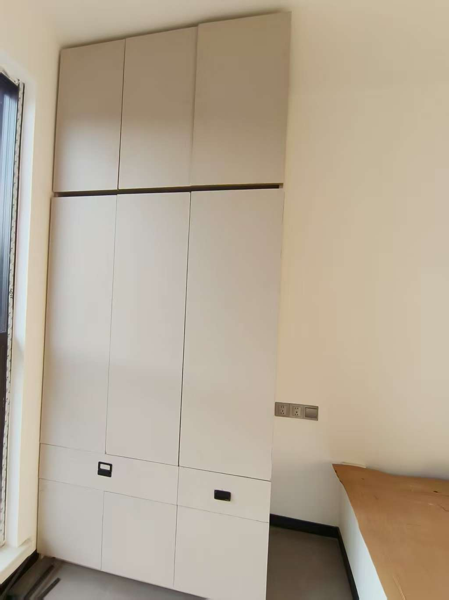
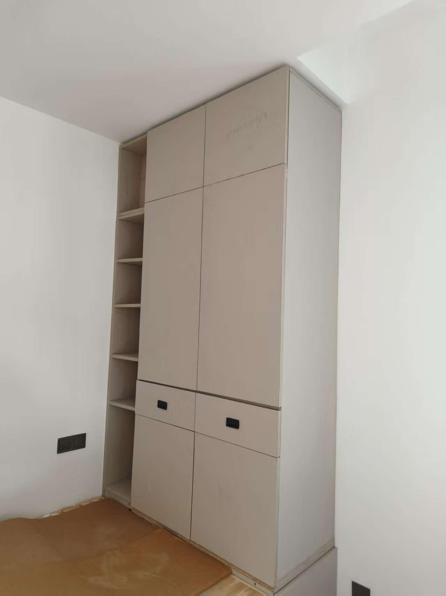
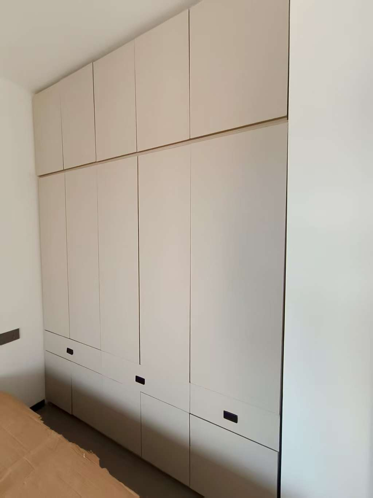

---
layout:		post
category:	"reads"
title:		"装修之木工打柜子的一点感悟"

tags:		[]
---
- Content
{:toc}

**装修之木工打柜子的一点感悟**

# 缘起

一是因为久坐不运动，身体变得很差，偶有腰突。

二是周末没有事做，实在闲得蛋疼，想着随便找点事情做做。

三是抖音看多了，看啥都觉得简单，总想着自己也动手体验下。

既能打发时间又能锻炼下身体，还能多一番体验，也算是一举多得了。

# 过程

从选购木材、台锯，到各种工具，东西买了一大堆，虽然汇总起来也没多少钱（相较于全屋定制，加起来所有的费用都不及三分之一），但是要去做攻略，了解使用方法。这是非常费神的，也非常消耗时间。

- 5.17：床板制作 书房夹角柜体制作 主要目的：练习木板切割、封边、组装、工具使用、熟悉流程、确定下次改进部分；
  - 此次推台锯没有按时送到，临时使用电圆锯切割的，没有办法推大板，只能切下小料，临时购买的靠山神器不够精准也很重也无法固定德力西7寸电圆锯，后面就是测量尺寸划线按照线路切割的，勉强切出了床板。
  - 练习了二合一套件，对精度要求比较高，对深浅也有要求。
  - 练习了自动螺丝及导孔，这个比较简单，在不见光的地方尽量用自攻螺丝。
  - 改进：尽量使用推台锯；欧松板要全部封边，使用手持封边机+带胶封边条，不要用自动封边机，那个配套太复杂了还要用气泵，不适合家庭及DIY。
- 5.24：书房床板制作 书房外侧柜体制作 书房书桌制作。
  - 此次使用的推台锯WJ600B使用还算简单，小白可以立即上手，组装简单但耗时，毕竟东西比较多且重，一个人的话也要组装半天。刻度精准，只需调好靠山尺寸直接推板即可，锯口很平整。不足之处：买的是手动升降的，这个切十字卡口的时候就不方便了，因为需要把子锯下调，这样每次手动调整就很麻烦。只能上电圆锯了。切大板的时候还是不太方便，仍然需要两个人配合才行。不过整体还算好的了，基本上符合我的预期：小白也能很好地使用。
  - 切板顺利后，后面很快。 封边很慢，且修边不是那么的直溜，拐角处处理得不好，封边特别耗时。
  - 组装也特别耗时，有一个2.1米x1米的衣柜，组装了连续8个小时，尺寸还不那么完美。这个后面需要想办法利用工具。组装完成后框架还是有点晃动，钉上背板后就很牢固了，不会晃动。
  - F30直钉枪不完美，不能彻底打平，还要用锤子二次敲击。
  - 电钻只有一把，需要频繁更换钻头与批头，特别浪费时间和体力，后面需要补充一把。
  - 二合一连接件的胖钉位置特别容易开错，后面需要使用工具，网上有一个小神器但是那个也只是在定位好线之后再定孔的，中线的位置没有搜到工具，可以自己设计制作一个。
  - 二合一连接件锁扣使用的自攻螺丝最好是15mm~20mm的，不宜太长，欧松板容易撑爆。
  - 自攻螺丝的确都需要先导孔，不然木板容易撑爆。
  - 连接两个板子的时候使用35mm~40mm的自攻螺丝即可，太长不行，欧松板容易撑爆。
  - 层板与立板固定的时候，打钉的位置很难找，浪费时间且不准备，很容易打偏。搜索工具没有找到，后面需要自行制作一个。
  - 木工夹具很有用。
  - 书桌的设计可以整理成公式，使用电脑计算用料，节省时间。
- 5.31：二楼南次卧柜体制作（左右均不见光，直接上F30直钉和自攻螺丝，相对简单一些）。这个柜子的宽度比较大，将近两米，高度有2.7米，所以工复杂度和工作量也是比较大的，第一天晚上直接干到夜里十二点整。第二天打的上柜，结果左右方向搞反了，为了和下柜保持一致，无奈只好调转方向，让踢脚朝上了，这个也是很遗憾的地方，实在是太累了，没有拆开重新组装。
- 6.7：此次带了水平仪，用来定位和校准，非常准确快速。这次两天打了西次卧的下柜、上柜、书桌、书房角落书架、鞋柜。效率明显比之前高很多。

# 感悟

- **累**。好多年没怎么干过体力活了，身体是实在吃不消的，有几次都是身体酸疼好多天才得以缓解。好在工作日干的是脑力活，又是久坐，身体在物理上能得以恢复，到了周末就休息得差不多了，于是接着干。就这样利用周末的时间干了好多次。
- **说简单也简单，说复杂也复杂**。复杂在于，隔行如隔山，很多东西没有实践过总有不知道的地方，总要踩坑。于是反反复复，总会走弯路耗费时间。简单在于，实在是没有什么技术门槛，一回生二回熟，做过几次也就知道套路了。再做几次之后新鲜劲也没了，还觉得这事也蛮无聊没趣的，远不如写代码有趣。
- **真的省钱**。网购的材料工具啥的，其实是非常便宜的，尤其是在PDD上，真是物美价廉。另外一个费用就是人工，自己动手的话那就更省了。
- **没法后悔**。一个木材，如果你切错了，那么就是错了，木料大概率是废了，没办法撤销。一个钉眼，位置找错了那钉出来就会爆边丑陋。
- **不太安全**。需要大量使用：切割工具，接触水电，尤其是推台锯、切割机、角磨机、钉枪，这些都非常非常危险，可以自行搜索了解。另外一个潜在的危险是天气，特别是下雨、高温天气的时候也容易有触电、中暑的风险。还有一个危险是需要爬高、需要搬很重的物体（例如柜子就非常重），也很容易受到伤害。
- **计算机行业其实是个好行业**。说它好在于它的可复制性，写出的代码它能运行很多次，但是实体就得一件一件地去做，没有复制性，做了一个柜子只能被一个房间所使用，第二个房间要用柜子就必须再制作一个。种田也一样，种第二亩地必须花费和第一亩地一样的时间，想要种得更多那就得花费更多的时间和体力。但是软件却可以运行在无数的设备上，复制粘贴一下就是一个新的拷贝了。所以一定要**珍惜具有可复制性的工作**，除了计算机之外，写作也算是一个，写出的文章或书籍，很多人买跟一个人买，你所付出的劳动量是相同的，再多一个人买你也不用额外再去写。鉴于此，我也能更加踏实地去坚持自己所在的行业。再从安全性上考虑，虽然说计算机行业偶有猝死的，但是这个危险的概率乃至绝对数值我个人感觉都要小的多，请参见上条。再从容错性上说，代码写错了还可以撤销重来，还可以调试排查。再宽泛一些，从事脑力劳动的优点总体上是要比体力劳动的要多一些的。真的，如果你恰好在从事计算机行业，如果你感觉到疲了，不妨去尝试做一做体力活，有对比就能发现现在的好了。
- **身体确实变好了一些，腰突问题减轻，现在可以适当负重了**。脑力和体力应当适当地变换调节，经常久坐不爱运动的话，应该找一些适合自己的体力活，适当地活动下筋骨调节下身体。
- **人的屁股只能坐到一个凳子上**，不要想着什么都要做、什么都要会，完全没必要，要学会做减法。只要一个人是正常的，那他在一个领域能达到80分的水平，那么他在其他领域假以时日也一样可以达到80分。但是没必要去证明自己，也没有必要去花那个时间。人的时间是有限的，不如**专注一点**，把时间花在自己擅长自己熟悉的领域，继续加强做到90分、100分。所谓**千招会不如一招鲜**是也。

# 成品效果

2025-07-06
