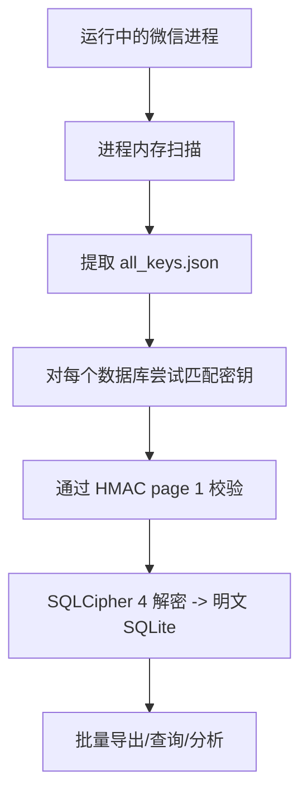

# WeChat Decrypt：微信 4.0 全平台数据库解密与数据工具箱深度解析

## 项目概览

**WeChat Decrypt** 是一个开源的全平台微信 4.0 本地数据库解密与数据工具集合，支持从运行中的微信进程内存提取加密密钥，解密 SQLCipher 4 加密的 SQLite 数据库，并提供实时消息监听、批量导出、图片解密、语音转录、朋友圈解析等一系列实用功能。

| 指标 | 数据 |
|------|------|
| 仓库 | https://github.com/ylytdeng/wechat-decrypt |
| Stars | 3,930 |
| Forks | 2,135 |
| 编程语言 | Python |
| 创建时间 | 2026-02-28 |
| 支持平台 | Windows / macOS / Linux |
| 核心能力 | 个人微信 4.0 + 企业微信 5.x 数据库解密 |

> 本文将从技术原理层面深入分析微信的本地数据加密机制，以及此项目采用的解密思路和工程实现。

---

## 一、微信 4.0 的本地数据加密体系

### 1.1 SQLCipher 4 加密引擎

微信 4.0 使用 **SQLCipher 4** 加密本地数据库（微信的 WCDB 封装）。其加密参数配置如下：

| 参数 | 值 |
|------|-----|
| 加密算法 | **AES-256-CBC** + **HMAC-SHA512** |
| 密钥派生函数 | **PBKDF2-HMAC-SHA512** |
| PBKDF2 迭代次数 | **256,000 次** |
| 每个数据库 | 独立的 **salt** 和 **enc_key** |
| 数据库文件后缀 | `.db`（实际为 SQLCipher 加密格式） |

每个数据库文件（联系人、会话、消息等约 26 个库）拥有独立的 salt 和加密密钥，这意味着解密一个库的密钥无法用于解密其他库。

### 1.2 SQLCipher 4 vs 旧版 SQLCipher

SQLCipher 4 相比前代在安全性上有显著提升：

- **默认 HMAC**：SQLCipher 3 的 HMAC 是可选的，SQLCipher 4 强制启用
- **KDF 迭代增强**：从 64,000 次提升到 256,000 次，暴力破解成本增加 4 倍
- **页面加密**：每页使用独立的 IV（初始化向量），由 page number 派生
- **Reserve 区域**：每页预留 HMAC 校验区域，防止篡改

### 1.3 数据库文件架构

解密后包含约 **26 个数据库文件**，各司其职：

| 数据库 | 用途 |
|--------|------|
| `session/session.db` | 会话列表（含最新消息摘要） |
| `message/message_*.db` | 聊天记录 |
| `contact/contact.db` | 联系人信息 |
| `media_*/media_*.db` | 媒体文件索引 |
| `head_image/` | 头像缓存 |
| `fav/` | 收藏 |
| 其他 | 表情、转账记录、朋友圈等 |

---

## 二、核心技术方案

### 2.1 密钥提取：进程内存扫描（核心突破）

**这是整个解密方案的基石。**

WCDB（微信的 SQLCipher 封装）会在进程内存中缓存派生后的 raw key，格式为：

```
x'<64hex_enc_key><32hex_salt>'
```

共计 48 字节（32 字节 enc_key + 16 字节 salt）的十六进制字符串表示。

#### 扫描原理

```
1. 定位微信进程（WeChat.exe / Weixin 等）
2. 读取进程内存空间
3. 搜索匹配 x'<64hex><32hex>' 模式的内存区域
4. 对候选密钥尝试解密数据库 page 1
5. 通过 HMAC 校验确认密钥正确性
```

三个平台的扫描实现各有不同：

| 平台 | 实现方式 | 工具 |
|------|---------|------|
| **Windows** | `ReadProcessMemory` Win32 API 扫描 Weixin.exe 内存 | `find_all_keys_windows.py` |
| **macOS** | Mach VM API (`mach_vm_read`) C 编写的原生扫描器 | `find_all_keys_macos.c` |
| **Linux** | 读取 `/proc/<pid>/mem` 伪文件 | `find_all_keys_linux.py` |

#### macOS 的特殊处理

macOS 由于系统安全机制（SIP + 硬运行时），需要：

```bash
# 1. 先退出微信
killall WeChat

# 2. 对微信做 ad-hoc 重签名（允许进程内存读取）
sudo codesign --force --deep --sign - /Applications/WeChat.app

# 3. 编译并运行原生扫描器（需 root）
cc -O2 -o find_all_keys_macos find_all_keys_macos.c -framework Foundation
sudo ./find_all_keys_macos
```

> **安全注意**：`all_keys.json` 包含明文 raw key，写入时自动设为 `chmod 0600` 权限。**切勿提交到 Git 或与人共享**——拿到 key 等于拿到全部聊天解密能力。

### 2.2 数据库解密流程



解密核心命令：

```bash
# 提取密钥
python find_all_keys.py

# 全量解密所有数据库
python decrypt_db.py

# 增量解密（仅解密有变化的库）
python decrypt_db.py -i
```

### 2.3 WAL 文件实时监听（关键技术）

微信使用 SQLite 的 **WAL（Write-Ahead Logging）模式**，这意味着新写入的消息不会立即写入主数据库文件，而是先写入 WAL 文件。

**WAL 文件的特殊性**：微信的 WAL 文件是**预分配固定大小**（4MB），因此无法通过文件大小变化检测写入。

监听策略：

| 检测方法 | 是否可行 | 原因 |
|---------|---------|------|
| 文件大小 | ❌ | 固定 4MB，永不变化 |
| mtime（修改时间） | ✅ | 写入时更新 |
| inotify（Linux） | ✅ | 文件事件通知 |
| ReadDirectoryChangesW（Windows） | ✅ | 目录变化通知 |

实现原理：

```
1. 30ms 轮询 WAL 文件的 mtime
2. 检测到变化后，读取 WAL 中的新 frame
3. 解密 frame 时需要校验 salt 值（跳过旧周期遗留的 frame）
4. 通过 SSE 推送到浏览器
```

Web UI 实时监听流：

```
用户浏览器 ← SSE ← Python 服务器 ← 30ms 轮询 ← WAL 文件
```

### 2.4 图片加密：三种格式兼容

微信 4.0 在本地存储图片时有三种加密格式，体现了微信加密策略的**演进过程**：

| 格式 | 时期 | Magic 标识 | 加密方式 | 密钥来源 |
|------|------|-----------|---------|---------|
| **旧 XOR** | ~2025-07 | 无 | 单字节 XOR | 自动检测（对比 magic bytes） |
| **V1** | 过渡期 | `07 08 V1 08 07` | AES-ECB + XOR | 固定 key: `cfcd208495d565ef` |
| **V2** | 2025-08+ | `07 08 V2 08 07` | AES-128-ECB + XOR | 从进程内存提取 |

V2 文件结构：

```
[6B signature] [4B aes_size LE] [4B xor_size LE] [1B padding]
+ [AES-ECB encrypted data]
+ [raw unencrypted data]
+ [XOR encrypted data]
```

macOS 的图片密钥有一个特殊来源——从磁盘 kvcomm 缓存推算，**无需进程在线**：

```bash
python find_image_key_macos.py
```

### 2.5 企业微信数据库解密（wxSQLite3 体系）

**企业微信 5.x** 的本地数据库与个人微信完全不同：

| 特性 | 个人微信 4.0 | 企业微信 5.x |
|------|-------------|-------------|
| 加密库 | SQLCipher 4 | **wxSQLite3** |
| 加密算法 | AES-256-CBC | AES-128-CBC |
| 密钥长度 | 256 bit | 128 bit |
| KDF | PBKDF2 256K 次 | 每页按 page index + `sAlT` 派生 |
| HMAC | HMAC-SHA512 | 无 |
| 密钥提取 | SQLCipher raw key | cipher 结构体扫描 |

企业微信的每页加密方案：

```
每页 AES key = SHA256(page_index + "sAlT") 取前 16 字节
每页 IV = SHA256(page_index + "sAlT") 取后 16 字节
```

**没有 SQLCipher 的 HMAC 和 reserve 区域**，安全性低于个人微信。

手动传入 key 解密：

```bash
python decrypt_wxwork_db.py --key 00112233445566778899aabbccddeeff
```

### 2.6 语音转录技术栈

微信语音消息存储为 **SILK_V3** 格式，项目支持三条转录路径：

| 后端 | 速度 | 隐私 | 依赖 |
|------|------|------|------|
| `local`（默认） | CPU，较慢 | 数据不出本机 | 仅需 Python 依赖 |
| `openai` | API，最快 | 语音上传至 OpenAI | 需 API Key |
| `whisper_cpp` | Metal GPU，3-5x | 数据不出本机 | `brew install whisper-cpp` |

工作流：`SILK_V3 → WAV（voice_to_mp3.py） → 语音识别 → 文本`

### 2.7 MCP Server 集成（AI 查询微信数据）

这是项目的一个创新点——将微信数据查询能力接入 **Claude Code**，让 AI 直接读取你的微信消息：

```bash
claude mcp add wechat -- python /path/to/mcp_server.py
```

MCP 工具清单：

| MCP 工具 | 功能 |
|---------|------|
| `get_recent_sessions(limit)` | 最近会话列表 |
| `get_chat_history(chat_name, ...)` | 聊天记录查询 |
| `search_messages(keyword, ...)` | 模糊搜索消息 |
| `get_contacts(query, limit)` | 联系人搜索 |
| `get_voice_messages(chat_name)` | 语音消息列表 |
| `decode_voice(chat_name, local_id)` | 解码语音为 WAV |
| `transcribe_voice(chat_name, local_id)` | 转录语音为文字 |
| `decode_refer(chat_name, ...)` | 解析引用/转账消息 |

这使得开发者可以在 AI 编程环境中直接检索自己的聊天记录，实现"让 AI 帮你回忆上次谁发了什么"的实用场景。

---

## 三、工程架构设计

### 3.1 模块化文件结构

项目代码组织清晰，按功能分层：

```
① 入口层       main.py / monitor_web.py / app_gui.py
② 密钥提取层   find_all_keys_*.py / find_image_key*.py
③ 解密层       decrypt_db.py / decode_image.py / decrypt_wxwork_db.py
④ 导出层       export_all_chats.py / export_messages.py / export_sns.py
⑤ 服务层       mcp_server.py / monitor.py
⑥ 语音层       transcribe_chat.py / voice_to_mp3.py
```

层间依赖清晰：② → ③ → ④ → ⑤，每层可独立使用。

### 3.2 双 UI 共存设计

项目同时提供 **两套 UI**：

| UI | 入口 | 优点 | 缺点 |
|----|------|------|------|
| **Web UI**（推荐） | `monitor_web.py` | 跨平台、远程可访问、渲染清晰、SSE 实时消息、导出模态框筛选 | 依赖浏览器 |
| **桌面 GUI**（备用） | `app_gui.py` | 全离线、无需浏览器、tkinter 原生 | Windows-only、中文渲染糊 |

### 3.3 导出计划系统

大规模导出时支持**导出计划 CSV**，精细控制导出范围：

- **黑名单模式**（默认）：只有标记 `export=0` 的会话被跳过
- **白名单模式**：只有标记 `export=1` 的会话被导出

```bash
# 生成导出计划 CSV
python export_all_chats.py --write-plan-csv export_plan.csv --plan-mode whitelist

# 按计划导出
python export_all_chats.py output_dir --from-plan-csv export_plan.csv --plan-mode whitelist
```

### 3.4 安全性设计

方案内置多项安全设计：

| 安全措施 | 说明 |
|---------|------|
| **XXE 防护** | 解析朋友圈 XML 时拒绝 `<!DOCTYPE>` / `<!ENTITY>` + 200KB 大小上限 |
| **密钥权限控制** | `all_keys.json` 自动 `chmod 0600` |
| **WAL frame salt 校验** | 防止读取旧周期的遗留数据 |
| **185+ 单元测试** | 含 wxsqlite3 / image v2 / msg types / pagination 等 |

---

## 四、应用场景分析

### 4.1 个人数据备份与迁移

**场景**：用户想将微信聊天记录导出为通用格式，备份到本地或迁移到其他平台。

**方案**：
```
解密数据库 → 导出为 JSON/CSV/HTML → 配合增量导出实现定期备份
```

增量导出不会覆盖已存在的文件，仅补充新增消息。支持 `--delta-only` 无状态时间窗口模式，适合由外部调度器（cron）维护游标定时拉取。

### 4.2 聊天记录分析与可视化

**场景**：分析个人/群聊的聊天行为，生成统计报告。

**方案**：导出为 JSON 后，可使用任何数据分析工具（Pandas、Jupyter 等）进行处理。导出支持日期范围筛选和增量模式。

### 4.3 聊天数据集成

**场景**：将微信消息接入其他系统（如 CRM、客服系统、个人知识库）。

**方案**：

| 集成方式 | 方案 |
|---------|------|
| **HTTP API** | Web UI 内置 RESTful API（`/api/history`、`/api/history?since=timestamp`） |
| **SSE 实时推送** | `/stream` 端点推送实时消息 |
| **MCP Server** | 直接对接 Claude AI 查询 |

### 4.4 企业微信合规审计

**场景**：企业需要合规备份和审计企业微信聊天记录。

**方案**：项目对企微 5.x 有专门支持，通过 `find_wxwork_keys.py` + `decrypt_wxwork_db.py` + `export_wxwork_messages.py` 完整链路，支持 CSV/HTML/JSON 三种导出格式。

### 4.5 语音消息归档

**场景**：将微信语音消息转录为文字，便于后续搜索和归档。

**方案**：三后端转录方案覆盖不同需求（本地隐私优先 / API 速度优先 / GPU 性能优先），转录后的文字自动嵌入到导出的 JSON 中。

---

## 五、优劣势分析

| 优势 | 说明 |
|------|------|
| **全平台支持** | Windows / macOS / Linux 三平台完整覆盖 |
| **解密深度全面** | 个人微信 4.0 SQLCipher 4 + 企业微信 5.x wxSQLite3 |
| **实时监视能力** | 30ms 轮询 + SSE 推送，接近实时消息同步 |
| **三格式图片解密** | 兼容微信三个时期的不同加密方案 |
| **三后端语音转录** | 覆盖本地隐私 / API 速度 / GPU 性能三种场景 |
| **MCP Server 创新** | 首个将微信数据接入 Claude AI 的开源实现 |
| **双 UI 设计** | Web UI（推荐）+ tkinter 桌面 GUI（备用） |
| **模块化架构** | 各组件独立可调用，适合二次开发 |
| **导出精细控制** | 黑/白名单导出计划、增量导出、时间窗口、dry-run |
| **测试覆盖** | 185+ 单元测试 |

| 劣势 | 说明 |
|------|------|
| **需要管理员/root 权限** | 进程内存读取需要高权限 |
| **macOS 需要重签名** | SIP 机制导致需要 ad-hoc codesign 绕过 |
| **企业微信仅 Windows** | 企微 5.x 解密仅在 Windows 实测可用 |
| **微信升级可能失效** | 微信更新可能改变密钥存储位置或加密参数 |
| **Python 依赖较重** | 语音转录等需要多种原生依赖（ffmpeg、whisper-cpp 等） |
| **无原生手机端支持** | 仅限桌面端微信，手机端数据不在范围内 |

---

## 六、技术启示

**WeChat Decrypt** 的技术方案对安全研究和逆向工程有多重启示：

### 6.1 内存取证的实战范例

传统的"破解加密"思路是试图还原加密算法本身的弱点（如弱密钥、短密钥长度），而本项目采用的是**内存取证**思路——不从加密算法本身入手，而是从**运行时的内存状态**中提取解密密钥。这本质上利用了计算机系统的一个基本矛盾：数据在使用时必须是明文。

这一思路在数字取证领域被称为 **"冷启动攻击"的软件等价物**——不需要物理访问内存条，只需要能读取目标进程的虚拟内存空间。

### 6.2 加密方案的演进观察

微信 4.0 的本地加密方案从旧 XOR → V1 AES-ECB → V2 AES-128-ECB 的演进，反映了互联网公司在"性能 vs 安全性"之间的权衡：

- **旧 XOR**：几乎没有安全性，可能只是为了阻止直接预览
- **V1 固定 key**：增加了简单的加密层，但固定 key 等于形同虚设
- **V2 动态 key**：使用进程内存中的动态密钥，安全性显著提升

这说明微信团队也在逐步加强本地数据保护。

### 6.3 安全边界讨论

**WeChat Decrypt** 的真实价值在于它讨论了一个重要的安全议题：**本地数据的归属权**。用户设备上产生的聊天数据，用户是否有权以通用格式导出和备份？当官方工具限制了这项能力时，开源社区通过技术手段解决这个问题，本质上是在维护 **"数据可移植性"（Data Portability）**这一基本原则。

---

## 七、适合谁用

- **安全研究者**——研究 SQLCipher 解密、进程内存取证、MCP Server 集成的技术案例
- **微信用户**——需要批量导出聊天记录做备份或迁移
- **数据分析爱好者**——分析自己的聊天行为，生成统计报告
- **企业合规人员**——需要备份企业微信聊天记录用于合规审计
- **AI 工具使用者**——通过 MCP Server 让 Claude 直接查询微信消息
- **逆向工程学习者**——研究微信本地加密机制的演进和对抗策略

---

## 总结

**WeChat Decrypt** 是目前功能最全面、技术实现最深入的微信 4.0 数据解密工具。它展示了从进程内存取证（密钥提取）→ SQLCipher 4 解密（数据库）→ 多格式导出（JSON/CSV/HTML）→ 实时监听（SSE）→ AI 集成（MCP Server）的完整数据管线的工程实现。

项目的核心价值不仅仅是"解密微信数据库"这个结果，更在于它开放了微信数据的可编程性——通过 HTTP API 和 MCP Server，开发者可以将微信聊天数据接入任何自动化工作流或 AI 工具。3,900+ Stars 和 2,100+ Forks 的社区数据，也证明了这一需求的存在。

---

## 项目地址

| 资源 | 链接 |
|------|------|
| GitHub 仓库 | https://github.com/ylytdeng/wechat-decrypt |
| Telegram 交流群 | https://t.me/wechat_decrypt |

## 参考资料

- **GitHub 仓库**：源代码、文档、Issues。→ https://github.com/ylytdeng/wechat-decrypt
- **SQLCipher 官方文档**：加密参数和格式说明。→ https://www.zetetic.net/sqlcipher/
- **MCP 协议文档**：Model Context Protocol 规范。→ https://modelcontextprotocol.io
