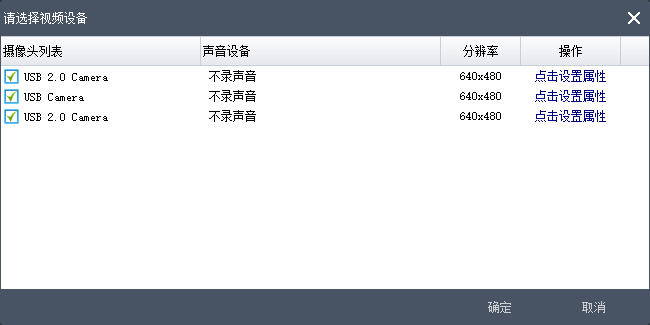

---
layout:		post
category:	"soft"
title:		"如何解决电脑USB摄像头设备名称重复问题？重新修改摄像头设备名"
tags:		[camera]
---
- Content
{:toc}
​	

# 问题场景

​	有时候在使用 [电脑摄像头录像软件](http://xcxzq.com/) 的时候，明明有多个摄像头就是会有个别的摄像头打不开。这个时候首先看看是不是有重名的设备，如图所示就存在第一个摄像头设备和第三个摄像头设备同名的情况，这样会造成第一个摄像头或者第三个摄像头打开失败。

解决办法就是把同名的摄像头设备，修改下名称即可，后面看具体的解决办法。

# 解决办法

## 1. 找到设备实例路径

​	在电脑桌面上，右键 **我的电脑** - > **管理**，点 **设备管理器**，找到对应的摄像头设备，右键点击打开**属性**，找到「**详细信息**」，在属性下拉列表框里找到「**设备实例路径**」，把显示出的「**值**」复制出来。

## 2.在注册表中搜索设备实例路径

​	Win + R 打开运行，输入 **regedit** 打开注册表。找到 HKEY_LOCAL_MACHINE\SYSTEM ，按下Ctrl + F 进行查找，输入上面找到的设备实例路径开始查找。

## 3.修改FriendlyName

​	找到后，在左侧的注册表目录展开，找到 **Device Parameters** ，点开后右侧会显示有 **FriendlyName** ，这个就是易于人读的设备名了，修改一个其他的名称即可。需要注意的是，**尽量用英文不要用中文名称**，否则还是会出现设备打开失败的情况。

如果看不太明白的可以参考图文教程：[usb摄像头设备名重复的问题](https://blog.csdn.net/weixin_42538789/article/details/102837389)