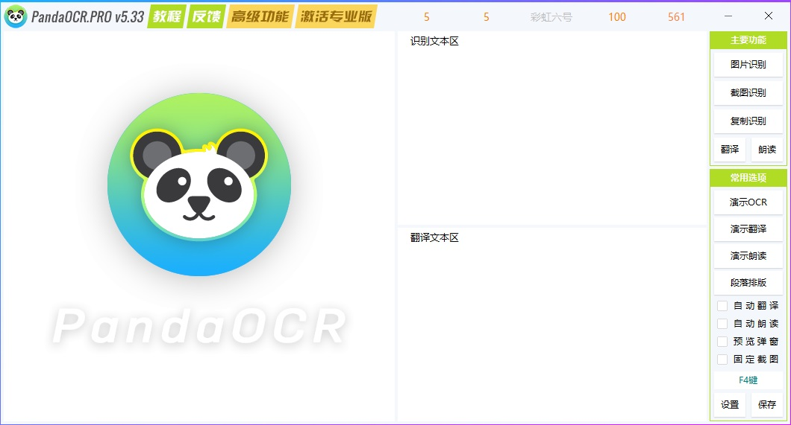

---
layout:		post
category:	"soft"
title:		"图片识别转文字OCR文字识别软件大搜集"

tags:		[ocr]
---

- Content
{:toc}
**关键词**：OCR，图片识别，文字识别，表格识别，公式识别，图片识别文字

# PandaOCR

之前有个[旧版](https://github.com/miaomiaosoft/PandaOCR)，完全免费使用，主要是使用的各个厂家的演示用OCR接口，每日调用次数使用完后需要换一家接着用。可能是现在用户多起来了，接口就会不够，经常会出现不可用的情况。加上作者自己解释说，代码写的有点乱，需要重新架构设计，推荐使用新版，谓之 [专业版：PandaOCR.Pro](https://github.com/miaomiaosoft/PandaOCR.Pro)。

专业版区分了高级功能和免费功能，高级功能需要付费购买激活使用，未购买未激活的用户可以使用高级功能之外的功能。

高级功能目前包含：图文批量识别、调用本地接口、屏幕对照翻译、屏幕显示按键、按键音效播放、快捷短语翻译等更多功能！

免费版的识别或翻译只限使用演示接口和百度API版接口，普通使用基本足够！

对于我个人来说，通常是使用图片转文字功能，且转换后自动复制使用。可以这样设置：

- 热键快捷键更换一个，默认的F4不适合，会与PDF软件的热键冲突。
- 设置里，开启下自动复制识别的文本。
- 关闭预览窗口。
- 关闭提示音，关闭气泡提示窗口。

总体来说，PandaOCR的使用还算便捷，功能比较强大，就是东西太多了，建议作者多做一下减法，目前界面上堆积了太多的东西。

# 天若OCR

与PandaOCR类似， [天若OCR](http://ocr.tianruo.net/)也是一款OCR软件，但是与其不同的是，它的界面设计交互设计方面做的就非常的干净，这也是为什么建议PandaOCR的作者多做一些减法的原因。

天若OCR定位就是商业软件，所以做出来的效果感觉上会比较专业一些，包过界面交互设计上，比较干净清爽。天若OCR功能也比较强大，主要提供了如下功能：

- 文本识别：将图片中的文本转换成可编辑文本
- 表格识别：将图片中的表格转换成可编辑表格
- 竖排识别：将图片竖排文字识别成可编辑文本
- 公式识别：将图片公式识别出latex代码
- 矫正识别：可以将图片进行倾斜透视矫正
- 高级识别：调整识别对比度，自动绘制表格线
- 识别翻译：识别图片后自动翻译
- 识别搜索：识别图片后自动搜索
- 截图功能：丰富的截图标注功能

# 天若ocr开源版本的本地版（推荐）

不过好在有离线版，[天若ocr开源版本的本地版](https://github.com/wangfreexx/wangfreexx-tianruoocr-cl-paddle)，直接在release里下载解压缩直接运行主程序，F4截图识别，识别后文本合并成一段，复制即可使用。

使用说明： 

1. 文字识别 

按下快捷键-按下鼠标左键-移动鼠标-画出矩形区域-松开鼠标 

2. 截图到粘贴板 

按下快捷键-鼠标左键按下-画出矩形区域（鼠标按住）-按下空格键 

3. 截图自动保存 

按下快捷键-鼠标左键按下-画出矩形区域（鼠标按住）-按下A键 

4. 截图另存为 

按下快捷键-鼠标左键按下-画出矩形区域（鼠标按住）-按下S键 

5. 识别后百度 

按下快捷键-鼠标左键按下-画出矩形区域（鼠标按住）-按下B键 

6. 识别后分割文本 

按下快捷键-鼠标左键按下-画出矩形区域（鼠标按住）-按下数字键1键 

7. 识别后合并文本 

按下快捷键-鼠标左键按下-画出矩形区域（鼠标按住）-按下数字键2键 

8. 贴图功能 

按下快捷键-鼠标左键按下-画出矩形区域（鼠标按住）-按下Q键 

9. 屏幕取色器 

按下快捷键-按下C键-拾取颜色-松开鼠标 

10. 高级截图功能 

按下快捷键-按下E键-进行截图编辑 

11. 多选区识别 

按下快捷键-按下Tab键-选择区域-鼠标双击选中区域 

12. 多选区截图 

按下快捷键-按下Tab键-画区域-按下A键保存 
