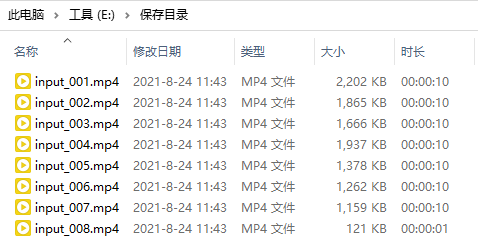

---
layout:		post
category:	"soft"
title:		"视频转换之视频切割分段剪切，如何等时间分割视频用于视频混剪？"

tags:		[video,mp4,convert]
---
- Content
{:toc}
**关键词**：视频转换，转换视频，视频切割，视频分段，mp4视频切割，视频混剪，视频剪辑，

有时候我们在网上看到比较好看的视频、电影、电视剧，想要下载下来作为视频素材使用，需要把视频快速分割成多段（等时间段）用于混剪。

那么如何快速把视频进行切割分段呢？并且按照等时间段剪切。这里介绍一种工具： [全能视频转换专家-转换任意格式视频](http://www.xcxzq.com/soft/videomaster.exe)，可以使用该软件进行剪切。

本软件有几大优势：

- 完全等时间段分割视频，非常精准。
- 视频音频质量完全等同源视频，不失真。
- 使用非常方便，简单快捷，傻瓜式操作。

下载安装，运行，软件首界面如下：

把视频文件添加进来，勾选「切割分段」，设置时间段（单位是秒），如果想要一分钟一段设置60即可，如果想要一小时一段设置为3600。

点击「开始转换」按钮，开始切割视频，切割完成后，软件提示完成并会自动打开视频保存目录。如下图所示，视频的时长均为设置的等时间段，非常精确。

