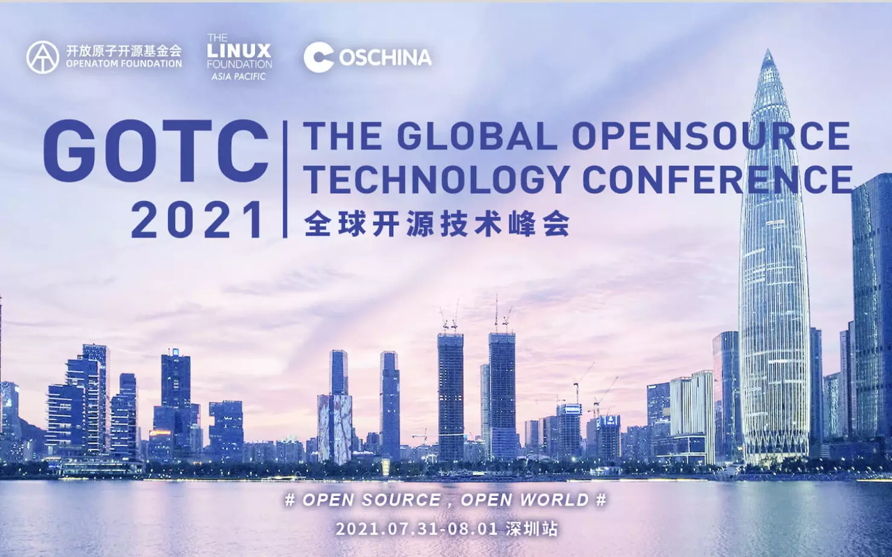

# OSCHINA点点滴滴
> 原文链接: http://www.oschina.cn/

---

##### 2021 年

举办首届全球开源技术峰会 GOTC ([https://gotc.oschina.net](https://gotc.oschina.net/))。
大会 2 个主会场、18 个论坛与一个闭门会议共有海内外 270 位资深开源专家带来分享，超过 3000 人现场参会，线上直播观看量 544.6 万人次，海外观众 3.3 万+。
大会宣发稿件 90+，80+ 家媒体报导了大会，包括央视与地方电视台等电视媒体、门户网站、科技垂直媒体、财经媒体等，国内曝光超 3.5 亿次，相关报道文章阅读量超过 500 万次。
央视《经济半小时》栏目开源专题对本次大会进行了报道，节目观看人数超过 1 千万，视频下载超过 10 万次。会议上全球各大顶级开源基金会掌门人罕见同框讨论；大会现场搭建了“开源长廊”，为国内首创，获得普遍好评；邀请 35+ 开源创企负责人联合成立了“中国开源原生商业化社区”

26