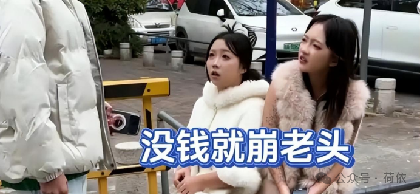
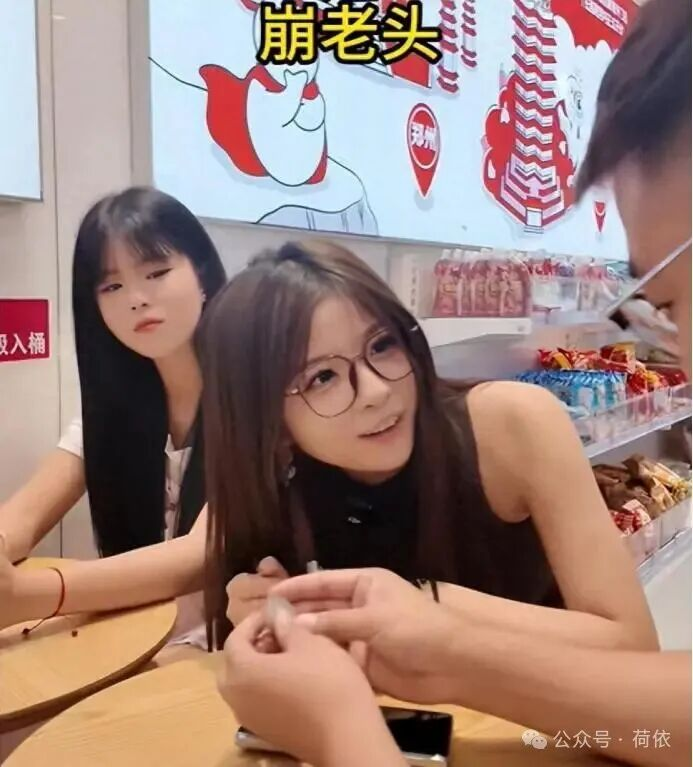
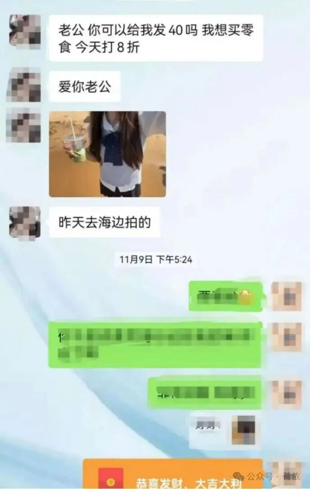
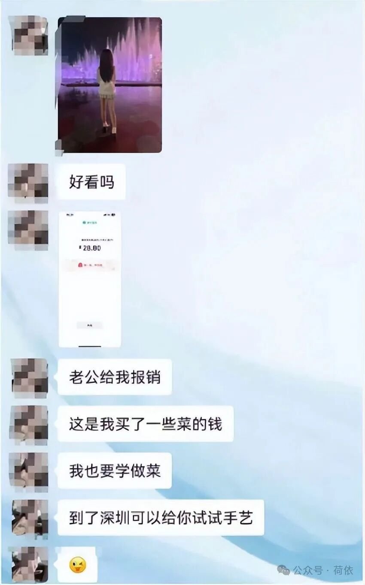

# 同时聊300个“老头”，月入超2万：揭秘“崩老头”灰色产业链
> 作者: 荷依
> 原文链接: https://mp.weixin.qq.com/s/tr_saeu0tZX4J35srXcSGg

---

# 同时聊300个“老头”，月入超2万：揭秘“崩老头”灰色产业链

原创 荷依 荷依 [荷依](javascript:void\(0\);)

_2026年4月17日 20:17_ _四川_

在小说阅读器读本章

去阅读

在小说阅读器中沉浸阅读

**如果你的微信里，突然多了一个年轻女孩，她每天准时对你说早安晚安，你发的每条朋友圈，她都会点赞评论。**

对你总是适度关心，在你情绪低落的时候会刚好出现给你安慰，在你习惯了她的善解人意之后，突然有一天，她对你说：“哥哥，今天天气好热，能请我喝一杯咖啡吗？”

金额不大，十几块。你是转还是不转？

如果你点头了，那么恭喜你，你可能已经一脚踏进了一个叫做“崩老头”的灰色江湖。

**你还以为是什么浪漫邂逅的开端，但扒开这层温情脉脉的面纱，其实是规模庞大、流程标准化的“情感生意”，更藏着金钱与人性的博弈。**

要了解这门生意，首先知道什么是“崩老头”？

**“老头”，不是年龄标签，更不是公园里遛弯下棋的大爷。而是一个筛选条件：有收入、有稳定支付能力、在社交平台上相对活跃的男性群体。实际观察里，80后、90后占比最高。**

**“崩”，本质是一种行为路径：用持续的情绪互动，换取对方的小额转账，说得直白点就是“骗”、“榨取”、“变现”。**

日常的嘘寒问暖、略带崇拜的聊天、节日里的专属问候，是她们提供的“产品”。

回报常见区间在20元到100元，理由都很生活化——饮料、外卖、打车、话费。金额刻意压低，避免对方产生警惕。

**金额虽不大，但频次高：一次几十块不痛不痒，但如果一天有十几个人转账，累加就变成一笔稳定收入。**

**不仅频次高，关键是规模大，她们可不是一对一的关系，而是一对多的“同时运营”。**

根据多家媒体对灰产行为的披露，有从业者同时维护上百个聊天对象，甚至有人提到长期维护200—300个联系人。

用一个保守模型估算：同时聊天有200人，如果每天转化10%，就有20人，单次评价约40元，那日收入就有800元，月收入就是两万多元。

**央视《法治在线》就报道过山东淄博警方破获的一起典型案件。一个网名为“盛某”的“女孩”，以交房租、看病买药等理由，让一名网友累计转账4000多元。**

**警方收网时才发现，手机那头的“温柔女友”，实际上是14名青年男性轮流扮演的。他们用变声器模仿女声，盗用网络美女照片，专门针对单身男性下手。现场查获了50多部作案手机、20多台电脑和20多个变声器。**

你看，**当你以为自己在和一位单纯的“妹妹”倾诉心声时，屏幕对面可能是一个抠脚大汉，或者是一个同时和几百人复制粘贴同一段话的“情感客服”。**

而更关键的是，这种行为已经从零散个体，变成了有方法、有流程的“轻运营模式”。

如果只靠随便聊天，很难稳定赚钱。

真正让这件事跑起来的，是一整套被拆解过的流程。

可以把它理解成三段式路径：**从陌生人，到熟人，再到“可以开口的人”，**中间每一步，都有具体操作。

**前期的目标，是让你觉得“这个人挺真实”。**

要怎么做呢？

**最常见的方式，是从你的内容入手。**

比如你发了一张加班的照片，她会回一句：这么晚还没下班呀;你发一条吐槽，她会顺着情绪接一句：我也经常这样。

这类回应的特点是——**不夸张、不暧昧，但很贴合。**

有从业者会专门做一件事：翻你过去一周甚至一个月的朋友圈，然后挑一个点来切入。

你以为是“被注意”，其实是“被筛选”。

**中期的目标，是建立一种轻度依赖感。**

这时候，聊天内容会开始出现变化。

不再只是回应你，而是主动输出自己的状态。

比如：

今天被领导说了两句，有点难受；刚租的房子有点小，住得不太习惯；最近在找工作，有点焦虑。

这些信息有一个共性：**都很生活化，而且容易让人产生共情。**

为了提高效率，一些人会用工具辅助生成话术，把“情绪表达”做成模板，再根据不同对象稍微调整。

你看到的是她在倾诉，其实是同一段内容在发给十几个人甚至更多。

等到**关系被“养熟”，就进入后期，很关键的动作——提出请求。**

但不会直接开口。

而**是用一种“顺带”的方式。**

**比如前面刚说自己累，接一句：要是能喝点甜的就好了；或者说刚加班完，顺一句：还没吃饭，有点饿。**

**然后让你“主动给”。**

金额依然控制在很低的范围，让你觉得这是一种顺手行为。

而对方完成了一次完整的转化。

当个体跑通之后，就会出现放大。

于是，上下游结构开始形成。

先看上游。

**上游在卖**什么？卖**经验，就是所谓的“培训师”。**

**他们把中年男性的心理研究得透透的，包括头像怎么选、第一句话怎么说、什么时候可以提要求、被怀疑了怎么解释。**

这些内容被打包成教程，在一些圈子里按几十到几百元出售。

有人甚至会提供“话术库”，按场景分类，比如破冰、安慰、要钱、解释，以及最重要的——如何规避被举报和封号的风险。

**这样一份“创业指南”，对于想入行的人来说，门槛极低，堪称“空手套白狼”的典范。**

中层是执行者。

他们做两件事：

一是养号。

**在各大社交平台批量打造“清纯女大学生”或“刚入社会的懵懂小妹”人设。**

他们广泛撒网，从短视频评论区、游戏组队频道、技术论坛等地，精准筛选出那些有消费潜力、主页动态流露出孤独感的男性，主动添加。

同时**运营多个账号，有人提到会用3到5个账号分流聊天对象。**

二是聊天。

当人数多到一个人聊不过来，就会用辅助工具，甚至多人轮流操作一个账号。

聊天这件事，**在这里变成了流水线，为了应对海量聊天，有人会使用专门的自动化软件或话术库。**

你发一句“今天好累”，软件能自动生成一段充满关怀的“甜言蜜语”回复。你看到的独一无二的关心，可能是发给几百个人的同一段代码。

下游更隐蔽。

**如果一个“老头”被榨干了**，不再愿意花钱了，怎么办？

**还有“回收团队”，他们会把这些“枯竭客户”的信息打包，像处理二手资源一样，卖给下一家。**

根据这个“老头”历史转账总额的不同，标价从几十元到几百元不等。新接手的人，再进行二次“开发”，换个头像和名字，又能开启新一轮的“情感收割”。

**从培训、引流、标准化运营，到代聊和客户信息转卖，这条灰色产业链已经形成了完整的闭环。每一个环节，都在把“情感”和“孤独”明码标价，高效变现。**

可为什么有的人明知道有问题，还是会付钱呢？

首先，因为“她”是**低成本的情绪“止痛药”。**

对于很多30-50岁的男性来说，几十块钱，可能就是一顿简餐、一包烟钱。在现实生活里，很容易被忽略。

但用这笔小钱，却能换来一整天，甚至连续一段时间被人在乎、被崇拜的感觉。

“去猫咖撸一次猫都不止这个价，现在有个‘妹妹’天天对我嘘寒问暖，性价比太高了。”——对于他们来说，买一种低成本、高回报的“情绪慰藉”。

再者，是**现实关系缺位的“情感荒漠”。**

这一代中年男性，正处在典型的“三明治”困境中：上有老，下有小，中间有职场KPI和房贷车贷。

在家庭里，他们可能是沉默的“经济支柱”，但情感沟通往往缺失；在职场中，他们是扛着压力的“工具人”，却难获得情感认同。

“男儿有泪不轻弹”的社会规训，让他们习惯了压抑情感需求。

当现实世界无人倾听他们的疲惫与孤独时，虚拟世界里那句“哥哥辛苦了”、“哥哥你好棒”、“哥哥想你了”、“爱你哦老公”......，就成了荒漠中的一滴甘泉。他们买的不是奶茶，是被看见、被理解的瞬间。

除此之外，还有的就是一种**被动接受。**

最开始可能只是一次尝试，后来变成习惯。

你知道对方可能不真实，但也没有更好的替代，这时候，钱已经不重要了，重要的是这个“过程”。

最后就是**边界的模糊。**

很多人会觉得：我又没被骗多少钱；我也没有投入感情；就是图个轻松，和她聊天心里就是舒服。

其实这种“共谋”现象非中国独有。

在日本，经济长期停滞催生了类似的“爸爸活”（パパ活）——年轻女性通过陪伴中年男性聊天、吃饭，来获取经济支持。

其核心逻辑与“崩老头”惊人一致：**年轻人用时间换快钱，中年人用金钱买陪伴。**

有的相关评论区，甚至出现了“老头”们主动“求崩”的奇观。

他们晒出自己的微信余额，留言“已备好奶茶钱，哪个妹妹来崩我？”

这背后，是一种扭曲的“各取所需”的共识。双方都清醒地参与这场游戏，一个出售标准化的温柔，一个购买定制化的幻觉。

可当理由是编造的，当关系是批量复制的，这已经偏离了正常的交换。

**这根本不是什么“双赢”，这是一场双输的“慢性自杀”。**

**“老头”们在虚拟世界里买到了廉价的“止痛药”，暂时忘了颈椎疼、忘了脂肪肝、忘了房贷压力，忘了工作KPI......，结果现实生活里的问题一个没解决，反而越来越依赖这种速食温情。**

**“小姑娘们”以为自己找到了财富密码，其实是在透支自己最宝贵的信用和青春。一旦这种“躺赚”的思维惯性养成，正经工作“她”还能待得住吗？**

这哪是搞钱啊，分明是拿着未来的幸福，换现在的奶茶。

**有的人其实心里是清楚的，知道对面不真实，知道那些关心可以复制，但还是一步步走进去，停在那种被反复投喂的“温柔乡”里。**

**如果换成你，遇到同样的场景，会怎么选？你愿意被“崩”吗？**

**END**

* * *

参考资料：

领房新语《现在，有多少年轻女孩儿靠“崩老头”活着？！》

山林溪声《了解了一个新词“崩老头”，据说80后是被崩的主力军》

婉姐故事会《崩老头，精神小妹和中年男人的双赢》

历史讲解员王汉周《我弟一客户，00后小姑娘，职业崩老头的》

小贾的科普日常《同时聊300个“老头”，月入2.4万：揭秘“崩老头”灰色产业链》

预览时标签不可点

**微信扫一扫赞赏作者**[喜欢作者](javascript:;)

关闭

**

[0人付费](javascript:;)

**

更多

正在加载...

正在加载...

关闭

更多

名称已清空

**微信扫一扫赞赏作者**

喜欢作者[其它金额](javascript:;)

赞赏后展示我的头像

作品

暂无作品

喜欢作者

其它金额

¥

最低赞赏 ¥0

确定

返回

**其它金额**

更多

赞赏金额

¥

最低赞赏 ¥0

1

2

3

4

5

6

7

8

9

0

.

作者提示: 个人观点，仅供参考

关闭

更多

搜索「」网络结果

关闭

**

调整当前正文文字大小

**

更多

100%

​

留言

暂无留言

1条留言

已无更多数据

[发消息](javascript:;)

  写留言:

微信扫一扫
关注该公众号

继续滑动看下一个