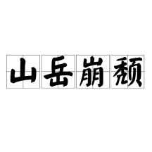

# 崩
> 原文链接: https://baike.baidu.com/item/%E5%B4%A9/2383377

---

订阅

175有用+1

17

崩，汉语一级字 \[3\]，读作崩（bēng），其本义为山倒塌。 \[2\]

## 相关星图

包含"崩"字的成语

共48个词条2913阅读

[

天崩地解

"天崩地解"是由"天""崩""地""解"四个字构成的联合式成语，其核心释义包含双重语义：一喻指重大事变或异常灾祸，二形容震天动地的巨大声响。该成语最早出自《战国策·赵策三》，语法功能上作谓语、定语使用，与"天崩地坼"为同义异形成语。在近义关联体系中，"天崩地坍""天崩地裂"等成语与其构成语义互证关系。

](https://baike.baidu.com/item/%E5%A4%A9%E5%B4%A9%E5%9C%B0%E8%A7%A3/54828?lemmaFrom=lemma_starMap&fromModule=lemma_starMap&starNodeId=66051d8863b85fd29bdc9a68&lemmaIdFrom=2383377)[

若崩厥角

若崩厥角，汉语成语，拼音是ruò bēng jué jiǎo，意思是叩头的声响像山崩一样，形容十分恭敬的样子。出自《书·泰誓中》。

](https://baike.baidu.com/item/%E8%8B%A5%E5%B4%A9%E5%8E%A5%E8%A7%92/8071774?lemmaFrom=lemma_starMap&fromModule=lemma_starMap&starNodeId=66051d8863b85fd29bdc9a68&lemmaIdFrom=2383377)[

山岳崩颓

山岳崩颓，汉语成语，拼音是shān yuè bēng tuí，意思是比喻王朝覆亡。出自北周·庾信《哀江南赋》。

](https://baike.baidu.com/item/%E5%B1%B1%E5%B2%B3%E5%B4%A9%E9%A2%93/8119294?lemmaFrom=lemma_starMap&fromModule=lemma_starMap&starNodeId=66051d8863b85fd29bdc9a68&lemmaIdFrom=2383377)[

栋朽榱崩

栋朽榱崩（拼音：dòng xiǔ cuī bēng，注音：ㄉㄨㄥˋ ㄒㄧㄡˇ ㄘㄨㄟ ㄅㄥ），汉语成语，属贬义联合式成语。该成语原指房屋主梁与椽子朽坏倒塌，后比喻倾覆。成语中“栋”指屋脊正梁，“朽”表腐朽，“榱”为椽子，“崩”本义山体倒塌，四字联合喻指核心部分败坏引发的整体崩溃。其近义词包括“栋榱崩折”等同源表述。该成语首见于宋·陈郁《话腴》收录的史舜元《哀王旦》诗句：“栋朽榱崩人短气”，以建筑坍塌隐喻时局动荡。清代叶廷琯《吹网录·三河县辽碑》载“宣圣庙……历岁换代，栋朽榱崩”，延续了原义用法。

](https://baike.baidu.com/item/%E6%A0%8B%E6%9C%BD%E6%A6%B1%E5%B4%A9/7280496?lemmaFrom=lemma_starMap&fromModule=lemma_starMap&starNodeId=66051d8863b85fd29bdc9a68&lemmaIdFrom=2383377)

中文名

崩

拼    音

bēng

部    首

山

五    笔

MEEF

仓    颉

UBB

总笔画

11

注    音

ㄅㄥˉ

部外笔画

8

笔顺编号

2 5 2 3 5 1 1 3 5 1 1

四角号码

22227

UniCode

CJK统一汉字U+5D29

## 目录

1.  1[详细释义](#1)
2.  2[古籍释义](#2)
3.  3[方言汇集](#3)

## 详细释义

播报

编辑

|
拼音

 |

词性

 |

释义

 |

英译

 |

例句

 |

例词

 |
| --- | --- | --- | --- | --- | --- |
|

bēng

 |

动词

 |

形声。从山，朋声。本义：山倒塌

 |

landslide;landslip

 |

梁山崩。——《左传·成公五年》

 |

山崩地裂

 |
|

崩裂；倒塌

 |

collapse;crash to the ground;burst apart

 |

中间力拉崩倒之声，火爆声，呼呼风声，百千齐作。——《虞初新志·秋声诗自序》

 |

崩拆(倒塌断裂);崩陷(倒塌陷落);崩陨(塌陷);崩损(崩塌损坏);崩坠(倒塌坠落)

 |
|

古代把天子的死看得很重，常用山塌下来比喻，由此从周代开始帝王死称“崩”

 |

death of an emperor

 |

故临崩寄臣以大事也。——诸葛亮《出师表》

越二月，帝崩。——《明史·海瑞传》

 |

崩驾(帝王之死);崩殂(崩背，崩逝。又指帝王之死)

 |
|

崩溃；垮台；败坏

 |

collapse;fall in ruin

 |

不义不昵，厚将崩。——《左传·隐公元年》

三年不为乐，乐必崩。——《论语·阳货》

 |

崩阙(败坏);崩动(煽动败坏)

 |
|

破裂，迸裂

 |

break;down burst

 |

天崩地塌壮士死。——吴士玉《玉带生歌奉和漫堂先生》

 |

谈崩了;崩裂(物体突然破裂);崩云(破裂的云彩);把气球吹崩了

 |
|

炸伤；枪毙

 |

go off in;hit by shooting

 |

\-

 |

\-

 |
|

血崩，指妇科“崩症”

 |

metrorrhagia

 |

\-

 |

\-

 |

（参考资料： \[2\]）

## 古籍释义

播报

编辑

[康熙字典](https://baike.baidu.com/item/%E5%BA%B7%E7%86%99%E5%AD%97%E5%85%B8/599071?fromModule=lemma_inlink)

【寅集中】【山字部】 崩

〔古文〕𨹹【[广韵](https://baike.baidu.com/item/%E5%B9%BF%E9%9F%B5/5802171?fromModule=lemma_inlink)】北滕切【集韵】【韵会】悲朋切，𠀤音绷。【说文】山坏也，从山朋声。【[玉篇](https://baike.baidu.com/item/%E7%8E%89%E7%AF%87/10013711?fromModule=lemma_inlink)】毁也。【礼·[曲礼](https://baike.baidu.com/item/%E6%9B%B2%E7%A4%BC/5913102?fromModule=lemma_inlink)·注】郉昺曰：自上坠下曰崩。【诗·小雅】如南山之寿，不骞不崩。【春秋·僖十四年】秋八月[辛卯](https://baike.baidu.com/item/%E8%BE%9B%E5%8D%AF/4134626?fromModule=lemma_inlink)，沙鹿崩。【注】沙鹿，山名。

又殂落也。【[谷梁传](https://baike.baidu.com/item/%E8%B0%B7%E6%A2%81%E4%BC%A0/740475?fromModule=lemma_inlink)·隐三年】高曰崩，厚曰崩，尊曰崩。

[又姓](https://baike.baidu.com/item/%E5%8F%88%E5%A7%93/18132572?fromModule=lemma_inlink)。【[正字通](https://baike.baidu.com/item/%E6%AD%A3%E5%AD%97%E9%80%9A/10013853?fromModule=lemma_inlink)】明[正德](https://baike.baidu.com/item/%E6%AD%A3%E5%BE%B7/0?fromModule=lemma_inlink)中崩愈坚，[固始县](https://baike.baidu.com/item/%E5%9B%BA%E5%A7%8B%E5%8E%BF/2403216?fromModule=lemma_inlink)丞，[潜山](https://baike.baidu.com/item/%E6%BD%9C%E5%B1%B1/6623606?fromModule=lemma_inlink)人。

【集韵】作𡹔。亦作𨻱。 \[1\]

## 方言汇集

播报

编辑

◎[客家话](https://baike.baidu.com/item/%E5%AE%A2%E5%AE%B6%E8%AF%9D/2582897?fromModule=lemma_inlink)：\[客英字典\] ben1 \[陆丰腔\] ben1 \[梅县腔\] ben1 \[海陆腔\] ben1 \[客语拼音字汇\] ben1 \[[东莞](https://baike.baidu.com/item/%E4%B8%9C%E8%8E%9E/495865?fromModule=lemma_inlink)腔\] ben1 \[[沙头角](https://baike.baidu.com/item/%E6%B2%99%E5%A4%B4%E8%A7%92/2341677?fromModule=lemma_inlink)腔\] bien1 \[[宝安](https://baike.baidu.com/item/%E5%AE%9D%E5%AE%89/774343?fromModule=lemma_inlink)腔\] ben1 \[台湾四县腔\] ben1

◎[粤语](https://baike.baidu.com/item/%E7%B2%A4%E8%AF%AD/266782?fromModule=lemma_inlink)：bang1

◎[赣语](https://baike.baidu.com/item/%E8%B5%A3%E8%AF%AD/1322722?fromModule=lemma_inlink)：bung1

◎[韩语](https://baike.baidu.com/item/%E9%9F%A9%E8%AF%AD/368221?fromModule=lemma_inlink)：PWUNG 붕 \[1\]

[词条图册更多图册](https://baike.baidu.com/pic/%E5%B4%A9/2383377?fr=lemma)

[

4

概述图册

](https://baike.baidu.com/pic/%E5%B4%A9/2383377/1/728da9773912b31bb051f8747644217adab44aed4b63?fr=lemma&fromModule=lemma_content-image "概述图册")

分享你的世界查看更多

**2**

b站搜索崩了，你被吓到了吗？

今天傍晚，b站的搜索功能不知为何崩了，许多网友反应搜啥啥搜不到，一开始还以为是自己爱豆被封杀了，还有人说以为是自己网的问题，流量wifi反复切换，甚至还卸载了b站又重新安装，不过如果b站真的下架了，许多人会悲伤到大哭吧，你今晚被吓到了吗？

吃货珍珠

参考资料

-   1

    

    [崩](https://baike.baidu.com/reference/2383377/533aYdO6cr3_z3kATKCOyfWlMHvBZ9_-tuDWV-NzzqIP0XOpX5nyFJI26dRx8PJzWxGE4cAta85aw8z4A1Udqqo)．汉典 \[引用日期2018-10-25\]
-   2

    

    [崩](https://baike.baidu.com/reference/2383377/533aYdO6cr3_z3kATKXdzK_xOifDZdr66uGFUeFzzqIPmGapB4P_U4w74dlx7_5mGhuFs5dvL8wc2a2PD1436uJheA)．千篇国学 \[引用日期2023-09-09\]
-   3

    

    [国务院关于公布《通用规范汉字表》的通知](https://baike.baidu.com/reference/2383377/533aYdO6cr3_z3kATPOIzfumOy6QZdSpv7bQBrJzzqIPmGapB5nyTcY178Fx_fkoDhzMu9cwMIdG27jyFUpM8aRPL6lgHPFNn3L5WjTLyqC-u4Q)．中华人民共和国中央人民政府 \[引用日期2023-09-09\]

崩的概述图（4张）

词条统计

浏览次数：460274次

编辑次数：46次[历史版本](https://baike.baidu.com/p/history?lemmaTitle=%E5%B4%A9&lemmaId=2383377&noadapt=1)

最近更新：

[小六琉](https://baike.baidu.com/usercenter/userpage?uk=cjFBM4ox2iL6phRqClW8Fg&from=lemma "查看此用户资料")

（2026-05-13）

突出贡献榜

[xug5350](https://baike.baidu.com/usercenter/userpage?uk=2TTm12luoQyHAlvSbe_1kw&from=lemma "查看此用户资料")

[1详细释义](#1)[2古籍释义](#2)[3方言汇集](#3)