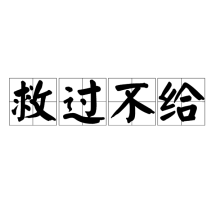
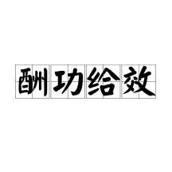
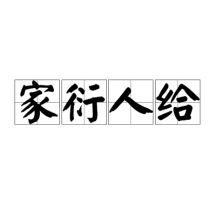
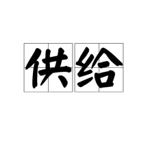
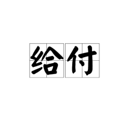

# 给
> 原文链接: https://baike.baidu.com/item/%E7%BB%99/4643294

---

订阅

348有用+1

39

给（拼音：gěi、jǐ），汉语一级通用规范汉字（常用字），繁体作“給”，左右结构，部首为“糸”，总笔画9画，笔顺编号551341251 \[4\]。该字形声结构“从糸合声”，《传》《论语》中用于“供给”“口给”等语境，表物质充裕或言辞敏捷 \[1\]。

字源溯至《说文解字》释“相足也”，经语义扩展从物质供给延伸至动作传递及语法辅助功能，形成文言与白话的用法差异 \[1\]。

## 相关星图

查看更多

包含"给"字的成语

共26个词条2536阅读

[

救过不给

救过不给，汉语成语，拼音为jiù guò bù gěi，注音符号ㄐㄧㄡˋ ㄍㄨㄛˋ ㄅㄨˋ ㄍㄟˇ，意为补救过失都来不及。该成语最早见于《史记·李斯列传》“群臣百姓救过不给，何变之敢图”之句，强调过失补救的紧迫性。

](https://baike.baidu.com/item/%E6%95%91%E8%BF%87%E4%B8%8D%E7%BB%99/8607533?lemmaFrom=lemma_starMap&fromModule=lemma_starMap&starNodeId=eca9aca484c27d4ed427886f&lemmaIdFrom=4643294)[

目不给视

目不给视，汉语成语，拼音是mù bù jǐ shì，意思是景物又美又多。出自宋·周邦彦《汴都赋》。

](https://baike.baidu.com/item/%E7%9B%AE%E4%B8%8D%E7%BB%99%E8%A7%86/3997252?lemmaFrom=lemma_starMap&fromModule=lemma_starMap&starNodeId=eca9aca484c27d4ed427886f&lemmaIdFrom=4643294)[

酬功给效

酬功给效，汉语成语，拼音是chóu gōng gěi xiào（“给”亦读jǐ），意思是赏赐有功劳者，其中“效”指呈献，献出（生命者）。其近义词为按功行赏。该成语感情色彩为中性，在句子中通常作谓语，指奖励有功之人。酬功给效出自《敦煌变文集·伍子胥变文》，原文“子胥随帝部卒入城，检纳干戈，酬功给效”为其用例。

](https://baike.baidu.com/item/%E9%85%AC%E5%8A%9F%E7%BB%99%E6%95%88/3057900?lemmaFrom=lemma_starMap&fromModule=lemma_starMap&starNodeId=eca9aca484c27d4ed427886f&lemmaIdFrom=4643294)[

家衍人给

家衍人给，汉语成语，拼音是jiā yǎn rén jǐ，意思是家家富裕，人人丰足。出自《盐铁论·通有》。

](https://baike.baidu.com/item/%E5%AE%B6%E8%A1%8D%E4%BA%BA%E7%BB%99/9164534?lemmaFrom=lemma_starMap&fromModule=lemma_starMap&starNodeId=eca9aca484c27d4ed427886f&lemmaIdFrom=4643294)

包含"给"字的词

共12个词条6177阅读

[

给予

给予，汉语词语，拼音jǐ yǔ，意思是给、赠送、使别人得到，也作给与。

](https://baike.baidu.com/item/%E7%BB%99%E4%BA%88/22258?lemmaFrom=lemma_starMap&fromModule=lemma_starMap&starNodeId=753cd009c5222426a1c03166&lemmaIdFrom=4643294)[

供给

供给（拼音：gōng jǐ），汉语词汇，本义指提供物资给予需求方。经济学中特指生产者在特定时期内基于价格水平愿意且能够提供的商品数量，包含供给欲望和供给能力两个构成要素。根据供给规律，商品价格与供给量呈同方向变动关系，经济学范畴的供给涵盖生产、市场投放及售出三个环节，可通过供给函数Qs=f(P)描述供给量与价格的关系。影响供给的主要因素包括商品价格、生产技术、生产要素价格及政策调控等。在聚乙烯等工业品领域，供给呈现区域产能分化与技术路线多元化特征

](https://baike.baidu.com/item/%E4%BE%9B%E7%BB%99/3334745?lemmaFrom=lemma_starMap&fromModule=lemma_starMap&starNodeId=753cd009c5222426a1c03166&lemmaIdFrom=4643294)[

给付

给付，读音jǐ fù，即债权债务所共同指向的对象。我国债法理论上的客体，在德国民法称为内容，在日本民法称为目的。债权为请求权，债权人的请求权是针对于债务人的特定的行为行使的，债务人的义务也正是此特定的行为，债权人得为请求及债务人所应实行的行为即为给付。在不当得利之债中，给付是不当得利人应返还不当得利的行为；在无因管理之债中，给付是本人应偿付管理人在管理活动中支出的必要费用；而在合同之债中，由于合同的双方当事人常常互为债权人和债务人，双方当事人的行为都为给付。当然，给付在某些情况下，也可以是不作为，即不为一定的行为，如债务人不得泄露技术秘密等。2024年全年，赔款与给付支出2.3万亿元，同比增长19.4%。

](https://baike.baidu.com/item/%E7%BB%99%E4%BB%98/10416584?lemmaFrom=lemma_starMap&fromModule=lemma_starMap&starNodeId=753cd009c5222426a1c03166&lemmaIdFrom=4643294)[

送给

送给（拼音：sòng gěi，注音：ㄙㄨㄥˋㄍㄟˇ），是汉语词语，指将物品无偿转移所有权或以礼品形式赠予他人，包含无偿给予（如“这本书送给你了”）和礼物馈赠（如“送给他父母一台电视机”）两种类型。该词语广泛应用于日常生活、公益活动及节日赠礼场景，例如为户外工作者赠送饮品、在春节选择特色食品或游戏产品作为伴手礼。司法实践中，赠送行为需依据证据明确性质，恋爱关系中通过平台充值打赏不构成附条件赠与。赠予财物对应的英语表述为"to give a present"，德语为"schenken"。

](https://baike.baidu.com/item/%E9%80%81%E7%BB%99/10320967?lemmaFrom=lemma_starMap&fromModule=lemma_starMap&starNodeId=753cd009c5222426a1c03166&lemmaIdFrom=4643294)

中文名

给

拼    音

gěi、jǐ

繁    体

給

部    首

纟

五    笔

XWGK \[2\]

仓    颉

VMOMR

郑    码

ZOAJ \[2\]

笔    顺

撇折、撇折、提、撇、捺、横、竖、横折、横

字    级

一级（编号：1758） \[4\]

平水韵

入声 十四缉 \[2\]

总笔画

9

四角码

2816₁

统一码

U+7ED9 \[2\]

笔顺编号

551341251 \[2\]

结    构

左右结构

注音字母

ㄐㄧˇ，ㄍㄟˇ

## 目录

1.  1[文字溯源](#1)
2.  2[详细释义](#2)
3.  3[古籍释义](#3)
4.  ▪[康熙字典](#3-1)
5.  ▪[说文解字](#3-2)
6.  ▪[说文解字注](#3-3)

## 文字溯源

播报

编辑

给字源流可溯至《说文解字》，释为“相足也”，形声结构“从糸合声”。《左传》《论语》等古籍中，“给”多用于“供给”“口给”等语境，表物质充裕或言辞敏捷。《集韵》记载其通假用法，如“汁给”通“洽”表岁名。经语义扩展，其功能从物质丰足延伸至动作传递及语法辅助，形成文言与白话的用法差异 \[1\]。

## 详细释义

播报

编辑

|
拼音

 |

词性

 |

释义

 |

英译

 |

例句

 |

例词

 |
| --- | --- | --- | --- | --- | --- |
|

gěi

 |

动词

 |

口

 |  |  |  |
|

使对方得到或遭受到

 |

give；grant；hand

 |  |

给他一张票；我给他字典；给我一片面包；给脸(给面子；给以礼遇)；给个炭篓鬼戴(抹黑；使人难堪)

 |
|

让；使；叫

 |

let

 |  |

给我看看；别给风刮散了

 |
|

介词

 |

表示对象、目的，相当于“为”、“替”

 |

for；for the benefit of

 |  |

为给人类带来利益而工作；给饥饿者所需要的食物；寄给我的信

给伤员包扎

 |
|

引进动作行为的主动者，或表示被动语态，相当于“被”

 |

by

 |  |

机器给弄坏了；屋子里给弄得乱七八糟

 |
|

表示方向，相当于“朝”、“对”、“向”

 |

to

 |  |

给这儿灌水；给他送礼；给老师行礼；给他使了个眼色

 |
|

助词

 |

用在某些动词前面，用以加强语气

 |

used before some verbs，giving stress to the tone

 |  |

保不住给忘了；风把门给吹开了；您给找个人

碗给打碎了；裤腿都叫露水给湿透了

 |
|

jǐ

 |

形容词

 |

形声。从糸，合声。本义：衣食丰足；充裕

 |

ample；be well provided for；abundant

 |

给，相足也。——《说文》

事之供给。——《国语·周语》

岁岁广开，百姓充给。——《齐民要术·序》

则日不足，力不给。——《韩非子·有度》

要曰强本节用，则人给家足之道也。——《史记·太史公自序》

 |

给富(丰足富裕)；给足(丰足)

 |
|

口齿伶利

 |

clever

 |

御人以口给，屡憎于人。——《论语》

 |

给口(口才敏捷)；给捷(敏捷)

 |
|

动词

 |

充足的供给，以物质给予对方

 |

provide

 |

镇国家，抚百姓，给馈饷。——《史记·高祖本纪》

给贡职郡县。(像秦国的郡县那样贡纳赋税。给，供。)——《战国策·燕策》

给其食用。——《战国策·齐策四》

请铸铜记给之。——《宋史·职官志》

艺蔬自给。——清· 张廷玉《明史》

给军民赏月钱。——清· 邵长蘅《青门剩稿》

 |

补给；配给；自给自足；给使(供人差使)；给与(授物与人)

 |
|

授与，交付

 |

confer

 |

若残竖子之类，恶能给若金！——《吕氏春秋》

 |  |
|

副词

 |

速，捷

 |

quickly

 |

富必给贫，壮必给老。——《邓析子》

 |  |

（参考资料： \[2\] \[3\]）

## 古籍释义

播报

编辑

### 康熙字典

【未集中】【糸字部】给

《[广韵](https://baike.baidu.com/item/%E5%B9%BF%E9%9F%B5/5802171?fromModule=lemma_inlink)》《正韵》居立切《[集韵](https://baike.baidu.com/item/%E9%9B%86%E9%9F%B5/9629114?fromModule=lemma_inlink)》《[韵会](https://baike.baidu.com/item/%E9%9F%B5%E4%BC%9A/15739840?fromModule=lemma_inlink)》讫立切，𠀤音急。《[说文](https://baike.baidu.com/item/%E8%AF%B4%E6%96%87/8167161?fromModule=lemma_inlink)》相足也。《[玉篇](https://baike.baidu.com/item/%E7%8E%89%E7%AF%87/10013711?fromModule=lemma_inlink)》供也，备也。《左传·僖十三年》敢不共给。《前汉·礼乐志》日不暇给。《注》给，足也。

又《集韵》极业切，音劫。敏言也。《礼·仲尼燕居》恭而不中礼谓之给。《注》谓㨗给。《[论语](https://baike.baidu.com/item/%E8%AE%BA%E8%AF%AD/372830?fromModule=lemma_inlink)》御人以口给。《何晏注》佞人口辞㨗给。

又《[集韵](https://baike.baidu.com/item/%E9%9B%86%E9%9F%B5/9629114?fromModule=lemma_inlink)》於业切。义同。

又《集韵》辖夹切，音洽。[岁在](https://baike.baidu.com/item/%E5%B2%81%E5%9C%A8/20623541?fromModule=lemma_inlink)未曰汁给。[通作](https://baike.baidu.com/item/%E9%80%9A%E4%BD%9C/60317980?fromModule=lemma_inlink)洽。 \[2\]

### 说文解字

给【卷十三】【糸部】

相足也。从糸合声。居立切 \[2\]

### 说文解字注

(给)相足也。足居人下。人必有足而後体全。故引申为完足。相足者、彼不足此足之也。故从合。从糸。合声。形声亦会意也。居立切。七部。 \[2\]

[词条图册更多图册](https://baike.baidu.com/pic/%E7%BB%99/4643294?fr=lemma)

[

3

概述图册

](https://baike.baidu.com/pic/%E7%BB%99/4643294/1/5882b2b7d0a20cf431ad1984f0515c36acaf2edd336d?fr=lemma&fromModule=lemma_content-image "概述图册")

分享你的世界查看更多

**11**

烟台市交警支队特意给特殊妈妈们过母亲节，你见个吗？

近期据某网报道烟台市交警支队特意给特殊妈妈们过母亲节，因为她们的孩子由于智力和别的等等原因，让孩子的妈妈要比普通妈妈付出得有更多，所以每年都搞爱心传递公益活动的早早地把蛋糕等等一些提前做好，然后和交警支队一起送上节日的祝福，让这些妈妈们感受不一样的幸福，你觉得呢？

房尔阳06

**7**

机器人被面馆老板雇用当师傅下面条给顾客吃，你见过吗？

近日据某网报到石家庄民族马路边，开了一家面馆店是机器人被老板雇用，当师傅下面条给顾客吃，老板真聪明知道雇机器人干活，机器人一只手拿面，另一只手拿刀削，搞得比老板还好吃些，不管是大人或小孩都喜欢吃机它做的面条，真是不可思议，你觉得呢？

房尔阳06

**18**

你看邓超怎么坐在墙角给跑男录视频？

今天有人拍到邓超坐在墙角给跑男录视频，看见，真情实意地在录制，说明邓超对跑男家族的感情非常深厚，作为国内的真人鼻祖，一直陪了自己这么多年，大家都很喜欢他，这次的退出，真的令人有点舍不得，不管怎么样，还是很希望超哥哥能回来，你觉得呢？

房尔阳06

参考资料

-   1

    

    [【给】书法字典](https://baike.baidu.com/reference/4643294/533aYdO6cr3_z3kATPKPmP2hYXzNNdusuuDQU-dzzqIP0XOpW4bwXIl858Iw5uJiEArYuJEsY9kY2b-PfkJa)．国学大师 \[引用日期2020-10-25\]
-   2

    

    [给](https://baike.baidu.com/reference/4643294/533aYdO6cr3_z3kATPaLxfT2NCjBZ4-suLbUUrpzzqIPmGapB5nyTcYo5N48sPliAETDsZZxL5Mwwa2IeF5M5w)．汉典 \[引用日期2021-08-23\]
-   3

    

    [给](https://baike.baidu.com/reference/4643294/533aYdO6cr3_z3kATKePzvv5NH7DY9ip6LTUVuBzzqIPmGapB4P_U4w74dlx7_5mGhuFs5dvL8wc2a2PDV43nOIZeA)．千篇国学 \[引用日期2023-09-16\]
-   4

    

    [国务院关于公布《通用规范汉字表》的通知](https://baike.baidu.com/reference/4643294/533aYdO6cr3_z3kATPOIzfumOy6QZdSpv7bQBrJzzqIPmGapB5nyTcY178Fx_fkoDhzMu9cwMIdG27jyFUpM8aRPL6lgHPFNn3L5WjTLyqC-u4Q)．中华人民共和国中央人民政府 \[引用日期2023-09-16\]

给的概述图（3张）

词条统计

浏览次数：935254次

编辑次数：114次[历史版本](https://baike.baidu.com/p/history?lemmaTitle=%E7%BB%99&lemmaId=4643294&noadapt=1)

最近更新：

[超级超哥76](https://baike.baidu.com/usercenter/userpage?uk=j8-cadAsipc4H1cT-TUrnw&from=lemma "查看此用户资料")

（2026-02-24）

突出贡献榜

[人间半盏灯](https://baike.baidu.com/usercenter/userpage?uk=4jE3iLR3Eah2KLBVAqpcuA&from=lemma "查看此用户资料")

[别无选择0921](https://baike.baidu.com/usercenter/userpage?uk=_vmamGd2j3QCHxm0HlLYDw&from=lemma "查看此用户资料")

[1文字溯源](#1)[2详细释义](#2)[3古籍释义](#3)[康熙字典](#3-1)[说文解字](#3-2)[说文解字注](#3-3)