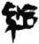
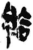
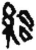
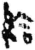
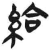
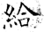
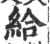
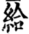
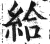
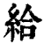

# 给的意思,给的解释,给的拼音,给的部首,给的笔顺
> 原文链接: https://www.hanyuguoxue.com/zidian/zi-32473

---

停止全屏

## 给

复制

  _gěi_ _ㄍㄟˇ_ _jǐ_ _ㄐㄧˇ_

纟部共9画左右结构U+7ED9CJK 基本汉字

汉字游戏应用

[最常用字](https://www.hanyuguoxue.com/zidian/zuichangyongzi "最常用字")[一级汉字](https://www.hanyuguoxue.com/zidian/guifanhanzi-1 "一级汉字")[常用字](https://www.hanyuguoxue.com/zidian/changyongzi-2500 "常用字")[通用字](https://www.hanyuguoxue.com/zidian/tongyongzi "通用字")

汉语字典

-   [汉语字典](https://www.hanyuguoxue.com/zidian/zi-32473)
-   [康熙字典](https://www.hanyuguoxue.com/kangxi/zi-32473)
-   [说文解字](https://www.hanyuguoxue.com/shuowen/zi-32473)
-   [组词](https://www.hanyuguoxue.com/zuci/zi-32473)

繁体 [給](https://www.hanyuguoxue.com/zidian/zi-32102 "給")

部首 [纟部](https://www.hanyuguoxue.com/zidian/bushou-32415 "部首纟的汉字")

总笔画 [9画](https://www.hanyuguoxue.com/zidian/bihua-9 "总笔画9的汉字")

部外笔画 6画

结构 左右结构

造字法 形声字

五行 木

五笔 XWGK

仓颉 VMOMR

郑码 ZOAJ

四角 28161

中文电码 4822

区位码 2488

统一码 U+7ED9

笔画 _551341251_ 撇折、撇折、提、撇、捺、横、竖、横折、横

异体字 [給](https://www.hanyuguoxue.com/zidian/zi-32102)

## 给字概述

纠错

〔给〕字是多音字，拼音是（gěi、jǐ），部首是_纟部_，总笔画是_9画_。

〔给〕字是左右结构，可拆字为“_纟、合_”，五行属木。

成语词典

〔给〕字造字法是形声。从糸，合声。本义是衣食丰足;充裕。

〔给〕字仓颉码是_VMOMR_，五笔是_XWGK_，四角号码是_28161_，郑码是_ZOAJ_，中文电码是_4822_，区位码是_2488_。

〔给〕字的UNICODE是_U+7ED9_，位于UNICODE的_中日韩统一表意文字 (基本汉字)_，10进制： 32473，UTF-32：00007ED9，UTF-8：E7 BB 99。

〔给〕字在_《通用规范汉字表》_的_一级字表_中，序号_1758_，属_常用字_。

〔给〕字异体字是_[給](https://www.hanyuguoxue.com/zidian/zi-32102)_。

展开更多

## 给的笔顺

纠错

-   撇折
-   撇折
-   提
-   撇
-   捺
-   横
-   竖
-   横折
-   横

## 给的意思

纠错

[全部](#)[gěi1](#)[jǐ2](#)

### 给繁：[給](https://www.hanyuguoxue.com/zidian/zi-32102)

1_gěi__ㄍㄟˇ_

#### 基本解释

①交付，送与。例如～以。～予。送～。献～。

②把动作或态度加到对方。例如～他一顿批评。

③替，为。例如～大家帮忙。

④被，表示遭受。例如房子～火烧掉了。

词典在线查字

⑤把，将。例如请你随手～门送上。

#### 详细解释

例证

动词

1.\[口\]。

2.使对方得到或遭受到 。

例如 _：_给他一张票；我给他字典；给我一片面包；给脸（给面子；给以礼遇）；给个炭篓鬼戴（抹黑；使人难堪）

英文 _：_give; grant; hand;

3.让；使；叫 。

笔画动画教程

例如 _：_给我看看；别叫风给刮散了

英文 _：_let;

介词

1.表示对象、目的，相当于“[为](https://www.hanyuguoxue.com/zidian/zi-20026 "为")”、“[替](https://www.hanyuguoxue.com/zidian/zi-26367 "替")” 。

引证 _：_给伤员包扎

例如 _：_为给人类带来利益而工作；给饥饿者所需要的食物；寄给我的信

英文 _：_for; for the benefit of;

中文学习课程

2.引进动作行为的主动者，或表示被动语态，相当于“[被](https://www.hanyuguoxue.com/zidian/zi-34987 "被")” 。

例如 _：_机器给弄坏了；屋子里给弄得乱七八糟

英文 _：_by;

3.表示方向，相当于“[朝](https://www.hanyuguoxue.com/zidian/zi-26397 "朝")”、“[对](https://www.hanyuguoxue.com/zidian/zi-23545 "对")”、“[向](https://www.hanyuguoxue.com/zidian/zi-21521 "向")” 。

例如 _：_给这儿灌水；给他送礼；给老师行礼；给他使了个眼色

英文 _：_to;

助词

1.用在某些动词前面，用以加强语气 。

汉字游戏应用

引证 _：_碗给打碎了；裤腿都叫露水给湿透了

例如 _：_保不住给忘了；风把门给吹开了；您给找个人

英文 _：_used before some verbs, giving stress to the tone;

2.另见 jǐ。

### 给繁：[給](https://www.hanyuguoxue.com/zidian/zi-32102)

2_jǐ__ㄐㄧˇ_

#### 基本解释

①供应。例如供～。补～。～养。自～自足。

词典在线查字

②富裕，充足。例如家～人足。

③敏捷。例如言论～捷。

#### 详细解释

例证

形容词

1.形声。从糸，合声。本义：衣食丰足；充裕。

2.同本义。

引证 _：_给，相足也。 《说文》事之供给。 《国语 · 周语》岁岁广开，百姓充给。 《齐民要术 · 序》

字典与百科全书

则日不足，力不给。 《韩非子 · 有度》要曰强本节用，则人给家足之道也。 《史记 · 太史公自序》

例如 _：_给富（丰足富裕）；给足（丰足）

英文 _：_ample; be well provided for; abundant;

3.口齿伶利。

引证 _：_御人以口给，屡憎于人。 《论语》

例如 _：_给口（口才敏捷）；给捷（敏捷）

英文 _：_clever;

动词

1.充足的供给，以物质给予对方。

引证 _：_镇国家，抚百姓，给馈饷。 《史记 · 高祖本纪》给贡职郡县。（像秦国的郡县那样贡纳赋税。给，供。） 《战国策 · 燕策》给其食用。 《战国策 · 齐策四》请铸铜记给之。 《宋史 · 职官志》艺蔬自给。 清 · 张廷玉《明史》给军民赏月钱。 清 · 邵长蘅《青门剩稿》

例如 _：_补给；配给；自给自足；给使（供人差使）；给与（授物与人）

英文 _：_provide;

2.授与，交付。

引证 _：_若残竖子之类，恶能给若金！ 《吕氏春秋》

英文 _：_confer;

副词

1.速，捷。

引证 _：_富必给贫，壮必给老。 《邓析子》

英文 _：_quickly;

2.另见 gěi。

## 给字的翻译

纠错

1.  英语 give; by, for
2.  德语 geben, gewähren, tun für jemanden (V)​, für (Präp)
3.  法语 fournir, approvisionner, ample, bien pourvu de, pour, donner, offrir, accorder, laisser, permettre

## 给的字源字形

纠错

以下是“**给**”的正体“**給**”的字形

 秦 简 睡虎地

 秦 简 岳麓书院

 秦 简 龙岗

 秦 简 关沮

 汉 简 张家山

 唐 石经 开成石经

 宋 印刷字体 广韵

 宋 印刷字体

字典与百科全书

增韵

 明 印刷字体 洪武正韵

 清 印刷字体 康熙字典

## 含给字的成语

折叠展开

[自_给_自足](https://www.hanyuguoxue.com/chengyu/ci-1f93c9c3df "自给自足") [家_给_人足](https://www.hanyuguoxue.com/chengyu/ci-ce37841f2 "家给人足") [日不暇_给_](https://www.hanyuguoxue.com/chengyu/ci-1183d3b496 "日不暇给") [家_给_民足](https://www.hanyuguoxue.com/chengyu/ci-15b593c82d "家给民足") [人_给_家足](https://www.hanyuguoxue.com/chengyu/ci-10d71f753d "人给家足") [目不暇_给_](https://www.hanyuguoxue.com/chengyu/ci-111d79eb95 "目不暇给") [救过不_给_](https://www.hanyuguoxue.com/chengyu/ci-763f48238 "救过不给") [饔飧不_给_](https://www.hanyuguoxue.com/chengyu/ci-18b12a8073 "饔飧不给") [人足家_给_](https://www.hanyuguoxue.com/chengyu/ci-19946247a2 "人足家给") [利口捷_给_](https://www.hanyuguoxue.com/chengyu/ci-1d2a09a2b6 "利口捷给") [目不_给_视](https://www.hanyuguoxue.com/chengyu/ci-140b569d0d "目不给视") [家衍人_给_](https://www.hanyuguoxue.com/chengyu/ci-ee9d31246 "家衍人给") [目不_给_赏](https://www.hanyuguoxue.com/chengyu/ci-1c53bd7608 "目不给赏") [户_给_人足](https://www.hanyuguoxue.com/chengyu/ci-1ccc0f1446 "户给人足") [口谐辞_给_](https://www.hanyuguoxue.com/chengyu/ci-d365015ad "口谐辞给") [酬功_给_效](https://www.hanyuguoxue.com/chengyu/ci-3f6c0c7b5 "酬功给效") [有求必_给_](https://www.hanyuguoxue.com/chengyu/ci-1517641834 "有求必给") [利口辩_给_](https://www.hanyuguoxue.com/chengyu/ci-15ed3dfbdf "利口辩给") [呼不_给_吸](https://www.hanyuguoxue.com/chengyu/ci-22e234d5b "呼不给吸") [口才辨_给_](https://www.hanyuguoxue.com/chengyu/ci-9c2eace1e "口才辨给") [更多…](https://www.hanyuguoxue.com/chengyu/zuci-32473)

## 给字组词

折叠展开

给字开头给字结尾给字中间

### 给开头的词语

[_给_予](https://www.hanyuguoxue.com/cidian/ci-5f63ec0f1 "给予") [_给_以](https://www.hanyuguoxue.com/cidian/ci-54dc4047f "给以") [_给_养](https://www.hanyuguoxue.com/cidian/ci-fbc9c2c1b "给养") [_给_面子](https://www.hanyuguoxue.com/cidian/ci-1bdd8e242a "给面子") [_给_水](https://www.hanyuguoxue.com/cidian/ci-ed46f42a8 "给水") [_给_禀](https://www.hanyuguoxue.com/cidian/ci-139d2fed2 "给禀") [_给_布](https://www.hanyuguoxue.com/cidian/ci-9de52cb80 "给布") [_给_传](https://www.hanyuguoxue.com/cidian/ci-1efe32b3a0 "给传") [_给_赐](https://www.hanyuguoxue.com/cidian/ci-15e69aca03 "给赐") [_给_待](https://www.hanyuguoxue.com/cidian/ci-10e6f93688 "给待") [_给_贷](https://www.hanyuguoxue.com/cidian/ci-1f5239c214 "给贷") [_给_定](https://www.hanyuguoxue.com/cidian/ci-646834c01 "给定") [_给_对](https://www.hanyuguoxue.com/cidian/ci-ded36611e "给对") [_给_发](https://www.hanyuguoxue.com/cidian/ci-1015dce1f8 "给发") [_给_富](https://www.hanyuguoxue.com/cidian/ci-184c0a588f "给富") [_给_扶](https://www.hanyuguoxue.com/cidian/ci-19a9449b9a "给扶") [_给_复](https://www.hanyuguoxue.com/cidian/ci-15845e3153 "给复") [_给_孤独](https://www.hanyuguoxue.com/cidian/ci-87f98cdcc "给孤独") [_给_孤独园](https://www.hanyuguoxue.com/cidian/ci-127c1a78c6 "给孤独园") [_给_孤园](https://www.hanyuguoxue.com/cidian/ci-1e735abf7e "给孤园") [_给_还](https://www.hanyuguoxue.com/cidian/ci-4bc055876 "给还") [_给__给_](https://www.hanyuguoxue.com/cidian/ci-124e1f01ce "给给") [_给_济](https://www.hanyuguoxue.com/cidian/ci-2c9fe67e0 "给济") [更多…](https://www.hanyuguoxue.com/zuci/zi-32473)

### 给结尾的词语

[交_给_](https://www.hanyuguoxue.com/cidian/ci-dcc84c5fe "交给") [供_给_](https://www.hanyuguoxue.com/cidian/ci-edfb2f732 "供给") [发_给_](https://www.hanyuguoxue.com/cidian/ci-1be03e56b5 "发给") [补_给_](https://www.hanyuguoxue.com/cidian/ci-15d8bc2dab "补给") [自_给_](https://www.hanyuguoxue.com/cidian/ci-43e688ecf "自给") [赠_给_](https://www.hanyuguoxue.com/cidian/ci-1148ddf307 "赠给") [配_给_](https://www.hanyuguoxue.com/cidian/ci-1a0d031d41 "配给") [薪_给_](https://www.hanyuguoxue.com/cidian/ci-19c8e4b78 "薪给") [仰_给_](https://www.hanyuguoxue.com/cidian/ci-18de452407 "仰给") [卬_给_](https://www.hanyuguoxue.com/cidian/ci-b9fdd551b "卬给") [奥利_给_](https://www.hanyuguoxue.com/cidian/ci-23d7de209 "奥利给") [办_给_](https://www.hanyuguoxue.com/cidian/ci-99a8fb3a6 "办给") [颁_给_](https://www.hanyuguoxue.com/cidian/ci-70b170747 "颁给") [便_给_](https://www.hanyuguoxue.com/cidian/ci-ff7911ba "便给") [辨_给_](https://www.hanyuguoxue.com/cidian/ci-17d4cb58cd "辨给") [辩_给_](https://www.hanyuguoxue.com/cidian/ci-d391eae41 "辩给") [俵_给_](https://www.hanyuguoxue.com/cidian/ci-246e677e0 "俵给") [毕_给_](https://www.hanyuguoxue.com/cidian/ci-4b7d458d4 "毕给") [禀_给_](https://www.hanyuguoxue.com/cidian/ci-1c96767cbd "禀给") [拨_给_](https://www.hanyuguoxue.com/cidian/ci-d03f40ca5 "拨给") [不_给_](https://www.hanyuguoxue.com/cidian/ci-205dc973cc "不给") [超额供_给_](https://www.hanyuguoxue.com/cidian/ci-68e886828 "超额供给") [宠_给_](https://www.hanyuguoxue.com/cidian/ci-16e9e2bf90 "宠给") [更多…](https://www.hanyuguoxue.com/zuci/zi-32473)

### 给中间的词语

[自_给_自足](https://www.hanyuguoxue.com/cidian/ci-1f93c9c3df "自给自足") [供_给_制](https://www.hanyuguoxue.com/cidian/ci-133c89ad2b "供给制") [补_给_线](https://www.hanyuguoxue.com/cidian/ci-203b7982d "补给线") [配_给_制](https://www.hanyuguoxue.com/cidian/ci-a0ce0771b "配给制") [不_给_力](https://www.hanyuguoxue.com/cidian/ci-b4a31ee1c "不给力") [不_给_面子](https://www.hanyuguoxue.com/cidian/ci-12fd32a6dc "不给面子") [不_给_命](https://www.hanyuguoxue.com/cidian/ci-163fb13241 "不给命") [补_给_舰](https://www.hanyuguoxue.com/cidian/ci-205128f0a9 "补给舰") [酬功_给_效](https://www.hanyuguoxue.com/cidian/ci-3f6c0c7b5 "酬功给效") [都_给_事中](https://www.hanyuguoxue.com/cidian/ci-9f6631770 "都给事中") [供_给_定理](https://www.hanyuguoxue.com/cidian/ci-2d5e945ac "供给定理") [虾蟆_给_事](https://www.hanyuguoxue.com/cidian/ci-143bafe5b1 "虾蟆给事") [很_给_力](https://www.hanyuguoxue.com/cidian/ci-10a25e369e "很给力") [呼不_给_吸](https://www.hanyuguoxue.com/cidian/ci-22e234d5b "呼不给吸") [户_给_人足](https://www.hanyuguoxue.com/cidian/ci-1ccc0f1446 "户给人足") [家_给_民足](https://www.hanyuguoxue.com/cidian/ci-15b593c82d "家给民足") [家_给_人足](https://www.hanyuguoxue.com/cidian/ci-ce37841f2 "家给人足") [进_给_量](https://www.hanyuguoxue.com/cidian/ci-1da49d1d57 "进给量") [目不_给_赏](https://www.hanyuguoxue.com/cidian/ci-1c53bd7608 "目不给赏") [目不_给_视](https://www.hanyuguoxue.com/cidian/ci-140b569d0d "目不给视") [人_给_家足](https://www.hanyuguoxue.com/cidian/ci-10d71f753d "人给家足") [桑_给_巴尔](https://www.hanyuguoxue.com/cidian/ci-1fcc1c414f "桑给巴尔") [桑_给_帝国](https://www.hanyuguoxue.com/cidian/ci-141fe526c8 "桑给帝国") [更多…](https://www.hanyuguoxue.com/zuci/zi-32473 "更多给的组词")